Yes. The key to making Stellar Engine click is to **ignore networking at first** and understand the **GCP resource hierarchy + Terraform handoff between stages**.

I reviewed the deployment guide you uploaded, the `0-bootstrap` and `1-resman` Terraform you provided, and the current Stellar Engine repository. The important mental model is:

> **Stage 0 creates the landing-zone control plane. Stage 1 creates the organizational structure that networking, security, and workloads will later live inside.**

Stellar Engine itself is an Assured Workloads adaptation of Google Cloud Foundation Fabric, intended to create a compliant GCP landing zone for regimes such as IL4, IL5, and FedRAMP High. Your deployment guide explicitly describes the stages as passing generated Terraform variables and provider files through a GCS bucket. 

---

# 1. First understand the GCP hierarchy

Before Stellar Engine, understand this:

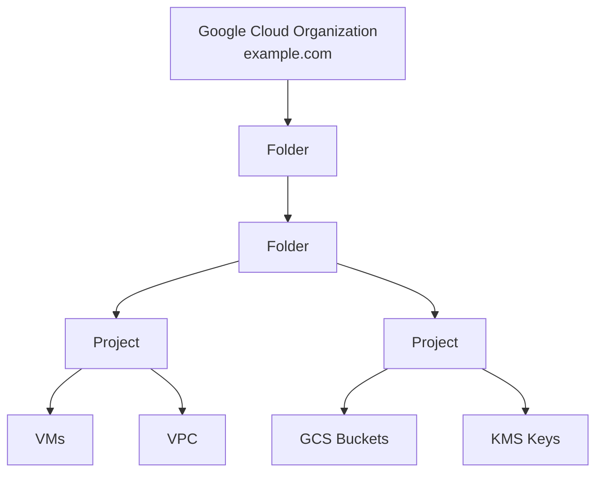

The hierarchy is:

```text
Organization
    ↓
Folder
    ↓
Folder
    ↓
Project
    ↓
Actual resources
    VM / VPC / Bucket / KMS / Pub/Sub / etc.
```

IAM and Organization Policies can be attached high in this hierarchy and inherited downward. Google describes the normal hierarchy as **Organization → Folders → Projects → service resources**. ([Google Cloud Documentation][1])

For an AWS engineer, use this approximate translation:

| Google Cloud             | AWS mental model                                               |
| ------------------------ | -------------------------------------------------------------- |
| Organization             | AWS Organization                                               |
| Folder                   | AWS OU                                                         |
| Nested Folder            | Nested OU                                                      |
| Project                  | Roughly an AWS Account                                         |
| VPC / VM / GCS / KMS     | Resources inside an AWS account                                |
| Organization Policy      | SCP-like governance, although implementation differs           |
| IAM on Folder            | IAM/governance inherited by child projects                     |
| Assured Workloads Folder | Regulated/compliance boundary around a branch of the hierarchy |

The **Project ≈ AWS Account** comparison is particularly useful, although they are not technically identical.

---

# 2. Where Assured Workloads fits

Stellar Engine inserts an **Assured Workloads folder underneath the Organization**.

For IL5, conceptually:

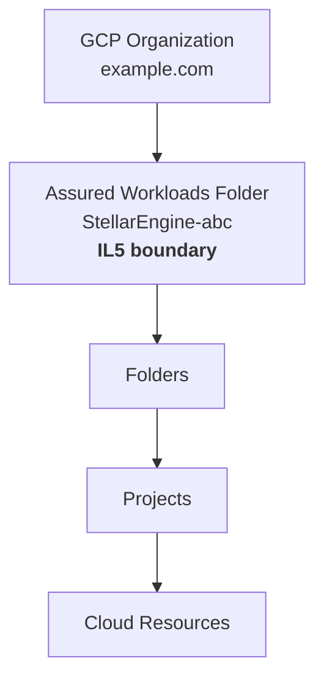

Google calls the Assured Workloads folder the top-level regulatory boundary for workloads. Projects placed underneath it inherit the applicable compliance controls. ([Google Cloud Documentation][2])

That explains why Stellar Engine is very deliberate about this hierarchy.

Instead of:

```text
Organization
├── random networking project
├── random security project
├── application project
└── some IL5 folder
```

it wants:

```text
Organization
└── IL5 Assured Workloads boundary
    ├── Networking
    ├── Security
    ├── Logging
    ├── Prod workloads
    ├── Test workloads
    └── Int workloads
```

The Stellar README specifically says Stage 0 creates the Assured Workloads folder early so future folders, projects, and services stay within the selected compliance regime. ([GitHub][3])

---

# 3. Stellar Engine stages at a high level

Think of the deployment like building a house.

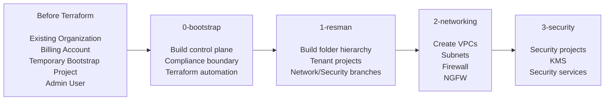

So:

**0-bootstrap = “Who controls and automates the landing zone?”**

**1-resman = “What does the landing-zone resource hierarchy look like?”**

**2-networking = “Now actually build the network.”**

This distinction is important.

---

# 4. Before Stage 0: something must already exist

Stage 0 cannot start from absolute nothing.

Your DDG requires that you already have approximately:

```text
Google Cloud Organization
Billing Account
Cloud Identity / Workspace domain
Admin groups
A manually created bootstrap project
Privileged deployment user
```

For example:

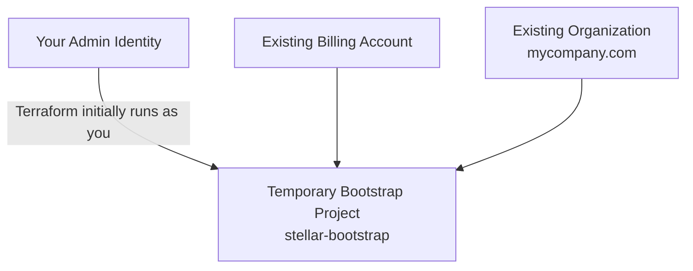

That **bootstrap project is not the final Terraform control-plane project**.

This is one of the easiest parts of Stellar Engine to misunderstand.

You manually create something like:

```text
my-temporary-bootstrap-project
```

and initially run Terraform from there.

Stage 0 then creates the real automation infrastructure.

---

# 5. Stage 0 — Bootstrap

The Stage 0 README describes its purpose as enabling organization-wide functionality requiring broad permissions and preparing automation for subsequent stages. ([GitHub][3])

I would summarize it as:

> **Stage 0 turns an existing GCP organization into a Terraform-manageable, Assured-Workloads-governed organization.**

---

# 6. The first major thing Stage 0 creates: the compliance root

You configure:

```hcl
assured_workloads = {
  regime   = "IL5"
  location = "us-east4"
}
```

Stellar runs:

```text
google_assured_workloads_workload
```

and creates approximately:

```text
Organization
└── StellarEngine-<prefix>          ← Assured Workloads IL5 folder
```

The code explicitly creates an Assured Workloads workload using your compliance regime, location and organization. ([GitHub][4])

Then underneath that it creates another folder:

```text
<regime> Common Services
```

So after this portion:

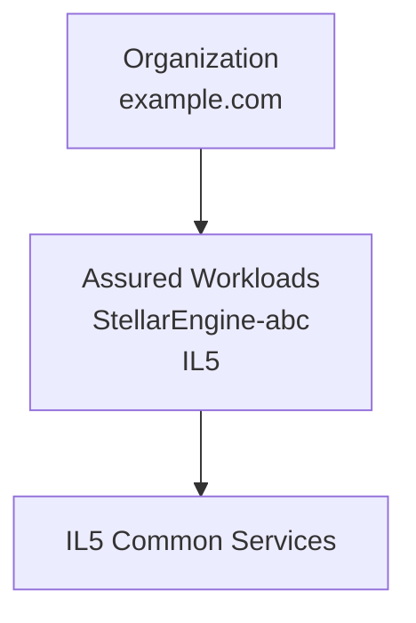

The code makes the Common Services folder a child of the Assured Workloads folder. ([GitHub][4])

---

# 7. Why “Common Services”?

This is similar to having something like this in AWS:

```text
AWS Organization
└── Infrastructure OU
    ├── Network Account
    ├── Security Account
    ├── Log Archive Account
    └── Terraform Account
```

In Stellar Engine:

```text
Assured Workloads
└── Common Services
    ├── Terraform automation
    ├── Audit/logging
    ├── Billing
    ├── Networking
    └── Security
```

Stage 0 creates part of it.

Stage 1 expands it.

---

# 8. Stage 0 creates the Terraform automation project

This is one of the most important projects.

Code:

```hcl
name = "iac-core-0"
```

Because Stellar adds your prefix and `prod`, it ends up approximately:

```text
<prefix>-prod-iac-core-0
```

For example:

```text
dod-prod-iac-core-0
```

The current code creates this project underneath Common Services. ([GitHub][5])

Think of this as roughly:

> **AWS Terraform/Infrastructure Tooling account**

It is where the automation infrastructure lives.

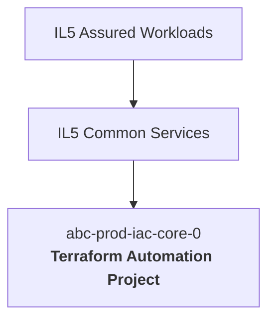

---

# 9. Inside the automation project

This project is extremely important because it contains things like:

```text
Service Accounts
GCS Terraform state buckets
Generated provider files
Generated tfvars files
KMS encryption
Possibly CI/CD / Workload Identity
```

Conceptually:

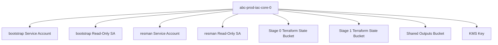

The code creates separate bootstrap and resource-management state buckets/service accounts. For example, the Stage 1 state bucket is named `iac-core-resman-0`, and the Stage 1 service account is `resman-0`. ([GitHub][5])

This separation is intentional.

---

# 10. There are actually multiple Terraform identities

Instead of one giant Terraform service account doing everything, Stellar creates stage-specific identities.

Conceptually:

```text
bootstrap-0
    controls Stage 0

resman-0
    controls Stage 1

networking SA
    controls Stage 2

security SA
    controls Stage 3
```

And there are read-only variants:

```text
bootstrap-0r
resman-0r
networking-...-0r
security-...-0r
```

Think of these as:

```text
Terraform APPLY role
Terraform PLAN/read role
```

That is similar to using separate AWS IAM roles such as:

```text
TerraformBootstrapRole
TerraformResourceManagementRole
TerraformNetworkRole
TerraformSecurityRole
```

rather than using `AdministratorAccess` everywhere.

---

# 11. Stage 0 also creates the Outputs bucket

This bucket is critical:

```text
<prefix>-prod-iac-core-outputs-0
```

The code explicitly creates `iac-core-outputs-0` in the automation project and encrypts it with KMS. ([GitHub][5])

Its purpose is not simply Terraform state.

It is the **handoff mechanism between stages**.

Think:

```text
Stage 0
   |
   | produces configuration
   v
GCS Outputs Bucket
   |
   | consumed by
   v
Stage 1
   |
   | produces more configuration
   v
GCS Outputs Bucket
   |
   v
Stage 2
```

This is one of Stellar Engine's core design patterns.

---

# 12. Stage 0 → Stage 1 handoff

After Stage 0, the output bucket contains files like:

```text
providers/
    0-bootstrap-providers.tf
    1-resman-providers.tf

tfvars/
    0-globals.auto.tfvars.json
    0-bootstrap.auto.tfvars.json
```

Your DDG tells you to run:

```bash
gcloud storage cp \
  gs://${FAST_PREFIX}-prod-iac-core-outputs-0/providers/1-resman-providers.tf ./

gcloud storage cp \
  gs://${FAST_PREFIX}-prod-iac-core-outputs-0/tfvars/0-globals.auto.tfvars.json ./

gcloud storage cp \
  gs://${FAST_PREFIX}-prod-iac-core-outputs-0/tfvars/0-bootstrap.auto.tfvars.json ./
```


The generated `1-resman` provider uses the Stage 1 state bucket and Stage 1 service account. ([GitHub][6])

So the chain is:

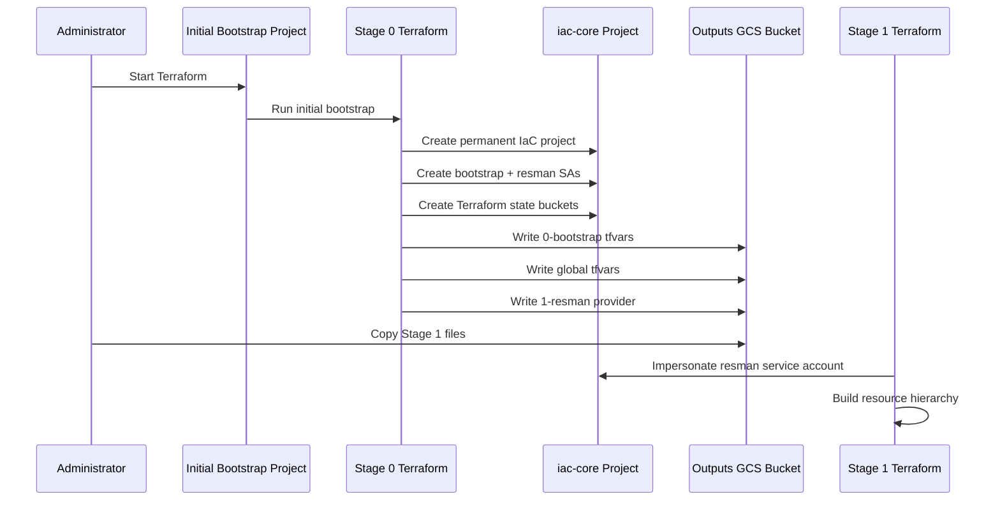

That is why the stages look somewhat complicated.

They are deliberately **bootstrapping the next stage's permissions and Terraform backend**.

---

# 13. Stage 0 also creates centralized logging infrastructure

Your uploaded Terraform creates a project called:

```text
<prefix>-prod-audit-logs-0
```

under Common Services.

Its job is organization-level logging.

Depending on `log_sinks`, logging can go to:

```text
Cloud Logging bucket
BigQuery
GCS
Pub/Sub
```

The Stage 0 code creates the log-export project and the selected destinations, including KMS encryption. The Stage 0 README says logging is deliberately created early so there is an audit trail from the beginning. ([GitHub][3])

Conceptually:

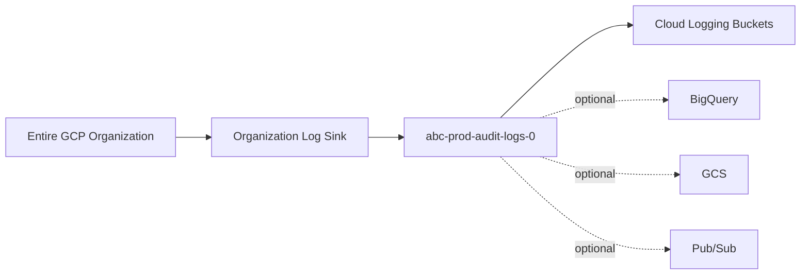

For an AWS engineer:

```text
GCP organization log sink
        ≈
Organization CloudTrail / centralized CloudWatch export

audit-logs project
        ≈
AWS Log Archive account
```

---

# 14. Stage 0 also has a billing project

When the billing account is handled at the organization level, the code creates:

```text
<prefix>-prod-billing-exp-0
```

with a BigQuery dataset:

```text
billing_export
```

This is approximately analogous to:

```text
AWS CUR / Cost and Usage Report
        ↓
Central billing/data account
        ↓
Athena/S3 analysis
```

but in GCP the billing export commonly goes to BigQuery.

---

# 15. Stage 0 final picture

After Stage 0, think of the environment approximately like this:

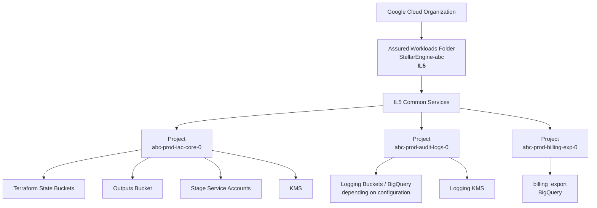

Notice what is **not here yet**:

```text
No application VPC
No actual tenant networking
No Palo Alto
No production application VM
```

Stage 0 is primarily **governance + automation + foundational services**.

---

# 16. Stage 1 — Resource Management

`resman` simply means:

> **Resource Management**

Stage 1 starts building the actual organizational layout.

The repository describes Stage 1 as provisioning Prod, Int and Test folders and tenant projects, while also laying out the folders needed by subsequent networking and security stages. ([GitHub][7])

Your `terraform.tfvars` example is:

```hcl
fast_features = {
  envs = true
}

envs_folders = {
  Prod = {...}
  Int  = {...}
  Test = {...}
}
```

and:

```hcl
tenants = {
  ten-1 = {...}
  ten-2 = {...}
}
```


---

# 17. Stage 1 creates environment folders

The code loops over:

```hcl
var.envs_folders
```

and creates each one directly under the Assured Workloads folder. ([GitHub][8])

If the regime is IL5:

```text
StellarEngine-abc
├── IL5 Prod
├── IL5 Int
└── IL5 Test
```

Diagram:

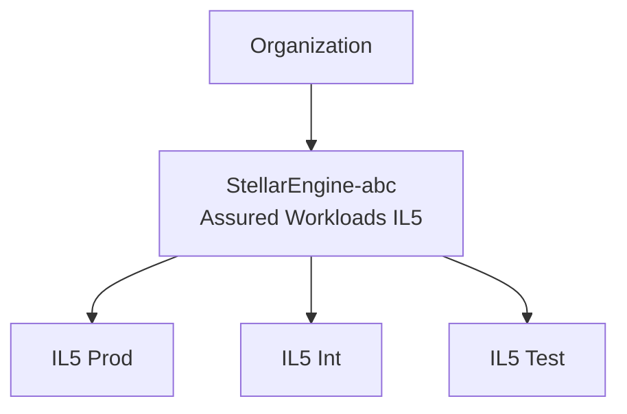

This is approximately like:

```text
AWS Organization
└── Workloads OU
    ├── Production OU
    ├── Integration OU
    └── Test OU
```

---

# 18. Stage 1 also creates Networking and Security folders

These are created underneath **Common Services**, not under Prod/Test/Int.

The networking Terraform explicitly creates:

```text
Common Services
└── Networking
```

([GitHub][9])

and security creates:

```text
Common Services
└── Security
```

([GitHub][10])

So now:

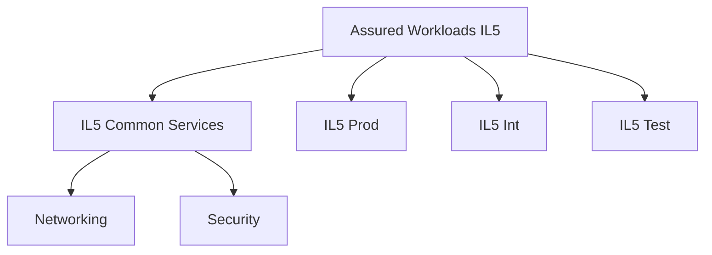

Stage 1 does **not yet build the VPC itself**.

It creates:

```text
Networking folder
Networking automation identity
Networking Terraform state bucket
Networking permissions
```

so that Stage 2 can later build networking there.

Same concept for Security.

---

# 19. This is a very important pattern

Stage 1 essentially says:

```text
I will not build the network.

I will create:
   WHERE network resources belong
   WHO is allowed to create them
   WHERE Terraform state lives
   WHAT IAM they receive
```

Then Stage 2 says:

```text
Now I will actually create VPCs, subnets,
firewall policies, NGFWs, etc.
```

This separation is deliberate.

---

# 20. The really interesting part: `tenants × environments`

Your current code does something worth understanding.

It computes:

```hcl
for every environment
    for every tenant
```

The Terraform literally builds `tenant_envs` from the Cartesian product of `envs_folders` and `tenants`. ([GitHub][11])

If you have:

```text
Environments:
Prod
Int
Test
```

and:

```text
Tenants:
ten-1
ten-2
```

Stellar produces:

```text
Prod-ten-1
Prod-ten-2

Int-ten-1
Int-ten-2

Test-ten-1
Test-ten-2
```

This is a crucial concept.

---

# 21. Tenant folder creation

For every environment/tenant combination, it creates a folder underneath the environment folder.

The code does:

```hcl
parent = module.branch-envs-folders[each.value.env].id

name = "Project ${each.value.tenant} ${each.value.env}"
```

([GitHub][11])

Therefore:

```text
IL5 Prod
├── Project ten-1 Prod
└── Project ten-2 Prod

IL5 Int
├── Project ten-1 Int
└── Project ten-2 Int

IL5 Test
├── Project ten-1 Test
└── Project ten-2 Test
```

---

# 22. Then two projects are created for each combination

Inside:

```text
Project ten-1 Prod
```

the code creates approximately:

```text
abc-prod-ten-1-iac-core-0
abc-prod-ten-1-main-0
```

The `iac-core` project is explicitly created under the tenant/environment folder. ([GitHub][11])

The `main` project is also created under that same folder. ([GitHub][11])

So:

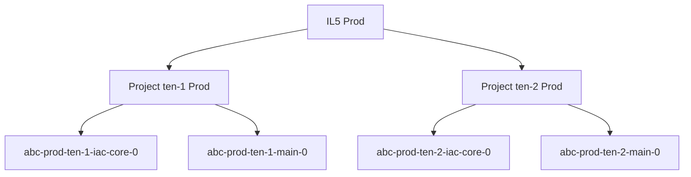

---

# 23. What is the tenant `iac-core` project versus `main` project?

This naming becomes easier if you translate it to AWS.

### Tenant IaC project

```text
abc-prod-ten-1-iac-core-0
```

Purpose:

```text
Terraform state
Terraform automation SA
Terraform output files
Terraform tooling
```

Think:

> **Tenant's Terraform/tooling AWS account**

The code places tenant output and state GCS buckets inside this IaC project and creates a tenant Terraform automation service account there. ([GitHub][11])

### Tenant main project

```text
abc-prod-ten-1-main-0
```

Purpose:

```text
Actual tenant workload foundation
```

Think:

> **Tenant workload AWS account**

This will later be where actual tenant resources can be built.

---

# 24. So the complete Stage 0 + Stage 1 hierarchy is approximately this

This diagram is the one I would keep beside you while reading Stellar Engine:

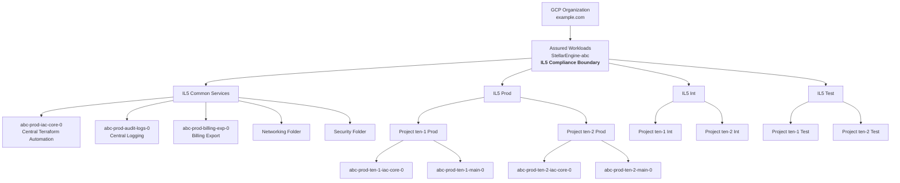

I intentionally didn't draw all 12 tenant projects because the diagram gets too large, but the same two-project pattern exists for each environment/tenant pair.

---

# 25. With your sample: how many resources does that mean?

You have:

```text
3 environments:
Prod
Int
Test

2 tenants:
ten-1
ten-2
```

Therefore:

```text
3 × 2 = 6 tenant/environment folders
```

and since each gets:

```text
1 IaC project
1 Main project
```

you get:

```text
6 × 2 = 12 tenant projects
```

So the hierarchy logic is:

```text
Environment
    ↓
Tenant
    ↓
IaC project + workload project
```

This is one of the most important things to understand before touching Stage 2 networking.

---

# 26. One subtle issue in the documentation

There is one thing that can genuinely make the documentation confusing.

The Stage 1 README still describes a lightweight tenancy model involving something conceptually like:

```text
Tenants
└── Tenant
    ├── Core
    └── Self
```

and says the hierarchy creates a `Tenants` branch. ([GitHub][7])

However, **the `branch-tenants.tf` version you uploaded/current code does not create separate Core and Self folders** in that way.

Instead, it creates:

```text
Environment
└── Project <tenant> <environment>
    ├── tenant IaC project
    └── tenant Main project
```

The Terraform confirms that `tenant-core-folders-iam` and `tenant-self-folders-iam` point back at the **same tenant folder ID** with:

```hcl
folder_create = false
```

rather than creating separate Core and Self folders. ([GitHub][11])

So while learning **this Stellar Engine version, follow the actual Terraform and your DDG rather than taking every older README hierarchy diagram literally**.

That discrepancy is probably contributing to the confusion.

---

# 27. What Stage 1 creates for networking

Stage 1's networking portion does **not** yet create:

```text
VPC
Subnet
Cloud Router
Cloud NAT
Palo Alto
Firewall
```

Instead it creates approximately:

```text
Networking Folder

Central automation project:
    networking Terraform Service Account
    networking read-only Service Account
    networking Terraform state bucket

IAM:
    gcp-vpc-network-admins permissions
    Terraform SA permissions
```

Conceptually:

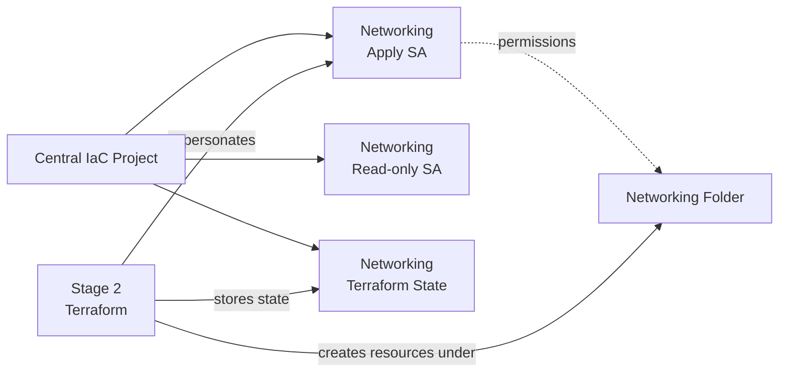

That is why you see networking code in `1-resman`, even though this is not the networking stage.

Stage 1 is **preparing Stage 2**.

---

# 28. Same thing for security

It creates:

```text
Security Folder

security apply SA
security read-only SA
security Terraform state bucket
security IAM
```

Then Stage 3 consumes those.

So there is a repeated pattern:

```text
Stage N
    |
    +-- Creates its own resources
    |
    +-- Creates identity/backend/config
        for Stage N+1
```

---

# 29. The most important Terraform pattern in Stellar Engine

Once you see this, the repository becomes much easier to read:

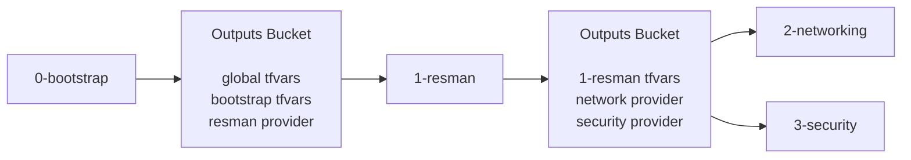

Each stage doesn't start independently.

It consumes facts discovered/created by previous stages.

For example, Stage 1 needs to know:

```text
What is the Organization ID?
What is the Assured Workloads folder ID?
What is the Common Services folder ID?
What is the automation project ID?
What output bucket should I use?
Which service account should I impersonate?
What billing account should projects use?
```

Stage 0 already knows those things.

So instead of making you manually type them again, Stage 0 generates:

```text
0-bootstrap.auto.tfvars.json
0-globals.auto.tfvars.json
1-resman-providers.tf
```

That is quite a good design once the pattern is understood.

---

# 30. AWS translation of Stage 0 and Stage 1

If Stellar Engine were conceptually implemented in AWS, think of it this way:

| Stellar/GCP                  | AWS mental equivalent                             |
| ---------------------------- | ------------------------------------------------- |
| Existing GCP Organization    | Existing AWS Organization                         |
| Assured Workloads IL5 folder | GovCloud/compliance-governed top-level OU concept |
| Common Services folder       | Infrastructure OU                                 |
| `iac-core-0` project         | Terraform/Deployment account                      |
| `audit-logs-0` project       | Log Archive account                               |
| `billing-exp-0` project      | Billing/FinOps account                            |
| Networking folder            | Network OU                                        |
| Security folder              | Security OU                                       |
| Prod / Int / Test folders    | Environment OUs                                   |
| Tenant folder                | Mission Owner / workload OU                       |
| Tenant `iac-core` project    | Tenant IaC account                                |
| Tenant `main` project        | Tenant workload account                           |
| GCS Terraform bucket         | S3 Terraform backend                              |
| Stage Service Account        | Terraform IAM role                                |
| SA impersonation             | `sts:AssumeRole`                                  |
| Organization Policy          | Roughly SCP-style governance                      |
| Folder IAM inheritance       | OU-level inherited governance                     |

This AWS analogy gets you about 80% of the way there.

---

# 31. The two stages in one sentence each

### `0-bootstrap`

> **Create the compliant root, organization guardrails, centralized automation, Terraform identities/backends, logging and foundational projects.**

```text
Organization
    ↓
Assured Workloads
    ↓
Common Services
    ↓
Central IaC / Logging / Billing
```

### `1-resman`

> **Create the organization/folder/project hierarchy and give later networking/security/workload stages their dedicated Terraform identities and state stores.**

```text
Assured Workloads
├── Common Services
│   ├── Networking
│   └── Security
│
├── Prod
│   └── Tenant
│       ├── IaC Project
│       └── Main Project
│
├── Int
│   └── ...
│
└── Test
    └── ...
```

---

# 32. The order of operation I would use when studying the repository

Don't read every `.tf` file yet. Read Stellar Engine in this mental order:

```text
0-bootstrap
   │
   ├── organization.tf
   │      "What is my compliance/governance boundary?"
   │
   ├── automation.tf
   │      "Who will run future Terraform?"
   │
   ├── log-export.tf
   │      "Where do central logs go?"
   │
   ├── billing.tf
   │      "Where does billing data go?"
   │
   └── outputs.tf
          "What information do I hand to Stage 1?"

                ↓

1-resman
   │
   ├── branch-envs.tf
   │      "Create Prod / Int / Test"
   │
   ├── branch-tenants.tf
   │      "Create tenant folders/projects"
   │
   ├── branch-networking.tf
   │      "Prepare networking hierarchy + Terraform identity"
   │
   ├── branch-security.tf
   │      "Prepare security hierarchy + Terraform identity"
   │
   └── outputs.tf
          "What information do I hand to Stage 2/3?"
```

That is much easier than opening `main.tf`, seeing dozens of modules, and trying to understand everything at once.

The Cloud Foundation Fabric that Stellar is based on is itself designed as an organization-wide landing-zone toolkit built from reusable Terraform modules. ([GitHub][12])

---

## The picture I would keep in your head

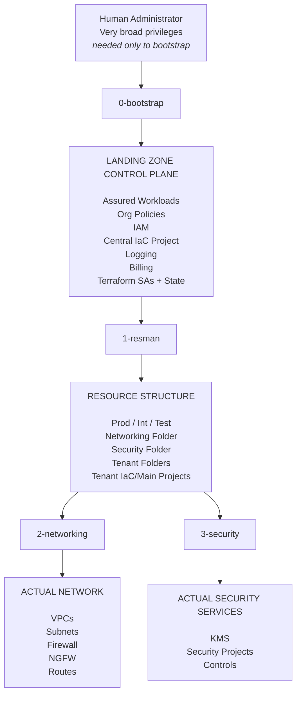

The distinction to remember is **“folder/project creation” versus “service/resource creation.”** `1-resman` creates the *places and permissions* where later resources will live; `2-networking` is where you should expect the actual VPC/network data plane to start appearing. ([GitHub][7])

A useful next step is to walk through **`0-bootstrap` file by file (`organization.tf → automation.tf → outputs.tf`) and then trace exactly what happens when you run `terraform apply`, including the service-account impersonation and local-state → GCS-state migration**. That is the part that usually makes the entire Stellar Engine design click for an AWS engineer.

[1]: https://docs.cloud.google.com/resource-manager/docs/cloud-platform-resource-hierarchy?authuser=6&utm_source=chatgpt.com "About resource hierarchy  |  Resource Manager  |  Google Cloud Documentation"
[2]: https://docs.cloud.google.com/assured-workloads/docs/key-concepts?utm_source=chatgpt.com "Key concepts  |  Assured Workloads  |  Google Cloud Documentation"
[3]: https://github.com/google/stellar-engine/tree/main/fast/stages-aw/0-bootstrap "stellar-engine/fast/stages-aw/0-bootstrap at main · google/stellar-engine · GitHub"
[4]: https://github.com/google/stellar-engine/blob/main/fast/stages-aw/0-bootstrap/organization.tf "stellar-engine/fast/stages-aw/0-bootstrap/organization.tf at main · google/stellar-engine · GitHub"
[5]: https://github.com/google/stellar-engine/blob/main/fast/stages-aw/0-bootstrap/automation.tf "stellar-engine/fast/stages-aw/0-bootstrap/automation.tf at main · google/stellar-engine · GitHub"
[6]: https://github.com/google/stellar-engine/blob/main/fast/stages-aw/0-bootstrap/outputs.tf "stellar-engine/fast/stages-aw/0-bootstrap/outputs.tf at main · google/stellar-engine · GitHub"
[7]: https://github.com/google/stellar-engine/tree/main/fast/stages-aw/1-resman "stellar-engine/fast/stages-aw/1-resman at main · google/stellar-engine · GitHub"
[8]: https://github.com/google/stellar-engine/blob/main/fast/stages-aw/1-resman/branch-envs.tf "stellar-engine/fast/stages-aw/1-resman/branch-envs.tf at main · google/stellar-engine · GitHub"
[9]: https://github.com/google/stellar-engine/blob/main/fast/stages-aw/1-resman/branch-networking.tf "stellar-engine/fast/stages-aw/1-resman/branch-networking.tf at main · google/stellar-engine · GitHub"
[10]: https://github.com/google/stellar-engine/blob/main/fast/stages-aw/1-resman/branch-security.tf "stellar-engine/fast/stages-aw/1-resman/branch-security.tf at main · google/stellar-engine · GitHub"
[11]: https://github.com/google/stellar-engine/blob/main/fast/stages-aw/1-resman/branch-tenants.tf "stellar-engine/fast/stages-aw/1-resman/branch-tenants.tf at main · google/stellar-engine · GitHub"
[12]: https://github.com/GoogleCloudPlatform/cloud-foundation-fabric?utm_source=chatgpt.com "GitHub - GoogleCloudPlatform/cloud-foundation-fabric: End-to-end modular samples and landing zones toolkit for Terraform on GCP. · GitHub"
