# Google Stellar Engine — Understanding Stage 0 Bootstrap and Stage 1 Resource Management

## 1. High-Level Mental Model

Google Stellar Engine is building a **regulated Google Cloud landing zone** in stages.

For an AWS engineer, the easiest way to understand the first two stages is:

> **Stage 0 builds the landing-zone control plane.**
> **Stage 1 builds the organizational structure and prepares the automation for networking, security, and tenant workloads.**

Actual VPCs, subnets, routing, Cloud NAT, and firewalls are primarily introduced later in **Stage 2 Networking**.

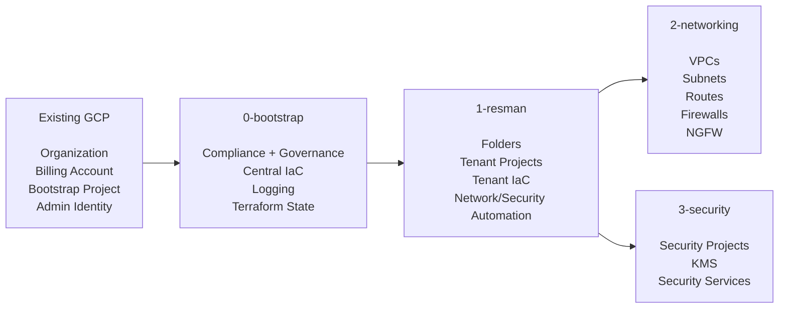

---

# 2. First Understand the Google Cloud Hierarchy

Google Cloud uses this hierarchy:

```text
Organization
    ↓
Folder
    ↓
Subfolder
    ↓
Project
    ↓
Resources
```

For example:

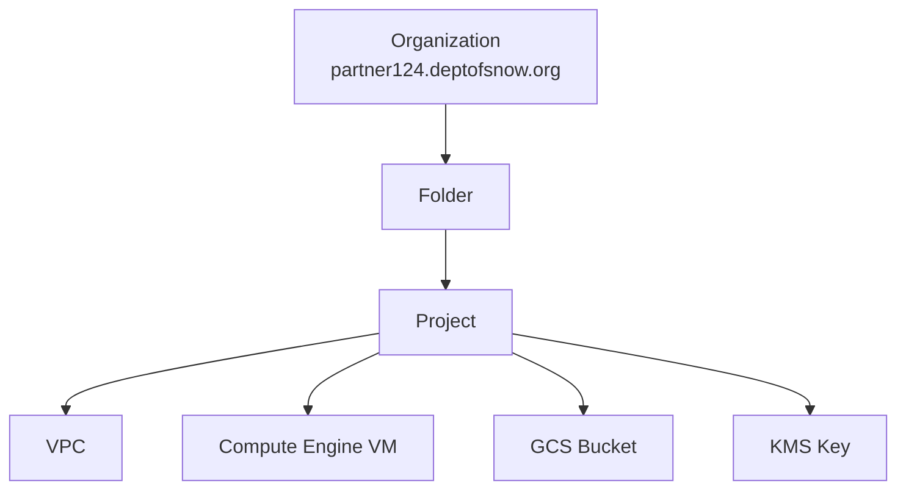

For an AWS engineer, an approximate mental mapping is:

| Google Cloud                  | AWS Mental Model                              |
| ----------------------------- | --------------------------------------------- |
| Organization                  | AWS Organization                              |
| Folder                        | AWS OU                                        |
| Project                       | Roughly an AWS Account                        |
| Organization Policy           | Roughly SCP-style guardrail                   |
| IAM inherited from folder     | OU-level inherited governance concept         |
| Service Account               | IAM Role / workload identity                  |
| GCS Terraform bucket          | S3 Terraform backend                          |
| Service Account impersonation | `sts:AssumeRole`                              |
| Assured Workloads folder      | Compliance-controlled organizational boundary |

The mapping is conceptual rather than exact, but it is extremely useful when learning Stellar Engine.

---

# 3. Where Assured Workloads Fits

Stellar Engine first creates an **Assured Workloads compliance boundary**.

For an IL4/IL5 deployment, conceptually:

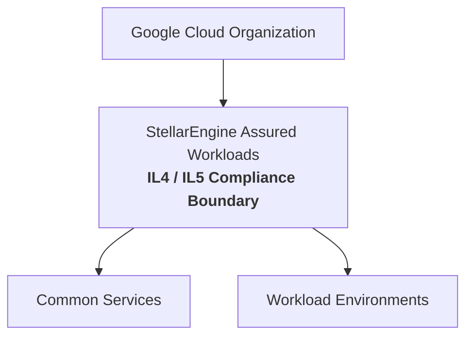

Everything that Stellar Engine subsequently places below this branch is intended to inherit the applicable compliance controls.

Your Stage 0 Terraform state confirms that the Assured Workloads object itself exists:

```text
google_assured_workloads_workload.primary[0]
```

This is different from a normal `google_folder` Terraform resource. Assured Workloads creates/manages the regulated workload boundary through the Assured Workloads API.

---

# 4. Stage 0 — Bootstrap

## High-Level Purpose

Stage 0 answers:

> **Who controls this landing zone, what compliance boundary applies, where will Terraform state live, and where will centralized logging and foundational automation live?**

It does **not** primarily build tenant workloads or networking.

The actual Stage 0 state shows that it creates:

* Assured Workloads
* Common Services folder
* Central IaC project
* Audit/logging project
* Billing export project
* Terraform service accounts
* Terraform state buckets
* Terraform outputs bucket
* KMS
* Organization Policies
* Organization IAM
* Organization logging sinks
* Central logging buckets
* Log-based metrics
* Monitoring alerts
* Billing export dataset
* Provider/tfvars files used by the next stage

---

# 5. Stage 0 Starts From Existing Infrastructure

Before Stage 0 runs, you already need approximately:

```text
Google Cloud Organization
Billing Account
Cloud Identity / Workspace domain
Administrative groups
Temporary Bootstrap Project
Privileged deployment identity
```

Conceptually:

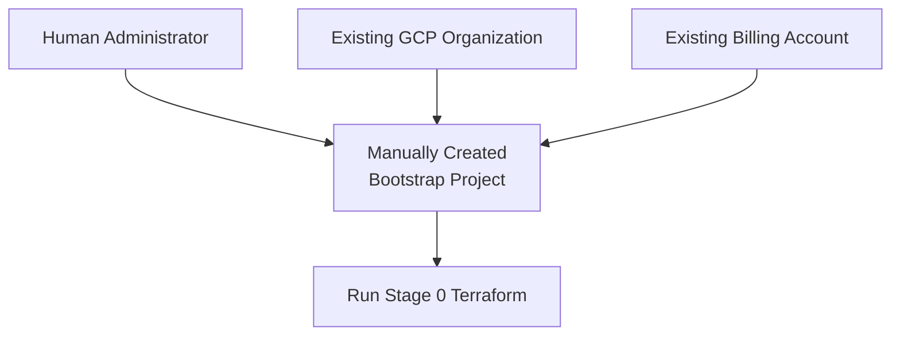

The manually created bootstrap project is primarily the **starting point**.

It is not the final permanent Terraform control plane.

---

# 6. Stage 0 Creates the Compliance and Common Services Hierarchy

One of the major Stage 0 resources in your state is:

```text
google_assured_workloads_workload.primary[0]
```

It also creates:

```text
module.branch-common-services-folder.google_folder.folder[0]
```

Conceptually:

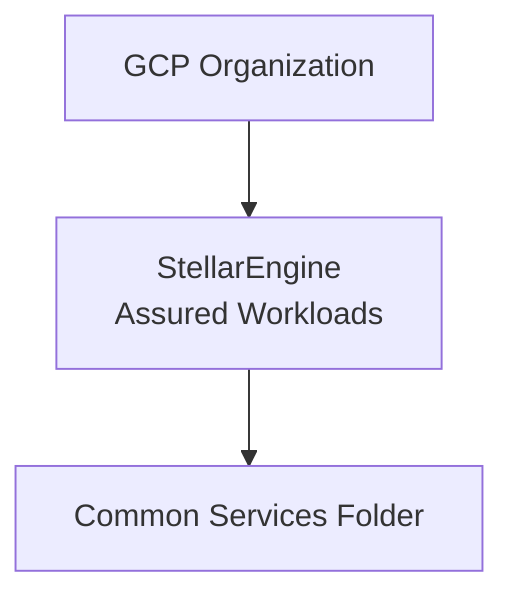

Think of **Common Services** as roughly analogous to an AWS infrastructure/platform OU.

Later it contains centralized capabilities such as:

```text
Common Services
├── Central IaC
├── Central Logging
├── Billing
├── Networking
└── Security
```

---

# 7. Stage 0 Creates Three Major Projects

Your actual state shows three managed `google_project` resources.

With your `p08124` prefix, the important projects are:

```text
p08124-prod-iac-core-0
p08124-prod-audit-logs-0
p08124-prod-billing-exp-0
```

Their purposes are very different.

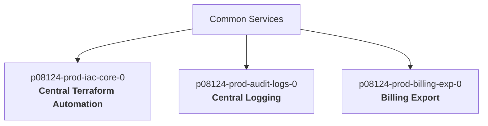

### AWS comparison

| GCP Project     | Approximate AWS Equivalent     |
| --------------- | ------------------------------ |
| `iac-core-0`    | Terraform / Deployment account |
| `audit-logs-0`  | Log Archive account            |
| `billing-exp-0` | Billing / FinOps account       |

---

# 8. `iac-core-0` — The Most Important Stage 0 Project

The `p08124-prod-iac-core-0` project becomes the central infrastructure automation project.

It contains the identities and storage required for subsequent Terraform stages.

Your state shows four important service accounts:

```text
p08124-prod-bootstrap-0
p08124-prod-bootstrap-0r

p08124-prod-resman-0
p08124-prod-resman-0r
```

The naming convention is important:

```text
bootstrap-0
    Stage 0 apply identity

bootstrap-0r
    Stage 0 read/plan identity

resman-0
    Stage 1 apply identity

resman-0r
    Stage 1 read/plan identity
```

Think:

```text
AWS:

TerraformBootstrapRole
TerraformBootstrapReadRole

TerraformResourceManagerRole
TerraformResourceManagerReadRole
```

---

# 9. Stage 0 Creates Three Important Terraform GCS Buckets

Your state contains three managed GCS buckets:

```text
module.automation-tf-bootstrap-gcs
module.automation-tf-resman-gcs
module.automation-tf-output-gcs
```

Their purposes are approximately:

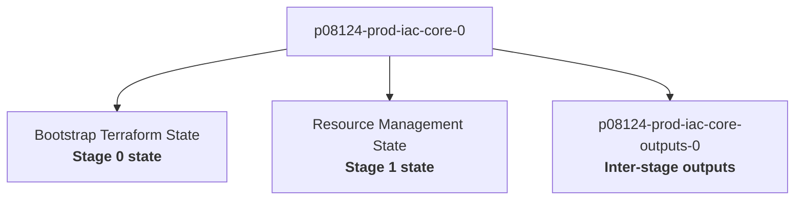

This distinction is critical.

### Terraform state bucket

Stores something equivalent to:

```text
terraform.tfstate
```

### Outputs bucket

Stores information that later Terraform stages need:

```text
providers/
tfvars/
generated configuration
```

So the outputs bucket is effectively a:

> **Terraform stage-to-stage configuration bus.**

---

# 10. Stage 0 Generates Stage 1 Configuration

Your state explicitly contains objects such as:

```text
google_storage_bucket_object.providers["0-bootstrap"]
google_storage_bucket_object.providers["0-bootstrap-r"]

google_storage_bucket_object.providers["1-resman"]
google_storage_bucket_object.providers["1-resman-r"]

google_storage_bucket_object.tfvars
google_storage_bucket_object.tfvars_globals
```

Conceptually:

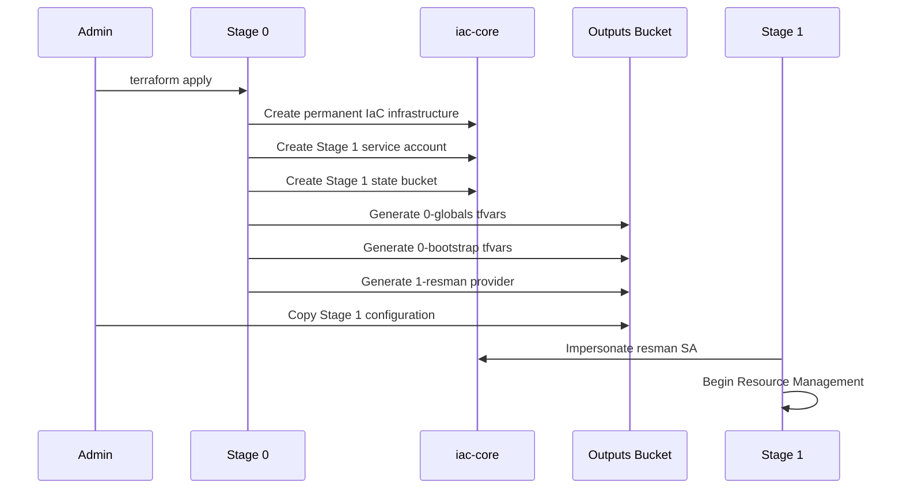

This is why the deployment guide makes you copy files such as:

```text
1-resman-providers.tf
0-globals.auto.tfvars.json
0-bootstrap.auto.tfvars.json
```

before running Stage 1.

---

# 11. Stage 0 Configures Organization-Wide Guardrails

A very large portion of your Stage 0 state is organization governance.

Your sample contains **72 `google_org_policy_policy` state resources**, plus **2 custom organization policy constraints**.

Examples include:

```text
compute.skipDefaultNetworkCreation
compute.requireOsLogin
compute.requireShieldedVm
compute.requireVpcFlowLogs
compute.vmExternalIpAccess

sql.restrictPublicIp

storage.publicAccessPrevention
storage.secureHttpTransport
storage.uniformBucketLevelAccess

iam.disableServiceAccountKeyCreation
iam.disableServiceAccountKeyUpload

gcp.resourceLocations
gcp.restrictNonCmekServices
gcp.restrictTLSVersion
```

There are also custom constraints such as:

```text
custom.kmsRotation
custom.restrictFirewallRanges
```

This is one of the reasons Stage 0 is much more important than simply “creating an IaC project.”

It establishes many of the **organization-level security guardrails** that workloads will inherit.

---

# 12. Stage 0 Creates Organization IAM

Your state contains extensive:

```text
google_organization_iam_binding
google_organization_iam_member
google_organization_iam_custom_role
```

resources.

This includes permissions for groups such as:

```text
gcp-organization-admins
gcp-security-admins
gcp-vpc-network-admins
gcp-billing-admins
```

and permissions for the bootstrap and resource-manager Terraform service accounts.

The state also shows **seven custom organization IAM roles**, including concepts such as:

```text
organization_admin_viewer
organization_iam_admin
service_project_network_admin
storage_viewer
tag_viewer
tenant_network_admin
gcve_network_admin
```

So Stage 0 is establishing both:

```text
Human Administration
        +
Terraform Administration
```

at the organization level.

---

# 13. Stage 0 Centralized Logging

The sample state clearly shows a central logging architecture.

There are four organization sinks:

```text
audit-logs
empty-audit-logs
vpc-sc
workspace-audit-logs
```

and four corresponding Cloud Logging buckets.

Conceptually:

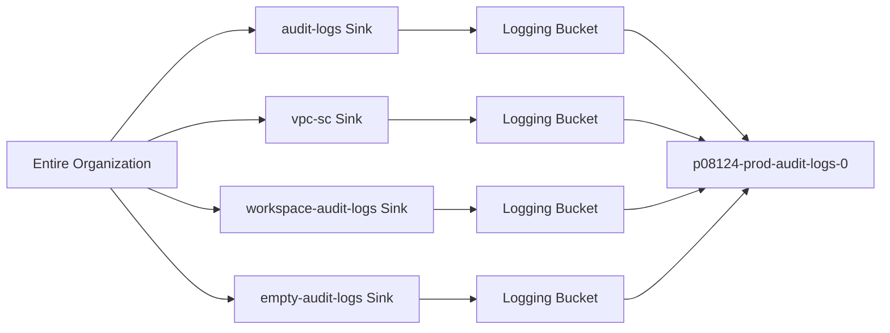

For an AWS engineer:

```text
Organization Logging Sink
        ≈
Organization-wide log aggregation

audit-logs project
        ≈
AWS Log Archive account
```

---

# 14. Stage 0 Creates Logging KMS

Your state shows two main KMS key purposes:

```text
gcs
log-sink
```

through:

```text
module.gcs-kms
module.logging-kms
```

Conceptually:

```text
KMS
├── Key used for Terraform/GCS infrastructure
└── Key used for centralized logging
```

This is supporting CMEK-oriented encryption requirements.

---

# 15. Stage 0 Creates Security Monitoring

This was not obvious from the high-level documentation, but it is very visible in your Terraform state.

For each of these three projects:

```text
p08124-prod-iac-core-0
p08124-prod-audit-logs-0
p08124-prod-billing-exp-0
```

Stellar creates log metrics for changes such as:

```text
audit-config-change
custom-role-change
project-owner-log
sql-config-change
storage-iam-change
vpc-firewall-change
vpc-network-change
vpc-route-change
```

and corresponding monitoring alert policies.

Your sample therefore contains:

```text
24 log-based metrics
24 monitoring alert policies
3 email notification channels
```

This is:

```text
8 monitored events
×
3 foundational projects
=
24 metrics + 24 alerts
```

Conceptually:

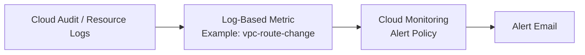

---

# 16. Stage 0 Billing Project

Stage 0 also creates:

```text
p08124-prod-billing-exp-0
```

and your state includes:

```text
module.billing-export-dataset[0].google_bigquery_dataset.default
```

Conceptually:

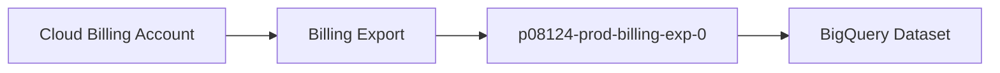

For AWS engineers, think roughly:

```text
AWS Cost and Usage Report
    ↓
S3 / Athena

versus

GCP Billing Export
    ↓
BigQuery
```

---

# 17. Actual Stage 0 Resource Summary

Based on your Stage 0 `terraform state list`, the important managed-resource counts are approximately:

| Resource                   | Sample Count | Purpose                                |
| -------------------------- | -----------: | -------------------------------------- |
| Assured Workloads workload |            1 | Compliance boundary                    |
| Normal folder              |            1 | Common Services                        |
| Projects                   |            3 | IaC, logging, billing                  |
| GCS Terraform buckets      |            3 | Bootstrap state, Resman state, outputs |
| Terraform service accounts |            4 | Bootstrap/Resman apply + read          |
| KMS key rings              |            2 | Terraform/GCS and logging              |
| KMS crypto keys            |            2 | GCS and logging encryption             |
| Organization log sinks     |            4 | Centralized log routing                |
| Cloud Logging buckets      |            4 | Central log destinations               |
| Organization policies      |           72 | Security/compliance guardrails         |
| Custom org constraints     |            2 | Additional Stellar controls            |
| Custom IAM roles           |            7 | Specialized permissions                |
| Log metrics                |           24 | Security/change detection              |
| Alert policies             |           24 | Monitoring                             |
| Notification channels      |            3 | Alert delivery                         |
| BigQuery billing dataset   |            1 | Cost/billing export                    |

The raw state contains many additional IAM bindings, API enablements, service identities, provider objects, local files, liens, and supporting resources.

---

# 18. Stage 0 End State

The high-level environment after Stage 0 therefore looks approximately like this:

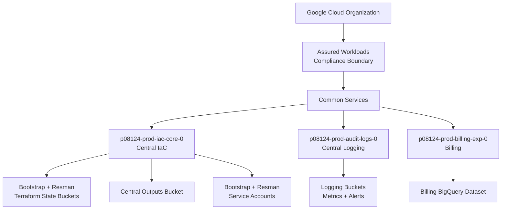

The most important point is:

> **There is still no tenant VPC at this stage.**

Stage 0 is the **landing-zone governance and Terraform control plane**.

---

# 19. Stage 1 — Resource Management

Stage 1 answers a different question:

> **What folders and projects should exist, where should tenants live, and which Terraform identities/backends will manage networking, security, and tenant infrastructure?**

Your Stage 1 state is much larger than Stage 0 because you configured:

```text
Environments:
    Int
    Prod
    Test

Tenants:
    g4g
    ten1
```

Stellar therefore builds combinations of:

```text
Environment × Tenant
```

giving:

```text
Int-g4g
Int-ten1

Prod-g4g
Prod-ten1

Test-g4g
Test-ten1
```

That creates **six tenant/environment combinations**.

---

# 20. Stage 1 Creates Three Environment Folders

Your state explicitly contains:

```text
module.branch-envs-folders["Int"]
module.branch-envs-folders["Prod"]
module.branch-envs-folders["Test"]
```

Conceptually:

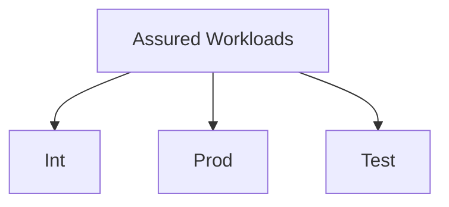

Each folder receives IAM such as:

```text
compute.xpnAdmin
logging.admin
owner
resourcemanager.folderAdmin
resourcemanager.projectCreator
```

The important concept is that these become **environment governance boundaries**.

---

# 21. Stage 1 Creates Networking and Security Folders

Your state explicitly includes:

```text
module.branch-network-folder.google_folder.folder[0]

module.branch-security-folder.google_folder.folder[0]
```

Conceptually:

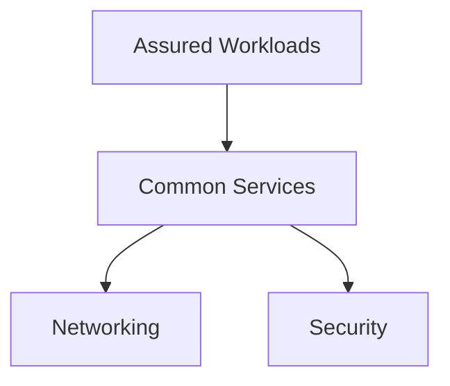

These folders do not themselves represent VPCs or KMS projects.

They establish the branches underneath which later stages operate.

---

# 22. Stage 1 Creates Six Tenant Folders

Your actual state contains:

```text
module.tenant-top-folders["Int-g4g"]
module.tenant-top-folders["Int-ten1"]

module.tenant-top-folders["Prod-g4g"]
module.tenant-top-folders["Prod-ten1"]

module.tenant-top-folders["Test-g4g"]
module.tenant-top-folders["Test-ten1"]
```

Therefore Stage 1 creates:

```text
3 environment folders
+
2 Common Services branch folders
+
6 tenant folders
=
11 folders
```

This exactly matches the **11 `google_folder` resources** in your state.

---

# 23. The Stage 1 Hierarchy

Conceptually:

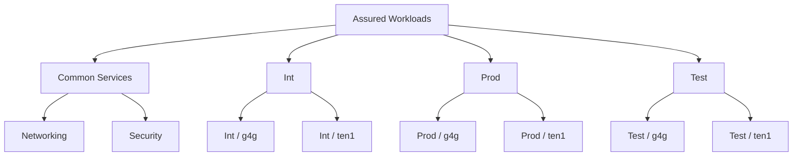

---

# 24. Stage 1 Creates Two Projects Per Tenant/Environment

This is one of the most important pieces of the design.

For each:

```text
Environment + Tenant
```

Stellar creates:

```text
Tenant IaC Project
        +
Tenant Main Project
```

Your Terraform state contains:

```text
module.tenant-self-iac-projects[...].google_project.project[0]

module.tenant-self-main-projects[...].google_project.project[0]
```

for all six combinations.

Therefore:

```text
6 tenant/environment combinations
×
2 projects
=
12 projects
```

That exactly matches the **12 `google_project` resources** in your Stage 1 state.

---

# 25. Tenant IaC Project Versus Main Project

For example, conceptually:

```text
Prod / ten1
│
├── p08124-prod-ten1-iac-0
│
└── p08124-prod-ten1-main-0
```

The exact naming of all project IDs is best taken from the applied project outputs, but the state clearly shows the six IaC and six Main project resources.

## IaC project

Purpose:

```text
Terraform automation
Terraform service account
Terraform state
Terraform generated outputs
Supporting APIs
```

AWS mental model:

> **Mission Owner / tenant Terraform account**

## Main project

Purpose:

```text
Tenant workload foundation
Future application resources
Compute
GKE
Storage
etc.
```

AWS mental model:

> **Mission Owner / application workload account**

---

# 26. Stage 1 Tenant Project Pattern

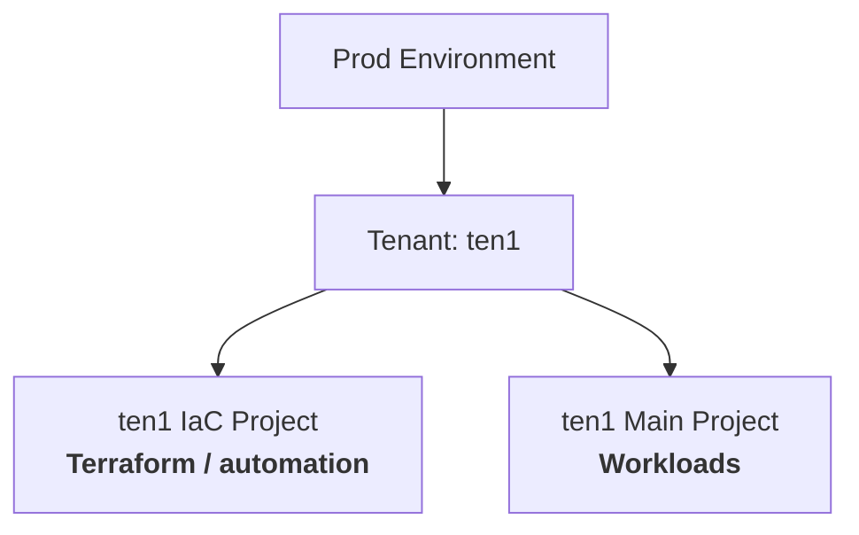

The same pattern is repeated for:

```text
Int-g4g
Int-ten1
Prod-g4g
Prod-ten1
Test-g4g
Test-ten1
```

---

# 27. Stage 1 Creates 20 GCS Buckets

Your actual Stage 1 state contains **20 managed `google_storage_bucket` resources**.

They break down logically as follows.

### Networking Terraform state

```text
1 bucket
```

### Security Terraform state

```text
1 bucket
```

### Tenant core/state buckets

```text
6 buckets
```

One per tenant/environment combination.

### Tenant IaC state buckets

```text
6 buckets
```

### Tenant IaC output buckets

```text
6 buckets
```

Therefore:

```text
1 + 1 + 6 + 6 + 6
=
20 GCS buckets
```

Diagram:

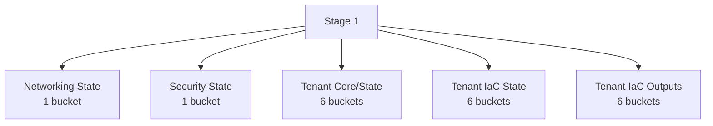

---

# 28. Stage 1 Creates 17 Service Accounts

Your state contains **17 managed service-account resources**.

The pattern is approximately:

```text
Environment branch automation SA        1

Networking apply SA                     1
Networking read SA                      1

Security apply SA                       1
Security read SA                        1

Tenant core SA                          6

Tenant self/IaC SA                      6
                                        --
                                        17
```

Again, notice what Stellar is doing:

> Stage 1 is creating the identities that future Terraform executions will impersonate.

It is not using one super-admin service account for every stage and tenant.

---

# 29. Stage 1 Prepares Stage 2 Networking

The state contains:

```text
module.branch-network-folder
module.branch-network-gcs
module.branch-network-sa
module.branch-network-r-sa
```

and generated provider files:

```text
google_storage_bucket_object.providers["2-networking"]
google_storage_bucket_object.providers["2-networking-r"]
```

That gives you:

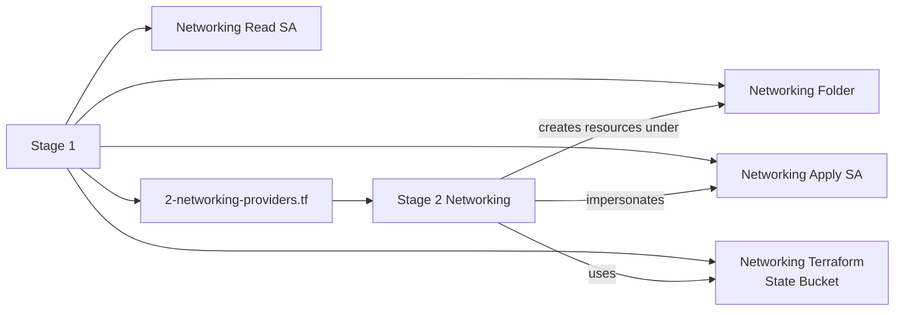

This is why you see networking-related resources in Stage 1 even though **Stage 1 does not yet build the actual network**.

Stage 1 creates:

> **Where + Who + State**

Stage 2 creates:

> **Actual network resources**

---

# 30. Stage 1 Prepares Stage 3 Security

The exact same pattern exists for security:

```text
module.branch-security-folder

module.branch-security-gcs

module.branch-security-sa

module.branch-security-r-sa
```

plus:

```text
google_storage_bucket_object.providers["3-security"]

google_storage_bucket_object.providers["3-security-r"]
```

Conceptually:

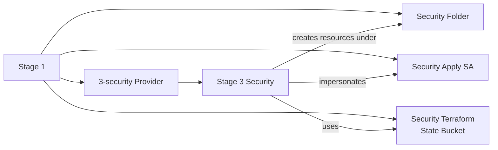

---

# 31. Stage 1 Creates Tenant KMS Resources

Another important finding from your actual state is that Stage 1 creates KMS infrastructure for every tenant/environment combination.

For example:

```text
module.tenant-project-keys["Prod-ten1"].google_kms_key_ring.default[0]

module.tenant-project-keys["Prod-ten1"].google_kms_crypto_key.default["default"]

module.tenant-project-keys["Prod-ten1"].google_kms_crypto_key.default["gcs"]
```

There are six tenant/environment combinations.

Each receives:

```text
1 KMS Key Ring

2 Crypto Keys:
    default
    gcs
```

So the sample creates:

```text
6 KMS key rings
12 KMS crypto keys
```

Conceptually:

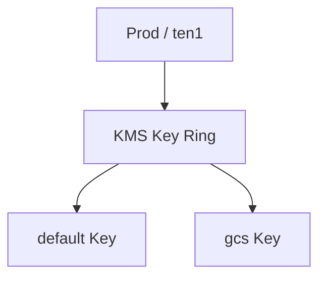

This prepares tenant projects for CMEK-oriented encrypted resources later.

---

# 32. Stage 1 Creates Tenant Monitoring

Stage 1 also creates much more monitoring than is obvious from the high-level documentation.

For each of the six tenant/environment combinations, Stellar configures monitoring for both:

```text
Core/IaC project
Main project
```

Your state contains examples such as:

```text
module.core_log_metrics["Prod-ten1"]
module.core_log_alerts["Prod-ten1"]

module.main_log_metrics["Prod-ten1"]
module.main_log_alerts["Prod-ten1"]
```

Each project receives eight monitored event types.

Therefore:

```text
6 combinations
×
2 projects
×
8 metrics
=
96 log metrics
```

and:

```text
6
×
2
×
8
=
96 monitoring alert policies
```

Your state confirms exactly:

```text
96 google_logging_metric resources
96 google_monitoring_alert_policy resources
```

---

# 33. Stage 1 Enables APIs in Tenant Projects

The large number of:

```text
google_project_service
```

resources exists because Stellar pre-enables Google APIs required by the landing zone.

Your Stage 1 state contains **264 managed API-enablements**.

Examples include:

```text
compute.googleapis.com
container.googleapis.com
cloudkms.googleapis.com
cloudbuild.googleapis.com
cloudresourcemanager.googleapis.com
iam.googleapis.com
iamcredentials.googleapis.com
orgpolicy.googleapis.com
pubsub.googleapis.com
servicenetworking.googleapis.com
storage.googleapis.com
sts.googleapis.com
```

This does **not** mean that Stage 1 creates:

```text
GKE cluster
VM
Pub/Sub topic
VPC
```

merely because their APIs are enabled.

Think of API enablement as:

> **Allow this project to use that Google service later.**

---

# 34. Actual Stage 1 Resource Summary

Based on your Stage 1 state:

| Resource              | Sample Count | Meaning                                   |
| --------------------- | -----------: | ----------------------------------------- |
| Environment folders   |            3 | Int, Prod, Test                           |
| Networking folder     |            1 | Stage 2 branch                            |
| Security folder       |            1 | Stage 3 branch                            |
| Tenant folders        |            6 | Environment × tenant                      |
| **Total folders**     |       **11** | Resource hierarchy                        |
| Tenant IaC projects   |            6 | Tenant Terraform automation               |
| Tenant Main projects  |            6 | Tenant workload projects                  |
| **Total projects**    |       **12** | Tenant foundation                         |
| GCS buckets           |           20 | Network/security/tenant state and outputs |
| Service accounts      |           17 | Stage and tenant automation identities    |
| KMS key rings         |            6 | One per tenant/environment                |
| KMS crypto keys       |           12 | `default` + `gcs`                         |
| Log metrics           |           96 | Tenant project security monitoring        |
| Alert policies        |           96 | Change/security alerts                    |
| Notification channels |           12 | Core + Main project notifications         |
| API enablements       |          264 | Required Google service APIs              |
| Generated GCS objects |           29 | Providers and tfvars for later stages     |

---

# 35. Important: Terraform State Count Is Not the Same as Visible Infrastructure Count

When you run:

```bash
terraform state list
```

you see entries such as:

```text
google_project
google_folder
google_storage_bucket
google_service_account
```

but you also see:

```text
google_project_iam_binding
google_folder_iam_binding
google_project_service
google_storage_bucket_iam_member
google_project_service_identity
google_monitoring_alert_policy
google_logging_metric
time_sleep
null_resource
```

Therefore:

> **Do not interpret 1,000 Terraform state entries as 1,000 major GCP infrastructure components.**

For example, creating one project can result in dozens of Terraform state entries because Stellar also:

```text
Creates the project
Enables 20+ APIs
Creates service identities
Applies IAM
Deletes the default VPC
Sets metadata
Creates monitoring rules
Applies encryption permissions
```

So think of the state as:

```text
Major infrastructure objects
        +
Configuration
        +
IAM
        +
Guardrails
        +
Monitoring
        +
Automation plumbing
```

---

# 36. Stage 0 Versus Stage 1 — Actual Deployment Comparison

|                     | `0-bootstrap`                         | `1-resman`                                     |
| ------------------- | ------------------------------------- | ---------------------------------------------- |
| Primary question    | Who governs/deploys the landing zone? | Where will infrastructure/workloads live?      |
| Assured Workloads   | Creates it                            | Uses it                                        |
| Common Services     | Creates base folder                   | Adds Network/Security branches                 |
| Central IaC project | Creates                               | Uses                                           |
| Audit project       | Creates                               | Uses inherited logging                         |
| Billing project     | Creates                               | Uses billing configuration                     |
| Org Policies        | Large portion created                 | Inherits/applies hierarchy                     |
| Org IAM             | Established                           | Extends for network/security/tenant automation |
| Terraform SAs       | Bootstrap + Resman                    | Network + Security + Tenant SAs                |
| Terraform State     | Stage 0 + Stage 1                     | Network + Security + tenant states             |
| Environment folders | No                                    | Prod / Int / Test                              |
| Tenant folders      | No                                    | Yes                                            |
| Tenant projects     | No                                    | IaC + Main                                     |
| Tenant KMS          | No                                    | Yes                                            |
| VPC                 | No                                    | No                                             |
| Subnets             | No                                    | No                                             |
| Cloud NAT           | No                                    | No                                             |
| NGFW                | No                                    | No                                             |
| Main purpose        | Governance/control plane              | Resource hierarchy and delegation              |

---

# 37. Combined Hierarchy After Stage 0 + Stage 1

Using your actual sample configuration:

```mermaid
flowchart TD
    ORG["Google Cloud Organization"]

    AW["StellarEngine<br/>Assured Workloads"]

    CS["Common Services"]

    CIAC["p08124-prod-iac-core-0<br/>Central Terraform"]

    AUD["p08124-prod-audit-logs-0<br/>Central Logging"]

    BILL["p08124-prod-billing-exp-0<br/>Billing"]

    NET["Networking"]

    SEC["Security"]

    INT["Int"]
    PROD["Prod"]
    TEST["Test"]

    IG["g4g"]
    IT["ten1"]

    PG["g4g"]
    PT["ten1"]

    TG["g4g"]
    TT["ten1"]

    PGIAC["Prod-g4g<br/>IaC Project"]
    PGMAIN["Prod-g4g<br/>Main Project"]

    PTIAC["Prod-ten1<br/>IaC Project"]
    PTMAIN["Prod-ten1<br/>Main Project"]

    ORG --> AW

    AW --> CS
    AW --> INT
    AW --> PROD
    AW --> TEST

    CS --> CIAC
    CS --> AUD
    CS --> BILL
    CS --> NET
    CS --> SEC

    INT --> IG
    INT --> IT

    PROD --> PG
    PROD --> PT

    TEST --> TG
    TEST --> TT

    PG --> PGIAC
    PG --> PGMAIN

    PT --> PTIAC
    PT --> PTMAIN
```

The same IaC/Main project pair exists under the Int and Test tenants as well.

---

# 38. AWS Translation of the Final Structure

For an AWS engineer, mentally translate the architecture approximately as:

```text
Google Organization
│
└── Assured Workloads
    │
    ├── Common Services
    │   │
    │   ├── Central IaC Project
    │   │      ≈ Terraform Deployment Account
    │   │
    │   ├── Audit Logs Project
    │   │      ≈ Log Archive Account
    │   │
    │   ├── Billing Project
    │   │      ≈ Billing / FinOps Account
    │   │
    │   ├── Networking Folder
    │   │      ≈ Network OU
    │   │
    │   └── Security Folder
    │          ≈ Security OU
    │
    ├── Prod
    │   ├── Tenant g4g
    │   │   ├── IaC Project
    │   │   └── Main Project
    │   │
    │   └── Tenant ten1
    │       ├── IaC Project
    │       └── Main Project
    │
    ├── Int
    │      ...
    │
    └── Test
           ...
```

---

# 39. The Most Important Stellar Engine Pattern

The entire first portion of Stellar Engine follows this pattern:

```mermaid
flowchart LR
    S0["Stage 0<br/>Bootstrap"]

    O0["Creates:<br/>Governance<br/>Central IaC<br/>Resman SA + State"]

    S1["Stage 1<br/>Resource Management"]

    O1["Creates:<br/>Hierarchy<br/>Tenants<br/>Network/Security SA + State"]

    S2["Stage 2<br/>Networking"]

    O2["Creates:<br/>Actual Network"]

    S3["Stage 3<br/>Security"]

    O3["Creates:<br/>Actual Security Services"]

    S0 --> O0 --> S1 --> O1

    O1 --> S2 --> O2
    O1 --> S3 --> O3
```

Another way to phrase it:

```text
Stage 0
    creates WHO runs Stage 1
    and WHERE Stage 1 stores state.

Stage 1
    creates WHO runs Stage 2/3
    and WHERE Stage 2/3 store state.

Stage 2
    creates the network.

Stage 3
    creates security services.
```

That is the design pattern that makes the repository much easier to understand.

---

# 40. Recommended Reading Order

When studying the Stellar Engine Terraform, do not initially try to understand every file.

Read it in this order:

```text
0-bootstrap
│
├── organization.tf
│      What is the organization/compliance boundary?
│
├── automation.tf
│      Who runs Terraform?
│      Where does Terraform state live?
│
├── log-export.tf
│      Where do organization logs go?
│
├── billing.tf
│      Where does billing information go?
│
└── outputs.tf
       What does Stage 0 hand to Stage 1?


1-resman
│
├── branch-envs.tf
│      Create Prod / Int / Test
│
├── branch-tenants.tf
│      Create tenant folders and projects
│
├── branch-networking.tf
│      Prepare Stage 2
│
├── branch-security.tf
│      Prepare Stage 3
│
└── outputs.tf
       Generate providers/tfvars for later stages
```

---

# 41. Final Mental Model

If you remember only one diagram, use this:

```mermaid
flowchart TD
    HUMAN["Human Administrator"]

    BOOT["Temporary Bootstrap Project"]

    S0["0-bootstrap"]

    CONTROL["LANDING ZONE CONTROL PLANE<br/><br/>Assured Workloads<br/>Org Policies<br/>IAM<br/>Central IaC Project<br/>Logging<br/>Billing<br/>Terraform SAs<br/>Terraform State"]

    S1["1-resman"]

    STRUCT["LANDING ZONE STRUCTURE<br/><br/>Prod / Int / Test<br/>Networking<br/>Security<br/>Tenant Folders<br/>Tenant IaC Projects<br/>Tenant Main Projects<br/>Tenant KMS<br/>Future-stage SAs/State"]

    S2["2-networking"]

    NETWORK["NETWORK DATA PLANE<br/><br/>VPCs<br/>Subnets<br/>Routes<br/>Firewall<br/>NGFW<br/>DNS"]

    S3["3-security"]

    SECURITY["SECURITY SERVICES<br/><br/>Security Projects<br/>KMS<br/>Security Controls"]

    HUMAN --> BOOT --> S0 --> CONTROL
    CONTROL --> S1 --> STRUCT

    STRUCT --> S2 --> NETWORK
    STRUCT --> S3 --> SECURITY
```

## In one sentence

> **`0-bootstrap` establishes the regulated landing-zone control plane; `1-resman` turns that control plane into a structured multi-environment, multi-tenant cloud foundation; `2-networking` and `3-security` then populate that foundation with the actual network and security infrastructure.**

The actual Terraform state from your environment strongly confirms this pattern: Stage 0 is dominated by organization policies, IAM, central projects, logging and Terraform automation, while Stage 1 expands into environment/tenant folders, 12 tenant projects, tenant-specific automation, KMS, state storage, IAM and monitoring.
