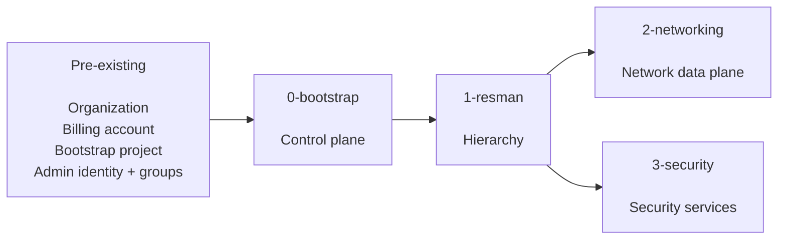
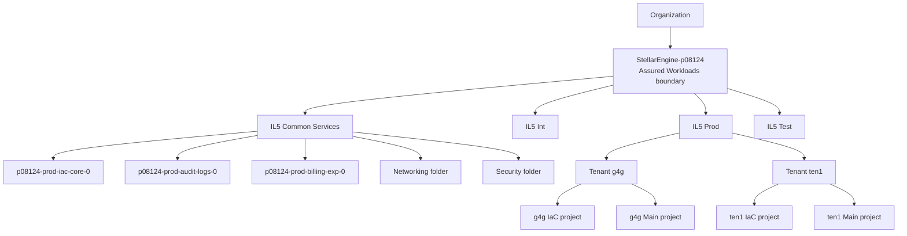
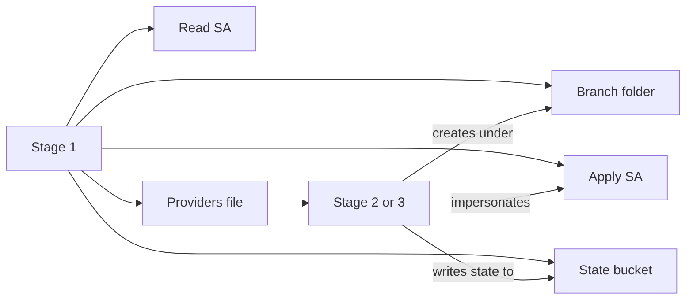
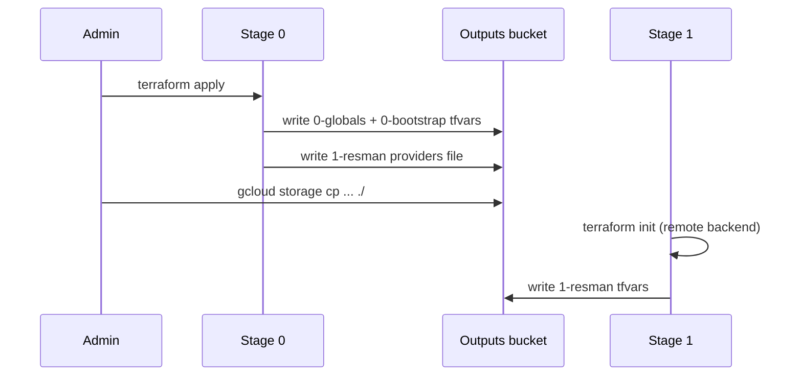

# Stellar Engine — Stages 0 and 1

A reference for the `0-bootstrap` and `1-resman` stages, written from an actual
deployment (prefix `p08124`, org `partner124.deptofsnow.org`, regime IL5).
All resource counts are taken from `terraform state list`.

---

# Part 1 — High Level

## 1.1 The core pattern

Every stage does the same thing: it creates the **identity**, the **state
storage**, and the **place in the hierarchy** that the next stage needs, then
publishes its outputs for that stage to consume.

```text
Stage 0  creates WHO runs Stage 1 and WHERE Stage 1 stores state
Stage 1  creates WHO runs Stages 2 and 3, and WHERE they store state
Stage 2  creates the actual network
Stage 3  creates the actual security services
```

Stages 0 and 1 build almost no workload infrastructure. There is no VPC, no
subnet, no VM, and no firewall rule after both have completed.



## 1.2 The Google Cloud hierarchy

Four levels. Permissions and organization policies inherit downward; nothing
inherits upward.

```text
Organization  →  Folder  →  (Subfolder)  →  Project  →  Resources
```

The billing account sits outside this tree. Projects link to it separately,
and it has its own permission model.

| Google Cloud | AWS mental model |
| --- | --- |
| Organization | AWS Organization |
| Folder | Organizational Unit |
| Project | Roughly an account |
| Organization policy | SCP-style guardrail |
| Service account | IAM role / workload identity |
| Service account impersonation | `sts:AssumeRole` |
| GCS state bucket | S3 Terraform backend |
| Assured Workloads folder | Compliance-controlled OU boundary |
| `iac-core-0` project | Terraform deployment account |
| `audit-logs-0` project | Log Archive account |
| `billing-exp-0` project | Billing / FinOps account |

The mapping is conceptual, not exact, but it holds well enough to reason with.

## 1.3 Assured Workloads

`google_assured_workloads_workload.primary[0]` is not a normal
`google_folder`. It is created through the Assured Workloads API and produces
a folder carrying compliance guarantees: data residency, personnel controls,
and a restricted list of allowed services. Everything Stellar Engine builds
sits inside it and inherits those controls.

## 1.4 Stage 0 versus Stage 1

| | `0-bootstrap` | `1-resman` |
| --- | --- | --- |
| Question answered | Who governs and deploys this? | Where does infrastructure live? |
| Assured Workloads | Creates | Uses |
| Common Services folder | Creates | Adds Networking + Security branches |
| Central IaC project | Creates | Uses |
| Org policies | Creates ~72 | Inherits |
| Org IAM | Establishes | Extends per branch |
| Service accounts | Bootstrap + Resman | Network, Security, Tenant |
| Environment folders | No | Prod / Int / Test |
| Tenant folders and projects | No | Yes |
| Tenant KMS | No | Yes |
| VPC, subnets, NAT, NGFW | No | No |

## 1.5 The combined hierarchy

The canonical picture after both stages complete.



Int and Test contain the same tenant structure as Prod. Stage 0 created the
top three levels; Stage 1 created everything below Common Services and the
three environment folders.

---

# Part 2 — Low Level

## 2.1 Stage 0 prerequisites

Stage 0 does not start from nothing. Before it runs you need an organization
with a verified domain, a billing account, the `gcp-*` administrative groups
in Workspace, a manually created bootstrap project, and a privileged
deployment identity.

The bootstrap project is a temporary launch point, not the permanent control
plane. Stage 0 creates `iac-core-0` and migrates Terraform state into it.

## 2.2 Stage 0 resources

| Resource | Count | Purpose |
| --- | ---: | --- |
| Assured Workloads workload | 1 | Compliance boundary |
| Folder | 1 | Common Services |
| Projects | 3 | IaC, audit logs, billing export |
| GCS buckets | 3 | Stage 0 state, Stage 1 state, outputs |
| Service accounts | 4 | bootstrap/resman, apply + read |
| KMS key rings | 2 | GCS and logging |
| KMS crypto keys | 2 | `gcs`, `log-sink` |
| Organization log sinks | 4 | Central log routing |
| Cloud Logging buckets | 4 | Sink destinations |
| Organization policies | 72 | Security guardrails |
| Custom org constraints | 2 | `custom.kmsRotation`, `custom.restrictFirewallRanges` |
| Custom IAM roles | 7 | Specialized permissions |
| Log metrics | 24 | 8 events × 3 projects |
| Alert policies | 24 | Matching alerts |
| Notification channels | 3 | Alert email per project |
| BigQuery dataset | 1 | Billing export |

### The three projects

```text
p08124-prod-iac-core-0       Central Terraform automation
p08124-prod-audit-logs-0     Centralized logging
p08124-prod-billing-exp-0    Billing export to BigQuery
```

All three carry a `google_resource_manager_lien` protecting them from
accidental deletion. The lien must be removed before any teardown.

### The service account naming convention

```text
p08124-prod-bootstrap-0     Stage 0 apply identity
p08124-prod-bootstrap-0r    Stage 0 read/plan identity
p08124-prod-resman-0        Stage 1 apply identity
p08124-prod-resman-0r       Stage 1 read/plan identity
```

The `-0r` suffix marks a read-only twin, used so CI can run `terraform plan`
with no write capability. Every stage follows this pattern.

### Organization policies

The 72 policies are the substance of Stage 0. Representative examples:

```text
compute.requireOsLogin              compute.requireShieldedVm
compute.requireVpcFlowLogs          compute.vmExternalIpAccess
compute.skipDefaultNetworkCreation  sql.restrictPublicIp
storage.publicAccessPrevention      storage.secureHttpTransport
storage.uniformBucketLevelAccess    iam.disableServiceAccountKeyCreation
gcp.resourceLocations               gcp.restrictNonCmekServices
```

Every project created afterward inherits all of them.

## 2.3 Stage 1 resources

Configuration used: environments `Int`, `Prod`, `Test`; tenants `g4g`, `ten1`.
Stellar Engine builds the cross product, giving six tenant/environment
combinations: `Int-g4g`, `Int-ten1`, `Prod-g4g`, `Prod-ten1`, `Test-g4g`,
`Test-ten1`.

| Resource | Count | Breakdown |
| --- | ---: | --- |
| Folders | 11 | 3 env + 1 networking + 1 security + 6 tenant |
| Projects | 12 | 6 tenant IaC + 6 tenant Main |
| GCS buckets | 20 | 1 network + 1 security + 6 tenant core + 6 tenant IaC state + 6 tenant IaC outputs |
| Service accounts | 17 | 1 envs + 2 network + 2 security + 6 tenant core + 6 tenant self-IaC |
| KMS key rings | 6 | One per combination |
| KMS crypto keys | 12 | `default` + `gcs` per ring |
| Log metrics | 96 | 6 × 2 projects × 8 events |
| Alert policies | 96 | Matching alerts |
| Notification channels | 12 | 6 × 2 projects |
| API enablements | 264 | Pre-enabled services |
| Generated GCS objects | 29 | Providers and tfvars for later stages |

### Two projects per tenant/environment

```text
Prod / ten1
├── IaC project     Terraform automation, state, outputs, service account
└── Main project    Workload foundation: compute, GKE, storage
```

In AWS terms, a mission-owner Terraform account paired with a mission-owner
workload account. The IaC project lets a tenant run their own Terraform
independently, within the boundaries the platform team set.

### API enablement is not resource creation

The 264 `google_project_service` entries mean the projects are *permitted* to
use those services. Enabling `container.googleapis.com` does not create a GKE
cluster.

## 2.4 The branch pattern

Stage 1 prepares Stages 2 and 3 identically. For each branch it creates a
folder, an apply service account, a read service account, a state bucket, and
a generated providers file.



Modules involved:

```text
Networking:  branch-network-folder, branch-network-sa,
             branch-network-r-sa, branch-network-gcs
Security:    branch-security-folder, branch-security-sa,
             branch-security-r-sa, branch-security-gcs
```

Generated providers: `2-networking`, `2-networking-r`, `3-security`,
`3-security-r`.

This is why networking resources appear in Stage 1 output even though no
network exists yet. Stage 1 creates *where, who, and state*. Stage 2 creates
the network itself.

## 2.5 The inter-stage handoff

Two bucket types, easily confused:

- **State buckets** hold `terraform.tfstate` for one stage.
- **The outputs bucket** (`p08124-prod-iac-core-outputs-0`) is the
  configuration bus between stages.



Files copied before Stage 1:

```text
1-resman-providers.tf
0-globals.auto.tfvars.json
0-bootstrap.auto.tfvars.json
```

The `.auto.tfvars.json` suffix means Terraform loads them automatically from
the working directory. No `-var-file` flag is needed.

Each stage pulls every prior stage's outputs, so the copy command grows by one
line per stage.

## 2.6 State entries are not infrastructure objects

A single project produces dozens of state entries because the module also
enables APIs, creates service identities, applies IAM, deletes the default
VPC, sets metadata, and configures monitoring. Stage 1's 1,037 state entries
represent 12 projects and 11 folders plus their supporting configuration.

When reading state, the entries that represent real infrastructure are
`google_project`, `google_folder`, `google_storage_bucket`,
`google_service_account`, and `google_kms_*`. The rest is configuration, IAM,
guardrails, monitoring, and automation plumbing.

## 2.7 Suggested reading order

```text
0-bootstrap
├── organization.tf    Compliance boundary and org policies
├── automation.tf      Who runs Terraform, where state lives
├── log-export.tf      Where organization logs go
├── billing.tf         Where billing data goes
└── outputs.tf         What is handed to Stage 1

1-resman
├── branch-envs.tf         Prod / Int / Test folders
├── branch-tenants.tf      Tenant folders and project pairs
├── branch-networking.tf   Stage 2 preparation
├── branch-security.tf     Stage 3 preparation
└── outputs.tf             Providers and tfvars for later stages
```

---

## Operational notes

**Project ID constraints.** Tenant map keys flow into project IDs through
`lower("${each.key}-main-0")` in `branch-tenants.tf`. Project IDs allow only
lowercase letters, digits, and hyphens, 6–30 characters, starting with a
letter. The `tenants` variable validates length only, not character set, so an
underscore in a tenant key passes validation and then fails at the API.

**Prefix length.** The sample tfvars comment says 9 characters, the deployment
guide says 6, and `variables.tf` validates 7 or fewer. Use 6 or fewer.

**Project quota.** Stage 0 uses 3 projects; Stage 1 with 3 environments and 2
tenants uses 12 more. The default quota is often below the 13 the deployment
guide asks you to request.
