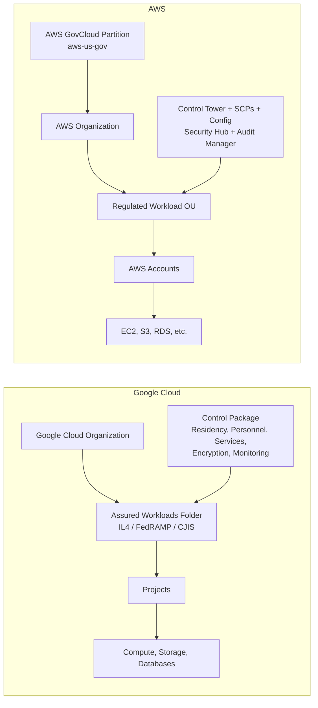
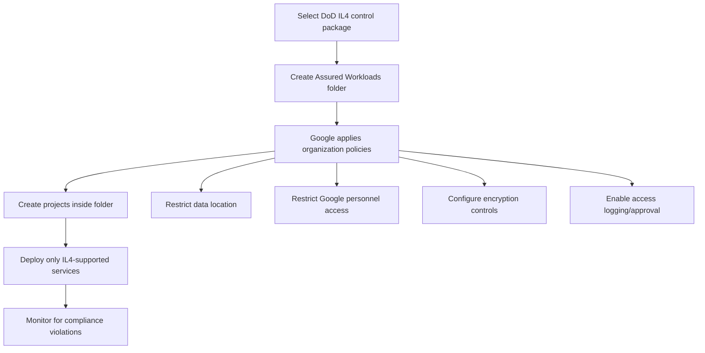
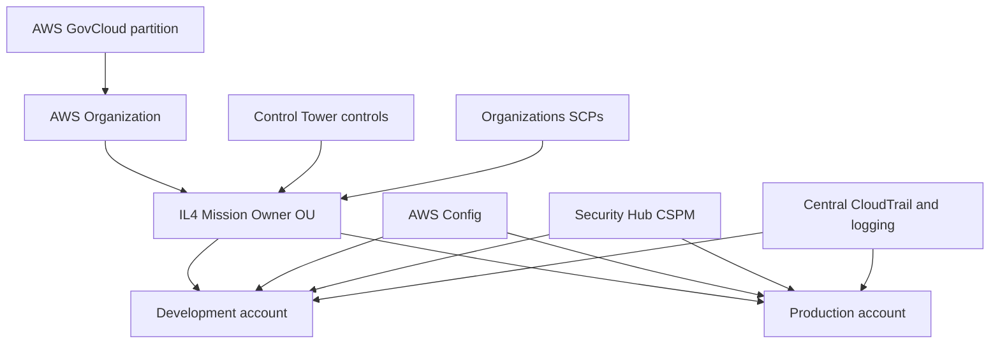

## What is Google Cloud Assured Workloads?

**Google Cloud Assured Workloads is a compliance and data-boundary management layer for regulated workloads.**

You select a regulatory or sovereignty requirement—called a **control package**—and apply it to a Google Cloud folder. Google then applies and monitors controls such as:

* Permitted regions and data residency
* Which Google personnel may access customer data
* Which Google support personnel may handle cases
* Encryption and customer-managed key requirements
* Access Transparency and, where supported, Access Approval
* Organization Policy constraints
* Restrictions on which Google Cloud services can be used
* Continuous monitoring for control violations

Projects and resources placed under the Assured Workloads folder inherit the controls. ([Google Cloud Documentation][1])

Examples of control packages include FedRAMP, DoD Impact Levels, CJIS, U.S. regions and support, EU regions and support, Canada, Japan, Israel, and healthcare-related boundaries. The exact controls and supported services differ by package. ([Google Cloud][2])

---

# The most important distinction

Google Assured Workloads and AWS GovCloud are **not exactly the same type of product**.



* **Google Assured Workloads:** applies a software-defined compliance boundary to a folder in the Google Cloud resource hierarchy.
* **AWS GovCloud:** provides separate, physically and logically isolated AWS Regions in the `aws-us-gov` partition.
* **AWS Control Tower and related services:** provide the governance and continuous compliance functions closest to Assured Workloads.

AWS GovCloud is administered exclusively by AWS personnel who are U.S. citizens and is designed for requirements including FedRAMP High, DoD IL4/IL5, CJIS, CUI, ITAR and EAR. ([AWS Documentation][3])

---

# Closest AWS equivalent

There is no single AWS service that equals Assured Workloads. The closest equivalent is this combination:

```text
Google Assured Workloads
        ≈
AWS GovCloud
+ AWS Organizations
+ AWS Control Tower
+ Service Control Policies
+ AWS Config
+ Security Hub CSPM
+ AWS Audit Manager
+ AWS KMS
```

## Capability mapping

| Google capability                | Closest AWS capability                                                            | Key difference                                                             |
| -------------------------------- | --------------------------------------------------------------------------------- | -------------------------------------------------------------------------- |
| Assured Workloads folder         | AWS Organizations OU                                                              | GCP boundary contains projects; AWS OU contains accounts                   |
| Control package                  | Control Tower controls, SCPs, Config conformance packs and Security Hub standards | AWS generally composes controls from several services                      |
| Restricted geographic locations  | GovCloud partition, Region controls and SCPs                                      | GovCloud provides stronger partition-level isolation                       |
| Provider-personnel restrictions  | AWS GovCloud U.S.-citizen administrative controls                                 | In GCP, restrictions depend on the selected Assured Workloads package      |
| Supported-service restrictions   | GovCloud service availability plus SCPs                                           | GCP publishes supported services for each control package                  |
| Continuous compliance monitoring | AWS Config, Control Tower and Security Hub CSPM                                   | Similar outcome, implemented through multiple AWS services                 |
| Customer-managed keys            | AWS KMS and CloudHSM                                                              | Comparable encryption-key functionality                                    |
| Access Transparency              | No exact one-service equivalent                                                   | GCP provides customer-visible logs for Google personnel access             |
| Access Approval                  | No direct one-for-one equivalent                                                  | GCP can require customer authorization for certain Google personnel access |
| Compliance evidence              | AWS Audit Manager                                                                 | AWS Audit Manager collects evidence and produces assessment reports        |

AWS Control Tower applies preventive, detective and proactive controls across AWS organizational units. Preventive controls commonly use Organizations policies, while detective controls use AWS Config. ([AWS Documentation][4])

AWS Audit Manager separately automates evidence collection and helps prepare audit-ready assessments. ([AWS Documentation][5])

---

# Google Cloud hierarchy versus AWS hierarchy

## Google Cloud

```text
Organization
└── Assured Workloads Folder: DoD IL4
    ├── Key Management Project
    ├── Mission Application Project
    ├── Logging Project
    └── Security Project
```

The **folder is the regulatory boundary**. Organization policies and Assured Workloads controls flow down to child folders, projects and resources. ([Google Cloud Documentation][1])

## AWS

```text
AWS GovCloud Partition
└── AWS Organization
    ├── Security OU
    │   ├── Log Archive Account
    │   └── Security Tooling Account
    └── Mission Owner OU
        ├── Development Account
        ├── Test Account
        └── Production Account
```

The **AWS account is normally the primary isolation boundary**. Controls are usually attached to an OU and inherited by accounts beneath it. AWS Organizations and Control Tower centrally manage access, security, compliance and logging across these accounts. ([AWS Documentation][6])

---

# Example: creating a DoD IL4 environment

## Google Cloud approach

An administrator might:

1. Create an Assured Workloads folder.
2. Select the DoD IL4 control package.
3. Create application and security projects under that folder.
4. Use only services supported by the IL4 package.
5. Restrict resource locations to approved U.S. regions.
6. Configure CMEK where required.
7. Enable Access Transparency or Access Approval where included.
8. Monitor the folder for policy or resource violations.

For DoD IL2, IL4 and IL5 environments, Google states that customers must use Data Boundary via Assured Workloads and qualifying support. ([Google Cloud][7])



## AWS approach

An equivalent AWS implementation might:

1. Establish an AWS GovCloud organization.
2. Create Security, Infrastructure and Mission Owner OUs.
3. Deploy Control Tower governance.
4. Attach SCPs and Control Tower controls to the IL4 OU.
5. Enable organization-wide CloudTrail, AWS Config, Security Hub and GuardDuty.
6. Centralize logs in a Log Archive account.
7. Use KMS customer-managed keys.
8. Collect assessment evidence through Audit Manager.
9. Add the customer-side controls needed for the DoD Cloud Computing SRG and the system ATO.



AWS Control Tower is available in AWS GovCloud, although GovCloud account creation has special limitations because paired commercial/GovCloud accounts are created through a separate process. ([AWS Documentation][8])

---

# Data residency comparison

## Google Assured Workloads

Assured Workloads configures location policies so that new supported resources can only be deployed in locations permitted by the selected control package. Depending on the package, it can also restrict support and provider access to personnel meeting nationality, location or background-check conditions. ([Google Cloud Documentation][9])

## AWS

AWS GovCloud uses two isolated U.S. Regions:

* `us-gov-west-1`
* `us-gov-east-1`

They operate in the separate `aws-us-gov` partition and have different endpoints, ARNs and account arrangements from the standard AWS partition. ([AWS Documentation][10])

Therefore:

* **GCP:** residency is primarily enforced through folder policies and supported-service controls.
* **AWS GovCloud:** residency is reinforced by placing the workload in an isolated sovereign partition, followed by customer governance controls.

---

# Provider administrative access

This is an area where Google exposes some distinctive customer-facing capabilities.

## Google

Depending on the control package:

* Google personnel must satisfy location, citizenship or background-check requirements.
* Access Transparency records actions taken by Google personnel against customer data.
* Access Approval can require customer approval before certain access.
* Key Access Justifications can provide context for requests to use encryption keys. ([Google Cloud Documentation][9])

## AWS

AWS GovCloud limits physical and logical administrative access to U.S.-citizen AWS personnel. AWS then relies on the GovCloud operational boundary, service architecture and support processes rather than exposing one exact equivalent to the complete Google Access Approval/Access Transparency combination. ([AWS Documentation][3])

This does **not** mean one platform is inherently more secure. They expose and implement portions of provider-access governance differently.

---

# Supported services

This is an important operational limitation in both clouds.

## Google

A service must be explicitly supported for the selected Assured Workloads control package. Google advises that unsupported products should not be used without appropriate due diligence or regulatory waivers. ([Google Cloud Documentation][11])

## AWS

A service may be:

1. Available in GovCloud.
2. In scope for a particular compliance program.
3. Technically suitable for your workload.
4. Still dependent on your secure configuration.

Service availability and compliance scope are separate questions. AWS publishes both the GovCloud service list and services-in-scope documentation. ([Amazon Web Services, Inc.][12])

---

# Does Assured Workloads make the application compliant?

**No. Neither Assured Workloads nor AWS GovCloud automatically makes the complete system compliant.**

Google manages controls such as provider-personnel restrictions and platform policies, but the customer remains responsible for its own personnel access, identities, applications, operating systems, network architecture, logging, vulnerability management and data handling. ([Google Cloud Documentation][13])

The same shared-responsibility principle applies in AWS. You must still implement the customer portion of controls such as:

* IAM and privileged-access management
* Network segmentation
* Centralized logging
* Vulnerability and patch management
* Endpoint security
* Incident response
* Configuration management
* Application security
* Backup and recovery
* RMF control implementation and evidence

---

# Which is a better comparison?

## For a commercial regulated workload

Compare:

```text
Google Assured Workloads
        versus
AWS Control Tower + Organizations + Config + Security Hub
```

Examples include healthcare, financial services, regional residency or corporate regulatory baselines.

## For U.S. government, CUI, FedRAMP High or DoD IL4/IL5

Compare:

```text
Google Cloud
+ Assured Workloads control package
+ approved support arrangement

versus

AWS GovCloud partition
+ Control Tower
+ Organizations/SCPs
+ Config/Security Hub
+ Audit Manager
```

For your DoD SCCA-type environment, **AWS GovCloud is the closer comparison for the infrastructure boundary**, while **Assured Workloads is closer to a combination of GovCloud placement and an AWS governance baseline**.

## Bottom line

> **Google Assured Workloads is a compliance control plane placed around selected Google Cloud folders. AWS achieves the equivalent outcome through an isolated GovCloud partition plus several governance, monitoring and evidence services.**

Google presents a more integrated **control-package experience**. AWS provides a stronger explicit **partition/account isolation model**, but customers generally assemble the compliance solution from multiple services.

[1]: https://docs.cloud.google.com/assured-workloads/docs/key-concepts?utm_source=chatgpt.com "Key concepts  |  Assured Workloads  |  Google Cloud Documentation"
[2]: https://cloud.google.com/security/products/assured-workloads?utm_source=chatgpt.com "Data Boundary via Assured Workloads | Sovereign Cloud"
[3]: https://docs.aws.amazon.com/govcloud-us/latest/UserGuide/whatis.html?utm_source=chatgpt.com "What Is AWS GovCloud (US)? - AWS GovCloud (US)"
[4]: https://docs.aws.amazon.com/controltower/latest/controlreference/controls.html?utm_source=chatgpt.com "About controls in AWS Control Tower"
[5]: https://docs.aws.amazon.com/audit-manager/latest/userguide/what-is.html?utm_source=chatgpt.com "AWS Audit Manager"
[6]: https://docs.aws.amazon.com/controltower/latest/userguide/organizations.html?utm_source=chatgpt.com "Manage Accounts Through AWS Organizations - AWS Control Tower"
[7]: https://cloud.google.com/security/compliance/disa?utm_source=chatgpt.com "DISA - Compliance"
[8]: https://docs.aws.amazon.com/govcloud-us/latest/UserGuide/govcloud-controltower.html?utm_source=chatgpt.com "AWS Control Tower in AWS GovCloud (US)"
[9]: https://docs.cloud.google.com/assured-workloads/docs/personnel-access-data-controls?utm_source=chatgpt.com "Personnel data access and support controls  |  Assured Workloads  |  Google Cloud Documentation"
[10]: https://docs.aws.amazon.com/govcloud-us/latest/UserGuide/govcloud-differences.html?utm_source=chatgpt.com "AWS GovCloud (US) Compared to Standard AWS Regions"
[11]: https://docs.cloud.google.com/assured-workloads/docs/supported-products?utm_source=chatgpt.com "Supported products by control package | Assured Workloads"
[12]: https://aws.amazon.com/compliance/services-in-scope/FedRAMP/?utm_source=chatgpt.com "AWS Services in Scope by Compliance Program"
[13]: https://docs.cloud.google.com/assured-workloads/docs/restrict-customer-personnel-access?utm_source=chatgpt.com "Supporting compliance by restricting customer personnel data access  |  Assured Workloads  |  Google Cloud Documentation"
