# Google Cloud VPC Networking for an AWS Network Engineer

The easiest way to understand Google Cloud networking is:

> **Google VPC provides many of the same outcomes as AWS VPC, but Google implements routing, internet access, NAT, and load balancing differently.**

The biggest conceptual differences are:

1. A **Google VPC network is global**; its subnets are regional.
2. An **AWS VPC is regional**; its subnets are Availability Zone–specific.
3. Google does not have a customer-created **Internet Gateway attachment** comparable to an AWS IGW.
4. Google routes generally belong to the **VPC network**, not separate subnet route tables.
5. Cloud NAT is a **distributed SDN function**; packets do not pass through a NAT gateway appliance or Cloud Router.
6. Google normally exposes applications through a **forwarding rule and load balancer frontend**, not by assigning public IP addresses directly to every VM. ([Google Cloud Documentation][1])

---

# 1. AWS-to-Google terminology mapping

| AWS concept              | Google Cloud equivalent                             | Important difference                                                   |
| ------------------------ | --------------------------------------------------- | ---------------------------------------------------------------------- |
| EC2 instance             | Compute Engine VM                                   | Similar virtual machine concept                                        |
| ENI                      | VM network interface or vNIC                        | Attached to a subnet                                                   |
| VPC                      | VPC network                                         | GCP VPC is global                                                      |
| Subnet                   | Subnet                                              | GCP subnet is regional, not zonal                                      |
| Availability Zone subnet | Regional subnet                                     | VMs from multiple zones in the region can use it                       |
| Route table              | VPC routes                                          | GCP normally does not associate separate route tables with each subnet |
| Internet Gateway         | `default-internet-gateway` route next hop           | Not a customer-attached gateway resource                               |
| NAT Gateway              | Cloud NAT                                           | Distributed; not in the packet path                                    |
| Elastic IP               | Static external IP address                          | Can attach to a VM or forwarding rule                                  |
| Security group           | VPC firewall rule/policy                            | Targets can use service accounts, tags or secure tags                  |
| Network ACL              | No exact one-to-one equivalent                      | Google firewall policy is stateful                                     |
| ALB                      | External Application Load Balancer                  | Can use global anycast frontend                                        |
| NLB                      | External passthrough or proxy Network Load Balancer | Choose based on source-IP preservation and proxy requirements          |
| Target group             | Backend service plus instance group/NEG             | Backend service contains health and traffic policies                   |
| Auto Scaling Group       | Managed Instance Group                              | Integrates with backend services                                       |
| AWS WAF                  | Cloud Armor                                         | Protects supported load balancer frontends                             |
| Transit Gateway          | Network Connectivity Center                         | Architecture and routing model differ                                  |
| AWS Network Firewall     | Cloud NGFW / third-party NVAs                       | Deployment model differs                                               |
| VPC Flow Logs            | VPC Flow Logs                                       | Both provide connection telemetry                                      |
| Route 53 Resolver        | Cloud DNS                                           | Includes inbound/outbound forwarding options                           |
| PrivateLink              | Private Service Connect                             | Private producer-consumer service access                               |
| VPC peering              | VPC Network Peering                                 | Non-transitive in normal designs                                       |
| Direct Connect           | Cloud Interconnect                                  | Dedicated or partner connectivity                                      |
| Site-to-Site VPN         | HA VPN / Classic VPN                                | HA VPN is preferred                                                    |

---

# 2. Global VPC versus regional VPC

## AWS

An AWS VPC belongs to one Region:

```text
AWS Region: us-east-1
└── VPC: 10.10.0.0/16
    ├── Public subnet: 10.10.1.0/24 — us-east-1a
    ├── Private subnet: 10.10.2.0/24 — us-east-1a
    ├── Public subnet: 10.10.3.0/24 — us-east-1b
    └── Private subnet: 10.10.4.0/24 — us-east-1b
```

Each AWS subnet resides in one Availability Zone.

## Google Cloud

A Google VPC network is global, while each subnet belongs to a Region:

```text
Google VPC: production-vpc
├── us-east1 subnet: 10.10.0.0/20
│   ├── VM in us-east1-b
│   ├── VM in us-east1-c
│   └── VM in us-east1-d
│
└── us-central1 subnet: 10.20.0.0/20
    ├── VM in us-central1-a
    └── VM in us-central1-b
```

A regional subnet can be used by VMs in the supported zones of that region. Google automatically creates subnet routes that apply across the VPC network. ([Google Cloud Documentation][2])

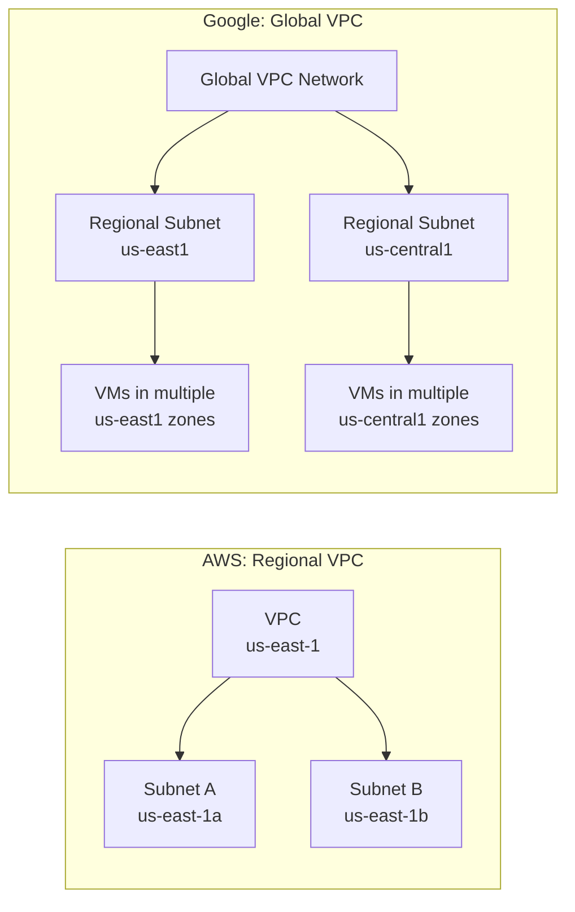

---

# 3. The “public subnet” difference

In AWS, a subnet is conventionally considered public when its subnet route table contains:

```text
0.0.0.0/0 → Internet Gateway
```

An EC2 instance also requires a public IPv4 address or Elastic IP and appropriate security controls.

In Google Cloud, you usually do not classify the subnet itself as public or private. Instead, classify the **resource**:

* VM with an external IP: directly internet-addressable, subject to firewall rules.
* VM without an external IP but using Cloud NAT: outbound internet only.
* VM without an external IP and without Cloud NAT: private-only, except for private service access mechanisms.
* VM behind an external load balancer: internet-facing through the load balancer, while the VM can remain private.

Google VPC networks commonly have a system-generated `0.0.0.0/0` route whose next hop is `default-internet-gateway`. That route applies at the VPC level. However, the route alone does not give a VM without an external IP internet access; it also needs Cloud NAT, a proxy/NVA or another appropriate path. ([Google Cloud Documentation][2])

---

# Part I: Outbound traffic

# 4. Outbound option 1 — VM has an external IP

This is conceptually similar to an EC2 instance with a public IPv4 address.

## GCP architecture

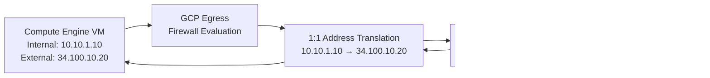

## Packet example

The application generates:

```text
Source:      10.10.1.10:49152
Destination: 142.250.10.20:443
Protocol:    TCP
```

Google performs external-address translation:

```text
Before translation:
10.10.1.10:49152 → 142.250.10.20:443

On the internet:
34.100.10.20:49152 → 142.250.10.20:443
```

The response returns to `34.100.10.20`, and Google translates the destination back to `10.10.1.10`.

A regional external IPv4 address attached to a Compute Engine network interface is used in a one-to-one NAT configuration. ([Google Cloud Documentation][3])

## AWS comparison

AWS behaves similarly:

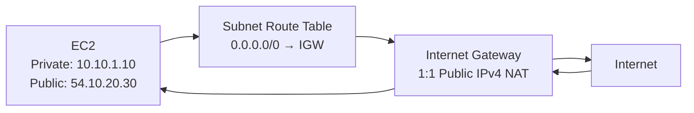

The AWS Internet Gateway logically performs the one-to-one mapping between an instance’s private IP and its public IPv4 or Elastic IP. ([AWS Documentation][4])

## Main difference

| AWS                              | Google Cloud                                   |
| -------------------------------- | ---------------------------------------------- |
| Attach IGW to VPC                | No customer-managed IGW attachment             |
| Subnet route table points to IGW | VPC route points to `default-internet-gateway` |
| IGW maps private to public IP    | Google SDN maps internal to external IP        |
| Security group controls instance | GCP firewall policy/rule controls VM interface |

Direct public IPs are useful for simple administration or testing, but they are generally not the preferred production design for application servers.

---

# 5. Outbound option 2 — private VM using Cloud NAT

This is the closest equivalent to an EC2 private subnet using an AWS NAT Gateway.

## AWS model

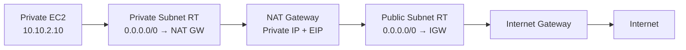

The AWS NAT Gateway is a regional or zonal managed NAT resource, depending on the selected NAT Gateway type and architecture. A public NAT gateway maps workloads to its private address, and the IGW maps that address to the NAT gateway’s Elastic IP for internet communication. ([AWS Documentation][5])

## Google Cloud model

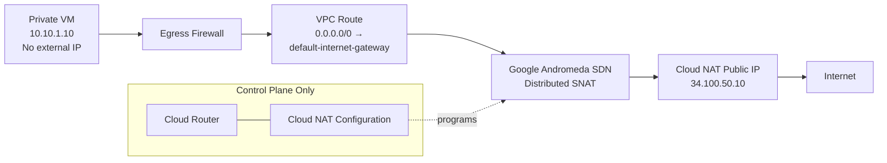

### Critical point

> Traffic does not physically pass through Cloud Router or through a centralized Cloud NAT appliance.

Cloud Router stores and manages the NAT configuration, but NAT is programmed into Google’s Andromeda software-defined network. The Cloud Router and Cloud NAT gateway are control-plane constructs for this purpose, not packet-forwarding hops. ([Google Cloud Documentation][6])

## Outbound packet flow

Assume:

```text
VM internal IP:  10.10.1.10
Cloud NAT IP:    34.100.50.10
Destination:     8.8.8.8:443
```

### Step 1: VM creates connection

```text
10.10.1.10:52000 → 8.8.8.8:443
```

### Step 2: Egress firewall evaluation

Google evaluates the packet against:

* Hierarchical firewall policies
* Global or regional network firewall policies
* VPC firewall rules
* Implied firewall rules

Firewall evaluation occurs before the VM’s internal source address is translated to the Cloud NAT public address. ([Google Cloud Documentation][7])

### Step 3: Route selection

The destination `8.8.8.8` matches:

```text
0.0.0.0/0 → default-internet-gateway
```

### Step 4: Cloud NAT applies SNAT

```text
Before NAT:
10.10.1.10:52000 → 8.8.8.8:443

After NAT:
34.100.50.10:30001 → 8.8.8.8:443
```

The translated source port can differ because Cloud NAT allocates public source ports to participating VMs.

### Step 5: Return packet

```text
8.8.8.8:443 → 34.100.50.10:30001
```

Google looks up the established NAT mapping and translates it back:

```text
8.8.8.8:443 → 10.10.1.10:52000
```

Cloud NAT supports return packets for established outbound connections, but it does not allow unsolicited inbound internet connections. ([Google Cloud Documentation][8])

---

# 6. Does Cloud NAT require a “public subnet”?

No.

This is a major AWS-to-GCP mental adjustment.

In AWS, the traditional public NAT Gateway is associated with a public subnet, and that subnet routes toward an IGW.

In Google Cloud:

* Cloud NAT is associated with a VPC.
* It is regional.
* It is configured through a regional Cloud Router.
* It applies to selected regional subnet IP ranges.
* It is not placed inside a subnet as a forwarding appliance.
* It does not require you to create a separate “NAT subnet.”
* NAT traffic does not traverse the Cloud Router. ([Google Cloud Documentation][8])

```text
AWS thinking:

Private subnet → NAT subnet → NAT Gateway → IGW


Google thinking:

Private VM → VPC routing
           → distributed Cloud NAT translation
           → internet
```

---

# 7. Cloud Router is not an AWS route table

The name **Cloud Router** can be confusing.

Cloud Router primarily provides dynamic BGP routing for services such as:

* Cloud VPN
* Cloud Interconnect
* Router appliances
* Network Connectivity Center

Cloud NAT uses a Cloud Router as a control-plane configuration container, but does not send NAT traffic through it or require BGP for Public NAT. ([Google Cloud Documentation][6])

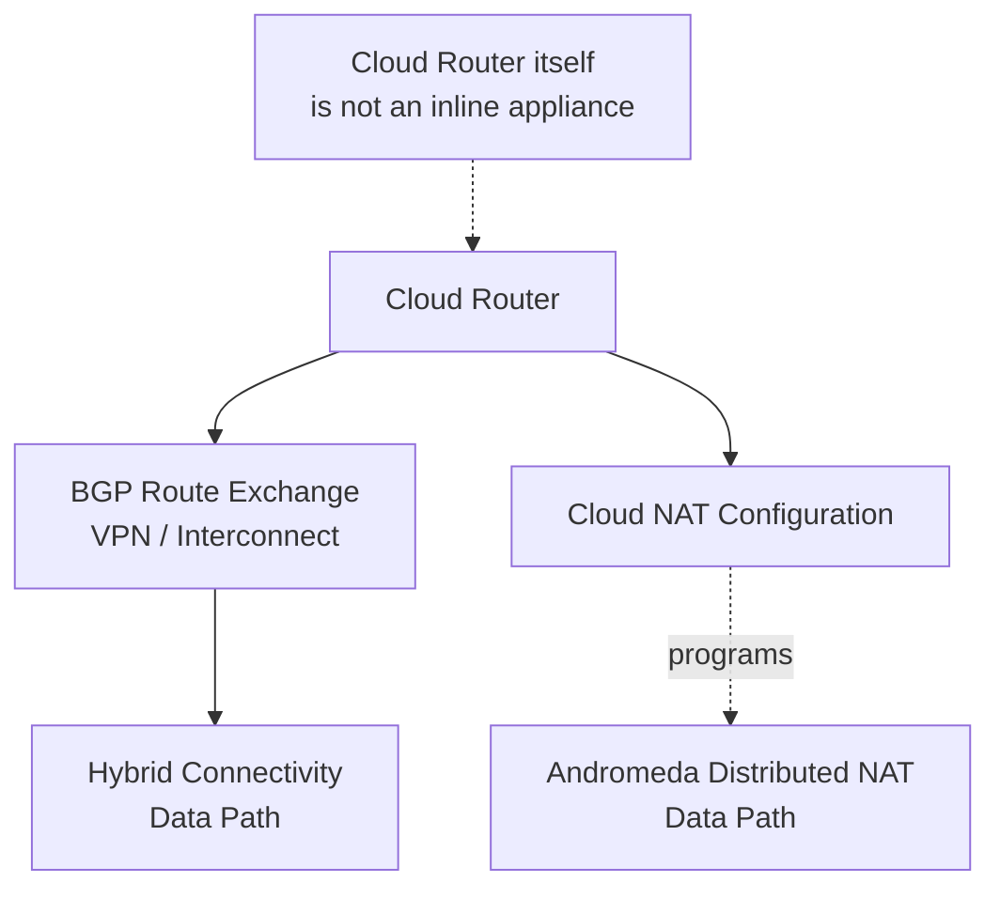

---

# Part II: Inbound traffic

There are two primary inbound designs:

1. Direct external IP on the VM.
2. External load balancer in front of private VMs.

The second design is generally preferred for production applications.

---

# 8. Inbound option 1 — internet directly to VM external IP

## Architecture

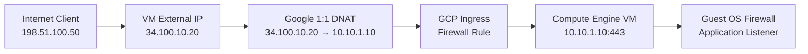

## Required conditions

The connection succeeds only when:

1. The VM has a static or ephemeral external IP.
2. A route exists through the default internet gateway.
3. A GCP ingress firewall rule allows the source, protocol and destination port.
4. The firewall rule targets the correct VM.
5. The guest operating system firewall allows the port.
6. An application is listening on that port.
7. Return traffic has a valid path.

Google VPC networks have an implied deny for ingress unless a higher-priority rule permits the connection. Firewall policies are stateful, so return traffic for an allowed connection is automatically permitted. ([Google Cloud Documentation][9])

## Example firewall logic

```text
Direction:     Ingress
Action:        Allow
Source:        198.51.100.0/24
Target:        web-server service account
Protocol/port: TCP/443
Priority:      1000
```

This is conceptually similar to:

```text
AWS Security Group:
Inbound HTTPS TCP/443
Source: 198.51.100.0/24
```

However, Google firewall rules are generally network-level policy resources that target VM interfaces through identities, tags or secure tags, rather than separate security group objects attached in precisely the AWS manner. ([Google Cloud Documentation][10])

---

# 9. Direct inbound AWS comparison

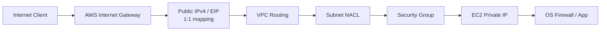

Google’s equivalent flow is approximately:

```text
Internet
  → Google external IP handling
  → external-to-internal address mapping
  → VPC firewall
  → VM vNIC
  → guest OS
```

Google does not require you to:

* Attach an Internet Gateway to the VPC.
* Associate a public route table with the subnet.
* Configure a separate stateless subnet NACL.

---

# 10. Inbound option 2 — external Application Load Balancer

This is the closer equivalent to:

```text
Internet → AWS ALB → Target Group → private EC2
```

For HTTP and HTTPS applications, this is normally the preferred GCP design.

## GCP architecture

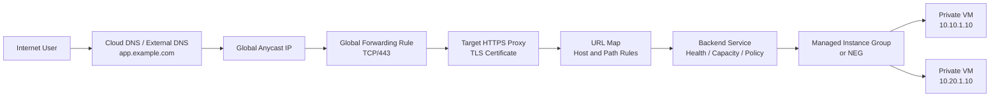

A forwarding rule represents the load balancer frontend by defining the IP address, protocol and port. For an external Application Load Balancer, the forwarding rule points to a target HTTP or HTTPS proxy; the proxy consults a URL map and selects a backend service. ([Google Cloud Documentation][11])

---

# 11. Detailed inbound load-balancer packet flow

Assume:

```text
DNS name:        application.example.com
Frontend IP:     34.110.20.30
Frontend port:   TCP/443
Backend VM:      10.10.1.10:8080
```

## Step 1: DNS resolution

The client resolves:

```text
application.example.com → 34.110.20.30
```

For a global external Application Load Balancer, this can be a global anycast address.

## Step 2: Client connects to Google frontend

```text
Client: 198.51.100.50:55000
Destination: 34.110.20.30:443
```

The connection reaches a Google frontend location.

## Step 3: Forwarding rule matches

The forwarding rule matches:

```text
IP:       34.110.20.30
Protocol: TCP
Port:     443
Target:   HTTPS proxy
```

## Step 4: TLS termination

The target HTTPS proxy:

* Presents the server certificate.
* Negotiates TLS.
* Decrypts the HTTP request.
* Passes the request to the URL-map logic.

## Step 5: URL map chooses backend

For example:

```text
api.example.com/*       → api-backend-service
app.example.com/images/* → image-backend-service
app.example.com/*        → web-backend-service
```

Google URL maps can route HTTP requests using host and path rules to backend services or backend buckets. ([Google Cloud Documentation][12])

## Step 6: Backend service selects a healthy endpoint

The backend service evaluates:

* Health-check status
* Backend location
* Capacity
* Load-balancing policy
* Session-affinity settings
* Traffic-management policy

## Step 7: Proxy creates a new backend connection

This is a crucial difference from simple routed or passthrough traffic.

```text
Connection 1:
Client → Google load-balancer proxy

Connection 2:
Google load-balancer proxy → backend VM
```

The target proxy establishes a new connection to the selected backend VM or endpoint. ([Google Cloud Documentation][13])

Therefore, the VM does not see the original client TCP connection as its socket peer. At the HTTP layer, client identity is commonly passed using headers such as `X-Forwarded-For`.

## Step 8: Firewall permits load-balancer-to-backend traffic

The backend VM firewall policy must permit the relevant health-check and load-balancer proxy traffic for the selected load-balancer type.

It does not normally need to permit TCP/443 directly from the entire internet.

## Step 9: VM responds

The VM returns the application response to the Google load-balancing system, and the frontend sends it back over the client-side connection.

---

# 12. AWS ALB versus GCP Application Load Balancer

| Function             | AWS ALB                                                              | GCP Application Load Balancer                         |
| -------------------- | -------------------------------------------------------------------- | ----------------------------------------------------- |
| Public frontend      | ALB DNS name with public nodes                                       | External forwarding rule and external IP              |
| IP design            | Regional ALB frontend                                                | Global or regional external frontend                  |
| Listener             | ALB listener                                                         | Forwarding rule plus target proxy                     |
| Listener certificate | ACM certificate                                                      | Certificate attached to target HTTPS proxy            |
| Listener rules       | Host/path listener rules                                             | URL map                                               |
| Target group         | Target group                                                         | Backend service                                       |
| Registered target    | EC2/IP/Lambda                                                        | Instance group, NEG, serverless or hybrid backend     |
| Health check         | Target group health check                                            | Backend service health check                          |
| WAF                  | AWS WAF                                                              | Cloud Armor                                           |
| Autoscaling backend  | Auto Scaling Group                                                   | Managed Instance Group                                |
| Global routing       | Usually additional services such as Global Accelerator or CloudFront | Native global anycast options for global external ALB |
| Backend connection   | ALB creates separate backend connection                              | Google proxy creates separate backend connection      |

A global external Application Load Balancer is implemented as a managed proxy service on Google Front Ends and can distribute HTTP/HTTPS traffic to backends in multiple supported locations. ([Google Cloud Documentation][14])

---

# 13. GCP load-balancer components translated into AWS language

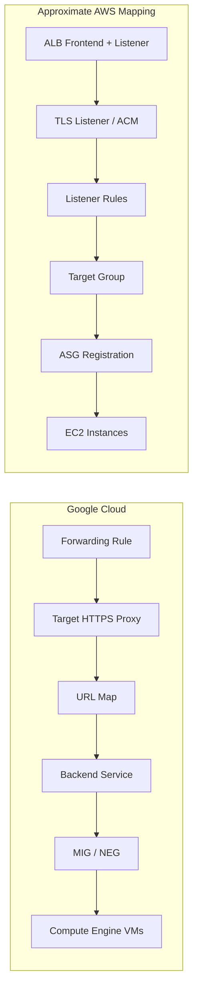

### Forwarding rule

Think:

```text
Frontend IP + protocol + port
```

Approximate AWS concept:

```text
Load balancer frontend plus listener binding
```

### Target HTTPS proxy

Think:

```text
TLS termination configuration
+ certificate
+ reference to URL map
```

Approximate AWS concept:

```text
HTTPS listener with ACM certificate
```

### URL map

Think:

```text
Host-based and path-based routing policy
```

Approximate AWS concept:

```text
ALB listener rules
```

### Backend service

Think:

```text
Target group
+ health policy
+ balancing behavior
+ timeout
+ session affinity
+ security/CDN options
```

### MIG

A managed instance group is similar to an AWS Auto Scaling Group.

### NEG

A network endpoint group is a flexible collection of backend endpoints. Depending on its type, it can represent:

* VM IP and port endpoints
* GKE endpoints
* Serverless services
* Hybrid endpoints
* Internet endpoints
* Private Service Connect endpoints

---

# 14. Layer 4 inbound choices

Do not assume every GCP network load balancer behaves like an AWS NLB.

Google has two important L4 families.

## Proxy Network Load Balancer

```text
Client → Google proxy → new connection → backend
```

Characteristics:

* Terminates the client TCP connection.
* Opens a separate connection to the backend.
* Original source IP is not the backend socket peer by default.
* PROXY protocol can be used in supported configurations.

Google documents that external proxy Network Load Balancers do not preserve the original client IP and port by default. ([Google Cloud Documentation][15])

## Passthrough Network Load Balancer

```text
Client packet → forwarding rule → backend VM
```

Characteristics:

* Does not proxy the connection in the same way.
* Preserves more of the original packet semantics.
* Backend VM receives traffic addressed to the forwarding-rule IP.
* Regional design.
* Appropriate for protocols where source-IP preservation or direct server return behavior matters.

Approximate AWS mapping:

| Google                                     | Approximate AWS comparison                                         |
| ------------------------------------------ | ------------------------------------------------------------------ |
| External Application Load Balancer         | AWS ALB                                                            |
| External proxy Network Load Balancer       | NLB operating as a proxy-style managed frontend, but not identical |
| External passthrough Network Load Balancer | AWS NLB is conceptually closer, but packet handling still differs  |
| Internal passthrough Network Load Balancer | Internal NLB-like service                                          |

---

# 15. Firewall behavior

Google Cloud firewall rules are stateful.

If an ingress rule permits a connection:

```text
Client → VM: TCP/443
```

return traffic is automatically allowed:

```text
VM → Client: established TCP response
```

You do not create a separate egress rule purely for established response traffic. ([Google Cloud Documentation][7])

## Default implied behavior

A standard VPC network generally has:

```text
Implied ingress: deny
Implied egress:  allow
```

Explicit higher-priority policies can override the implied behavior. ([Google Cloud Documentation][16])

## AWS comparison

| AWS control          | GCP comparison                                                   |
| -------------------- | ---------------------------------------------------------------- |
| Security group       | Stateful firewall rules/policies                                 |
| Network ACL          | No direct standard equivalent                                    |
| SG attached to ENI   | Rules target VM interfaces through tags, identities or scope     |
| Default SG rules     | Implied and configured GCP firewall behavior                     |
| AWS Firewall Manager | Hierarchical firewall policies and centralized policy management |

---

# 16. Complete outbound design comparison

## AWS production outbound

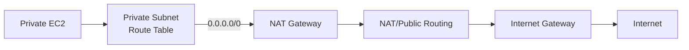

## GCP production outbound

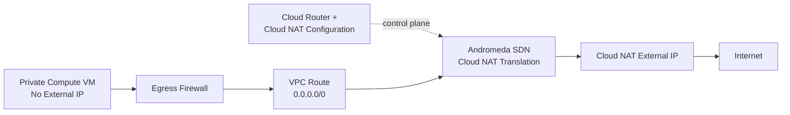

### Key translation

```text
AWS:
Subnet route table determines which NAT gateway receives traffic.

GCP:
VPC routing determines the destination path, while Cloud NAT configuration
determines whether matching private source addresses receive NAT translation.
```

---

# 17. Complete inbound design comparison

## AWS

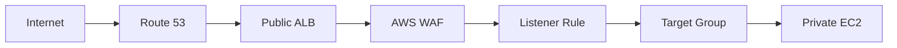

## Google Cloud

```mermaid
flowchart LR
    USER["Internet"]
    DNS["Cloud DNS"]
    VIP["Global Anycast IP"]
    FR["Forwarding Rule"]
    ARMOR["Cloud Armor"]
    PROXY["Target HTTPS Proxy"]
    URL["URL Map"]
    BS["Backend Service"]
    MIG["MIG / NEG"]
    VM["Private Compute VM"]

    USER --> DNS --> VIP --> FR --> ARMOR --> PROXY --> URL --> BS --> MIG --> VM
```

---

# 18. A practical secure architecture

For a public HTTPS application, an AWS engineer would commonly deploy this Google design:

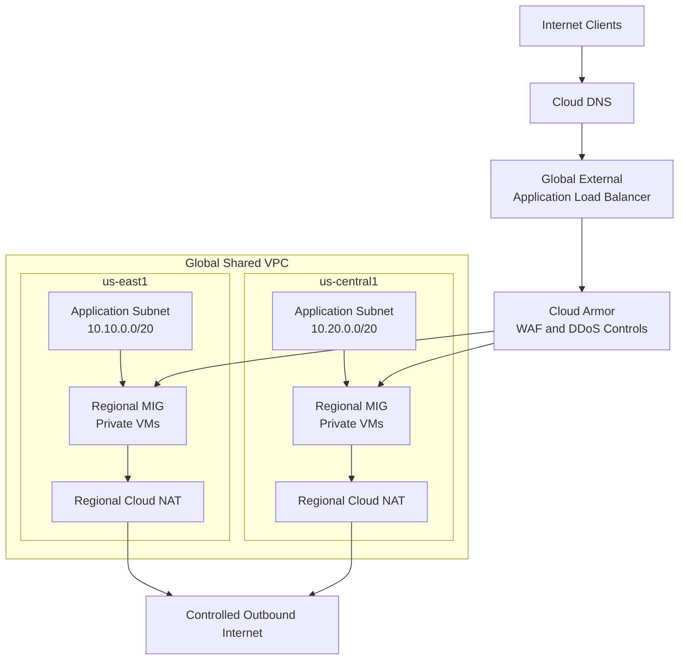

Important characteristics:

* Application VMs have no external IP addresses.
* Only the external load-balancer frontend is internet-facing.
* Cloud Armor filters supported inbound traffic.
* Firewall policies permit only necessary load-balancer and health-check traffic to backends.
* Cloud NAT provides outbound patching and API access.
* Cloud NAT is deployed regionally for the participating subnet ranges.
* Logs can include VPC Flow Logs, firewall-rule logging, Cloud NAT logs, load-balancer logs and Cloud Armor logs.

---

# 19. Packet-walk summary

## Outbound private VM

```text
1. Application creates packet:
   10.10.1.10:52000 → 8.8.8.8:443

2. GCP evaluates egress firewall policy.

3. VPC route lookup matches:
   0.0.0.0/0 → default-internet-gateway

4. Cloud NAT configuration matches the VM/subnet.

5. Distributed Google SDN translates:
   10.10.1.10:52000 → 34.100.50.10:30001

6. Packet travels to the internet.

7. Response returns to Cloud NAT public IP.

8. Established NAT state translates it back to the VM.
```

## Inbound through Application Load Balancer

```text
1. Client resolves app.example.com to global external IP.

2. Client connects to global IP on TCP/443.

3. Forwarding rule selects target HTTPS proxy.

4. HTTPS proxy terminates TLS.

5. URL map selects the backend service.

6. Backend service selects a healthy MIG or NEG endpoint.

7. Google proxy opens a second connection to the private backend.

8. VPC firewall permits proxy/health-check traffic.

9. VM processes request and responds through the proxy.

10. Load balancer returns the response to the client.
```

---

# 20. Most important AWS-to-GCP mental model

```text
AWS:
VPC
  → AZ-specific subnet
  → subnet route table
  → IGW or NAT Gateway
  → security group + NACL


Google Cloud:
Global VPC network
  → regional subnet
  → VPC-level routes
  → default-internet-gateway logical path
  → external IP or distributed Cloud NAT
  → stateful VPC firewall policies
```

And for inbound applications:

```text
AWS:
Public ALB
  → listener
  → listener rules
  → target group
  → private EC2


Google Cloud:
External IP + forwarding rule
  → target HTTPS proxy
  → URL map
  → backend service
  → MIG/NEG
  → private Compute Engine VM
```

The single biggest takeaway is:

> **In AWS, subnet route tables and gateway resources visually define the internet path. In Google Cloud, the VPC-wide routing system, external address mapping, forwarding rules and distributed SDN perform those functions without requiring a customer-attached IGW or an inline Cloud NAT appliance.**

[1]: https://docs.cloud.google.com/vpc/docs/overview?authuser=77&utm_source=chatgpt.com "Virtual Private Cloud (VPC) overview  |  Google Cloud Documentation"
[2]: https://docs.cloud.google.com/vpc/docs/routes?utm_source=chatgpt.com "Routes | Virtual Private Cloud"
[3]: https://docs.cloud.google.com/vpc/docs/ip-addresses?utm_source=chatgpt.com "IP addresses | Virtual Private Cloud"
[4]: https://docs.aws.amazon.com/es_en/vpc/latest/userguide/VPC_Internet_Gateway.html?utm_source=chatgpt.com "Enable internet access for a VPC using an internet gateway - Amazon Virtual Private Cloud"
[5]: https://docs.aws.amazon.com/vpc/latest/userguide/vpc-nat-gateway.html?utm_source=chatgpt.com "NAT gateways - Amazon Virtual Private Cloud"
[6]: https://docs.cloud.google.com/nat/docs/set-up-manage-network-address-translation?utm_source=chatgpt.com "Quickstart: Set up and manage network address translation ..."
[7]: https://docs.cloud.google.com/firewall/docs/firewall-policies-rule-details?utm_source=chatgpt.com "Firewall policy rule components  |  Cloud Next Generation Firewall  |  Google Cloud Documentation"
[8]: https://docs.cloud.google.com/nat/docs/overview?utm_source=chatgpt.com "Cloud NAT overview"
[9]: https://docs.cloud.google.com/vpc/docs/vpc?utm_source=chatgpt.com "VPC networks | Virtual Private Cloud"
[10]: https://docs.cloud.google.com/vpc/docs/add-remove-network-tags?utm_source=chatgpt.com "Add network tags  |  Virtual Private Cloud  |  Google Cloud Documentation"
[11]: https://docs.cloud.google.com/load-balancing/docs/forwarding-rule-concepts?utm_source=chatgpt.com "Forwarding rules overview  |  Cloud Load Balancing  |  Google Cloud Documentation"
[12]: https://docs.cloud.google.com/load-balancing/docs/url-map-concepts?hl=en&utm_source=chatgpt.com "URL maps overview  |  Cloud Load Balancing  |  Google Cloud Documentation"
[13]: https://docs.cloud.google.com/load-balancing/docs/target-proxies?utm_source=chatgpt.com "Target proxies overview  |  Cloud Load Balancing  |  Google Cloud Documentation"
[14]: https://docs.cloud.google.com/load-balancing/docs/https?authuser=0&utm_source=chatgpt.com "External Application Load Balancer overview  |  Cloud Load Balancing  |  Google Cloud Documentation"
[15]: https://docs.cloud.google.com/load-balancing/docs/tcp?utm_source=chatgpt.com "External proxy Network Load Balancer overview  |  Cloud Load Balancing  |  Google Cloud Documentation"
[16]: https://docs.cloud.google.com/firewall/docs/firewalls?authuser=77&hl=en&utm_source=chatgpt.com "VPC firewall rules  |  Cloud Next Generation Firewall  |  Google Cloud Documentation"
