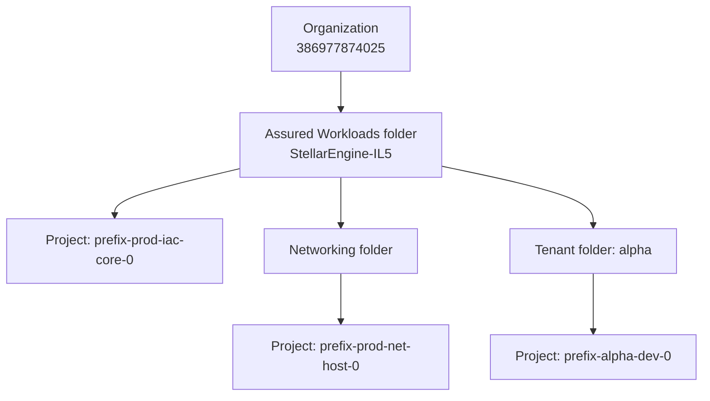
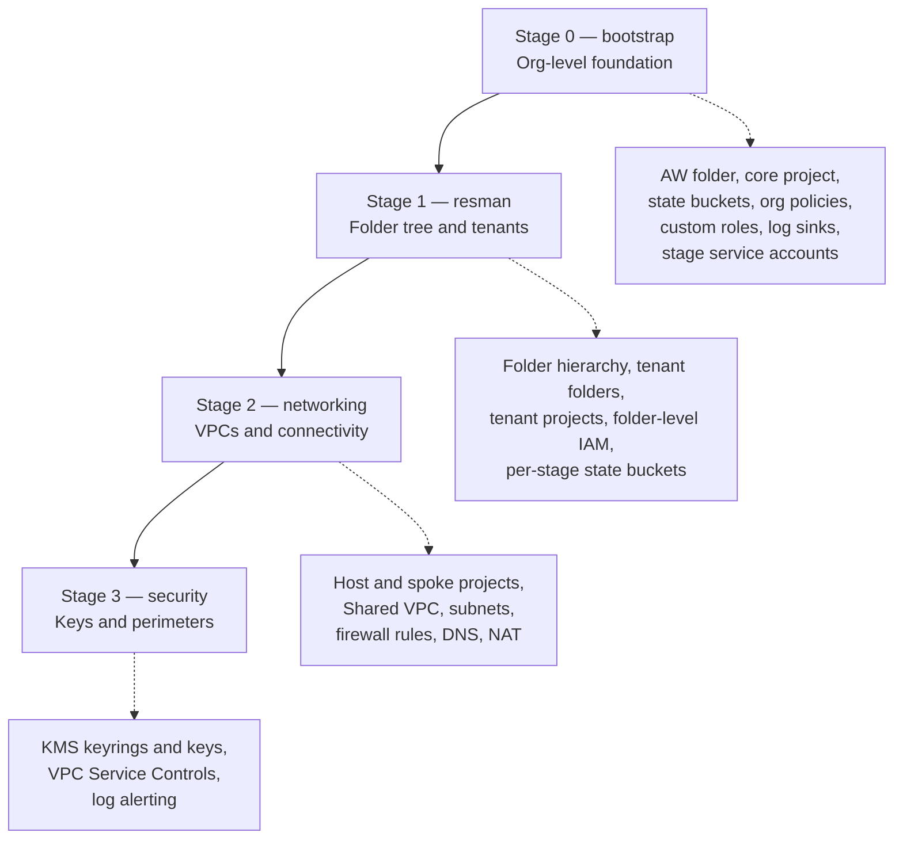

## Part 1 — The hierarchy

Everything in Google Cloud hangs off a single tree. Three node types: the organization at the root, folders in the middle, projects at the leaves. Resources live inside projects.Teal nodes are folders, purple nodes are projects, gray is the org root.

Same thing as mermaid, if you want it in your runbook:



Three rules to hold onto:

**Permissions flow down, never up.** A role granted on the org applies to every folder and project below it. A role granted on one project applies only there. This is why the prerequisites had you grant yourself org-level roles — Terraform creates things all over the tree.

**Org policies flow down the same way.** Assured Workloads is entirely built on this. The AW folder carries policies restricting regions, services, and personnel access; anything created inside inherits them. That's the compliance boundary.

**Projects are the unit of everything operational.** APIs are enabled per project. Quotas are per project. Billing is per project. A resource belongs to exactly one project and can't be moved between orgs.

## Part 2 — The consoles

This is the part the document never explains, and it's a major source of confusion. You're working across four separate web interfaces with different permission models.

| Console | URL | What lives there | Which role |
|---|---|---|---|
| Workspace Admin | admin.google.com | Users, **groups**, domain verification, Super Admin | Super Admin (not a GCP role) |
| Cloud Console | console.cloud.google.com | Projects, folders, resources, IAM | GCP IAM roles |
| Billing | console.cloud.google.com/billing | Billing accounts, payment | Billing Account Admin |
| Assured Workloads | console.cloud.google.com/compliance/assuredworkloads | AW folders, allowed services | Assured Workloads Admin |

Two things cause most of the confusion:

**Groups are not GCP objects.** `gcp-organization-admins@yourdomain` is created at admin.google.com. GCP can only *reference* it. If a group doesn't exist there, Terraform's IAM binding fails with a "member not found" error, and no amount of poking around Cloud Console will fix it.

**The project picker changes what you can see.** Cloud Console has a project selector at the top. Most pages show only the selected project's resources. If you're looking for the GCS bucket from stage 0 and don't see it, you're almost certainly still scoped to your old bootstrap project.

To see the tree itself, go to **IAM & Admin → Manage Resources** and switch the scope from a project to your organization. That's the one page that shows the hierarchy the way the diagram above does. Equivalent CLI:

```bash
gcloud projects list
gcloud resource-manager folders list --organization=386977874025
```

Also worth knowing: `gcloud` and the console are the same API underneath. Anything you do in one shows up in the other. There is no separate "Terraform view" — Terraform is just another API client.

## Part 3 — What each stage creates



The pattern: each stage operates one layer further down the tree than the one before it. Stage 0 works at the org level. Stage 1 builds folders. Stages 2 and 3 fill projects with resources. That's also why each stage gets its own service account — a networking service account has no business creating org policies.

I'm describing stages 2 and 3 from general FAST structure rather than from your document, since I lost the file. For the authoritative list of what any stage actually built, run this inside that stage's folder:

```bash
terraform state list
```

That's the literal inventory, straight from state. Run it in `0-bootstrap` right now and you'll see exactly what phase 1 of your deployment produced, custom roles included.

## What would help me

Re-upload `ddg.md`, and if you can, paste the output of `terraform state list` from `fast/stages-aw/0-bootstrap`. With those two I can walk you resource by resource through what you've actually built so far, using your real project names instead of placeholders — which will probably land better than any generic diagram.
