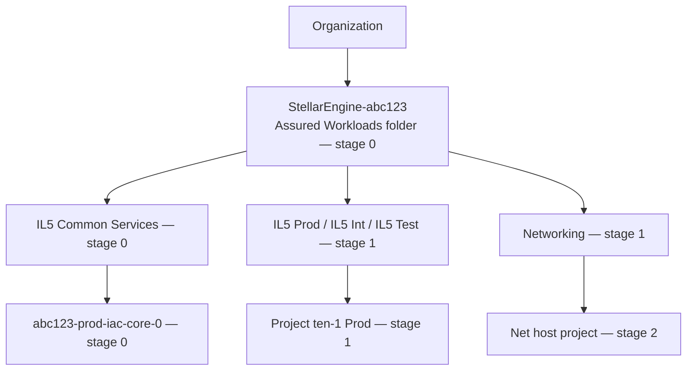

I pulled the repo directly, so I'm reading the actual `stages-aw` code now rather than guessing.

On uploading: you can attach several files at once — drag them in together or ctrl/cmd-click multiple in the file picker. But you don't need to send me anything from GitHub; I have it. What's worth sending is what *isn't* in the repo: your filled-in `terraform.tfvars` (redact the billing account ID), `terraform state list` output, or full error logs.

## The hierarchy, corrected

My earlier diagram was wrong in one important way. Tenant folders don't sit directly under the Assured Workloads folder — they're nested inside **environment** folders.Teal is folders, purple is projects. Mermaid version for your runbook:



Two things worth internalizing from the code:

The AW folder is named `StellarEngine-${prefix}` — that's `organization.tf` line 191. And the env folder names come from `regime_mapping`, so with `regime = "IL5"` and `envs_folders = { Prod, Int, Test }` you get folders literally called `IL5 Prod`, `IL5 Int`, `IL5 Test`. Tenant folders are then `Project <tenant> <env>`, one per tenant *per environment*. Two tenants × three envs = six tenant folders.

## Stage 0 tfvars, field by field

| Field | What it does |
|---|---|
| `billing_account.id` | Which billing account new projects link to |
| `regions.primary` | Drives GCS, BigQuery, KMS, and logging bucket locations |
| `organization.{domain,id,customer_id}` | Identifies your org — all three from `gcloud organizations list` |
| `outputs_location` | Local mirror of the generated files, `~/fast-config` |
| `prefix` | Name prefix on every project and resource |
| `log_sinks` | Four audit log sinks; `empty-audit-logs` with a blank filter is CIS benchmark 2.2 |
| `org_policies_config` | Org-wide policy constraints |
| `fast_features.envs` | Turns on environment folders in stage 1 |
| `assured_workloads.regime` | `IL4`, `IL5`, `FEDRAMP_HIGH`, or `COMPLIANCE_REGIME_UNSPECIFIED` |
| `bootstrap_project` | The project you made by hand before starting |
| `alert_email` | Where log alerts go |

**A real discrepancy to be aware of.** The sample file's comment says 9 characters or fewer, and your DDG says 6. The code in `variables.tf` actually validates `length(var.prefix) <= 7`. Use 6 or fewer and all three agree.

Setting `regime = "COMPLIANCE_REGIME_UNSPECIFIED"` skips Assured Workloads entirely and creates a plain folder instead. Useful if you want to rehearse the deployment without compliance overhead.

## Stage 1 tfvars, field by field

```hcl
tenants = {
  ten-1 = {                                       # map key — max 6 chars
    admin_principal  = "group:gcp-devops@yourdomain.com"
    descriptive_name = "tenant-1"
    locations = { gcs = "us-east4", kms = "us-east4" }
  }
}
```

The map key (`ten-1`) becomes part of project IDs, which is why it's length-limited — validated at fewer than 7 characters. `descriptive_name` is the human-readable label. `admin_principal` must be a **group that already exists** in admin.google.com, prefixed with `group:`. This is where the group work from the prerequisites pays off.

`envs_folders` defines which environment folders get created and who administers each. Its `admin` value is another Workspace group. Note the inconsistency in the sample: `tenants.admin_principal` needs the `group:` prefix, `envs_folders.admin` does not.

`fast_features` also controls optional branches beyond `envs` — `data_platform`, `gke`, `gcve`, `sandbox`, `teams`, `project_factory`, all defaulting to false. Each one you enable adds a folder subtree and its own service accounts. Leave them off for a first deployment.

## Starting minimal

For a first run I'd cut stage 1 down to one tenant and one environment:

```hcl
tenants = {
  ten1 = {
    admin_principal  = "group:gcp-devops@yourdomain.com"
    descriptive_name = "tenant-one"
    locations = { gcs = "us-east4", kms = "us-east4" }
  }
}

fast_features = { envs = true }

envs_folders = {
  Prod = { admin = "gcp-organization-admins@yourdomain.com" }
}
```

Fewer folders and projects means fewer places for a failure to hide, and you're already close to the 13-project quota the prerequisites mention. You can add tenants and environments later — the appendix section of your DDG covers exactly that workflow.

Send me your actual stage 0 `terraform.tfvars` (billing ID redacted) and I'll check it line by line against the validation rules in `variables.tf` before you run stage 1.
