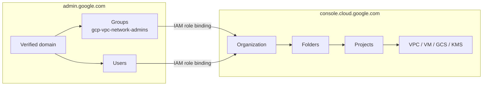
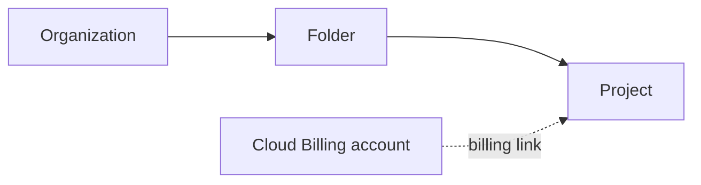
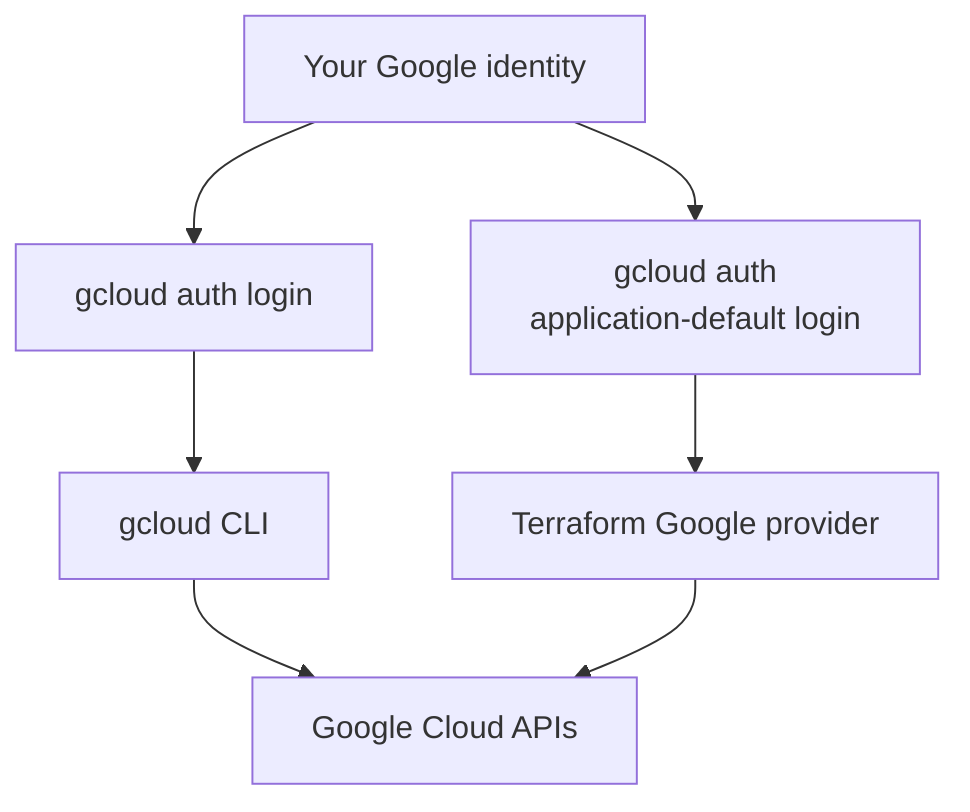
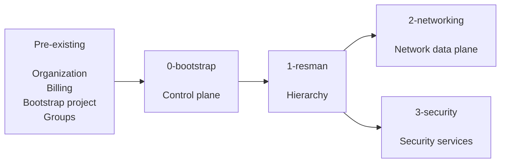
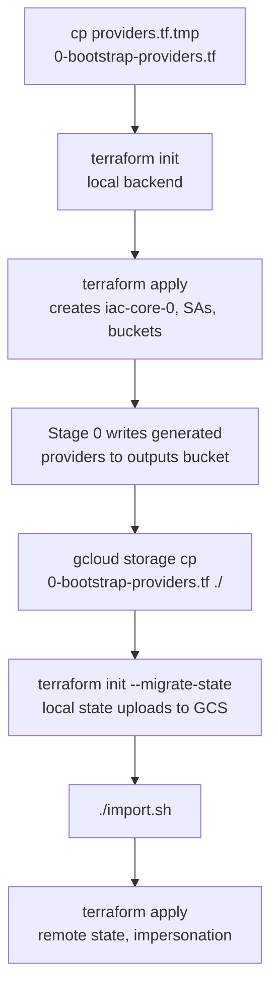
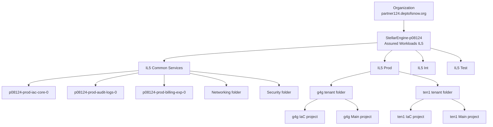
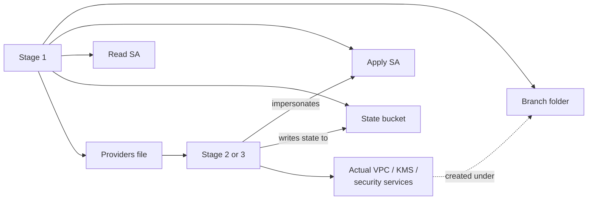
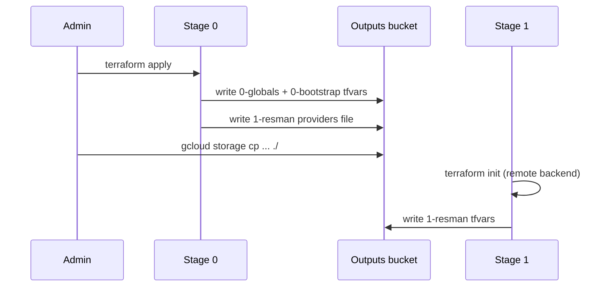

# Stellar Engine — Stages 0 and 1

A working reference for `0-bootstrap` and `1-resman`, written from a real IL5
deployment (prefix `p08124`, organization `partner124.deptofsnow.org`). All
resource counts come from `terraform state list`; all code references were
checked against the repository.

**Contents**

1. Two administrative planes
2. The resource hierarchy
3. The authentication model
4. The stage pattern
5. Stage 0: the bootstrap problem and state migration
6. Stage 0 resources
7. Stage 1 resources
8. State buckets versus the outputs bucket
9. Troubleshooting
10. Reading order and operational notes

---

# 1. Two administrative planes

Google splits administration across two consoles that manage different things.
Confusing them is the most common source of early frustration.

| | Admin Console | Cloud Console |
| --- | --- | --- |
| URL | `admin.google.com` | `console.cloud.google.com` |
| Product | Workspace / Cloud Identity | Google Cloud |
| Manages | Users, groups, domains, Super Admin | Organization, folders, projects, IAM, resources |
| Answers | Who exists? | What may they do in the cloud? |

Stellar Engine needs both. The `gcp-*` groups are created in the Admin
Console; the IAM roles binding those groups to the organization are applied in
the Cloud Console. Terraform can reference a group but cannot create one — if
a group is missing, the apply fails with a member-not-found error that no
amount of Cloud Console work will fix.



## Super Admin is not Organization Admin

Two separate roles that one person often holds during initial setup:

- **Super Admin** — a Workspace / Cloud Identity role, managed at
  `admin.google.com`, controlling the identity and domain side.
- **Organization Administrator** — the IAM role
  `roles/resourcemanager.organizationAdmin`, managed in the Cloud Console,
  controlling the Google Cloud organization resource.

Google recommends separating these once the deployment is established.

---

# 2. The resource hierarchy

```text
Organization  →  Folder  →  (Subfolder)  →  Project  →  Resources
```

Two rules govern everything: IAM inherits downward, and organization policies
inherit downward. Nothing inherits upward. A policy set at the organization
reaches every project beneath it.

```text
Organization policy: compute.vmExternalIpAccess = DENY
    ↓ Prod folder
    ↓ Tenant folder
    ↓ Tenant main project
    ↓ VM cannot receive an external IP
```

## Billing sits outside the tree

A billing account is not a child of the organization. Projects link to it
through a separate relationship with its own permission model — which is why
Stellar Engine requires billing permissions in addition to organization
permissions, and why external billing accounts need the extra service-account
grants described in the deployment guide.



## AWS translation

| Google Cloud | AWS mental model |
| --- | --- |
| Organization | AWS Organization |
| Folder | Organizational Unit |
| Project | Roughly an account |
| Organization policy | SCP-style guardrail |
| Service account | IAM role / machine identity |
| Service account impersonation | `sts:AssumeRole` |
| GCS state bucket | S3 Terraform backend |
| Assured Workloads folder | Compliance-controlled OU boundary |
| `iac-core-0` project | Terraform deployment account |
| `audit-logs-0` project | Log Archive account |
| `billing-exp-0` project | Billing / FinOps account |

## Where Assured Workloads fits

`google_assured_workloads_workload.primary[0]` is not a normal
`google_folder`. It is created through the Assured Workloads API and yields a
folder carrying compliance guarantees — data residency, personnel controls, a
restricted service list. In this deployment it is named
`StellarEngine-p08124` (see `organization.tf` line 191).

---

# 3. The authentication model

The deployment guide asks for three commands that look redundant. They are
three different things.

| Command | What it establishes | Consumed by |
| --- | --- | --- |
| `gcloud auth login` | CLI identity | `gcloud` commands |
| `gcloud config set project X` | Default project context | `gcloud` commands |
| `gcloud auth application-default login` | Application Default Credentials | Terraform, client libraries |



The gcloud CLI does not use ADC for its own authentication. Both credential
sets can represent the same human, but they are stored and consumed
separately. This is why `gcloud` can work perfectly while Terraform fails to
authenticate.

Three concepts worth keeping distinct:

```text
Authentication   Who am I?
Authorization    What am I allowed to do?
Project context  Which project is my default?
```

Setting a project you have no rights to succeeds as a config change and then
fails on every subsequent API call.

## How authentication evolves across stages

Stage 0 begins with your own credentials and ends with impersonation. Every
later stage impersonates from the start.

| Stage | Terraform acts as | State lives in |
| --- | --- | --- |
| 0, first apply | Your ADC user | Local `terraform.tfstate` |
| 0, after migration | `p08124-prod-bootstrap-0` | Bootstrap GCS bucket |
| 1 | `p08124-prod-resman-0` | Resman GCS bucket |
| 2 | Networking service account | Networking GCS bucket |
| 3 | Security service account | Security GCS bucket |

Impersonation requires `roles/iam.serviceAccountTokenCreator` on the target
service account. This is the equivalent of separate Terraform IAM roles and
separate S3 state buckets per platform responsibility in AWS.

---

# 4. The stage pattern

Every stage creates four things for the next one:

```text
1. WHERE the next stage operates      (a folder)
2. WHO runs it                        (a service account)
3. WHERE its state lives              (a GCS bucket)
4. Configuration it consumes          (providers + tfvars)
```



Neither Stage 0 nor Stage 1 creates a VPC, subnet, VM, or firewall rule. After
both complete, you have governance and structure but no network.

---

# 5. Stage 0: the bootstrap problem and state migration

## The problem

Terraform wants its state in a GCS bucket. That bucket does not exist until
Terraform creates it. So Stage 0 must start with local state and switch over
partway through.

## The sequence



## What changes at each end

The starting provider (`providers.tf.tmp`) has no backend block and no
impersonation. It does already set `user_project_override = true` and
`billing_project = var.bootstrap_project`, which the Assured Workloads API
requires:

```hcl
provider "google" {
  project               = var.bootstrap_project
  billing_project       = var.bootstrap_project
  user_project_override = true
}
```

The generated replacement (from `templates/providers.tf.tpl`) adds both a
remote backend and impersonation:

```hcl
terraform {
  backend "gcs" {
    bucket                      = "<stage-0-state-bucket>"
    impersonate_service_account = "<bootstrap-sa>"
  }
}

provider "google" {
  impersonate_service_account = "<bootstrap-sa>"
}
```

It also emits an aliased `billing` provider pair honouring the
`billing_override` variable, for cases where the service account cannot be
granted billing permissions.

## What migration actually moves

Not the infrastructure. The projects, folders, IAM bindings, KMS keys, and
buckets already exist in Google Cloud and do not move. What moves is
Terraform's *record* of them — resource IDs, attributes, dependencies, and
Terraform addresses — from a file on your disk into the GCS bucket.

Remote state gains you central storage, state locking, IAM-controlled access,
encryption at rest, and independence from one engineer's workstation.

## What `import.sh` does

The script reads existing organization policies and stages import blocks for
any constraint that is declared in `data/org-policies/` or
`data/custom-org-policies/` but not yet in state. This lets Terraform adopt
pre-existing policies rather than colliding with them.

Three details that are easy to miss:

- **It only handles organization policies.** Custom IAM roles, folders, and
  projects are not covered. Those need manual import blocks.
- **It runs `rm -f imports.tf` first**, then regenerates that file. Any
  hand-written `imports.tf` in the stage directory will be destroyed.
- **It skips `custom.*` constraints** deliberately.

---

# 6. Stage 0 resources

## Prerequisites

Stage 0 does not start from nothing:

```text
Cloud Identity / Workspace with verified domain
Google Cloud Organization
Billing account
Administrative groups (gcp-*)
Privileged user with org-level roles
Manually created bootstrap project
```

The bootstrap project is a launch pad, not the permanent control plane. Stage
0 creates `iac-core-0` and migrates state into it.

## What gets created

| Resource | Count | Purpose |
| --- | ---: | --- |
| Assured Workloads workload | 1 | IL5 compliance boundary |
| Folder | 1 | `IL5 Common Services` |
| Projects | 3 | IaC, audit logs, billing export |
| GCS buckets | 3 | Stage 0 state, Stage 1 state, outputs |
| Service accounts | 4 | bootstrap and resman, apply + read |
| KMS key rings | 2 | `gcs-kms`, `logging-kms` |
| KMS crypto keys | 2 | `gcs`, `log-sink` |
| Organization log sinks | 4 | Central log routing |
| Cloud Logging buckets | 4 | Sink destinations |
| Organization policies | 72 | Security guardrails |
| Custom org constraints | 2 | `custom.kmsRotation`, `custom.restrictFirewallRanges` |
| Custom IAM roles | 7 | Delegated administration |
| Log metrics | 24 | 8 events × 3 projects |
| Alert policies | 24 | Matching alerts |
| Notification channels | 3 | Alert email per project |
| BigQuery dataset | 1 | Billing export |

## The three projects

```text
p08124-prod-iac-core-0       Central Terraform automation
p08124-prod-audit-logs-0     Centralized logging
p08124-prod-billing-exp-0    Billing export to BigQuery
```

All three carry a `google_resource_manager_lien` blocking accidental
deletion. The lien must be removed before any teardown.

## Service account naming

```text
p08124-prod-bootstrap-0     Stage 0 apply identity
p08124-prod-bootstrap-0r    Stage 0 read/plan identity
p08124-prod-resman-0        Stage 1 apply identity
p08124-prod-resman-0r       Stage 1 read/plan identity
```

The `-0r` suffix marks a read-only twin used for `terraform plan` in CI with
no write capability. Every stage follows this pattern.

## Organization policies

The 72 policies are the substance of Stage 0. Representative examples:

```text
compute.requireOsLogin              compute.requireShieldedVm
compute.requireVpcFlowLogs          compute.vmExternalIpAccess
compute.skipDefaultNetworkCreation  sql.restrictPublicIp
storage.publicAccessPrevention      storage.secureHttpTransport
storage.uniformBucketLevelAccess    iam.disableServiceAccountKeyCreation
gcp.resourceLocations               gcp.restrictNonCmekServices
```

Every project created afterward inherits all of them.

## Centralized logging

Four organization sinks — `audit-logs`, `vpc-sc`, `workspace-audit-logs`,
`empty-audit-logs` — each write to a matching Cloud Logging bucket in the
audit-logs project. The `empty-audit-logs` sink with a blank filter satisfies
CIS benchmark 2.2. This is the equivalent of an AWS Log Archive account fed by
organization-wide log aggregation.

---

# 7. Stage 1 resources

Stage 1 starts with a remote backend already configured, so there is no
local-to-remote migration. Copy three files first:

```text
1-resman-providers.tf
0-globals.auto.tfvars.json
0-bootstrap.auto.tfvars.json
```

The `.auto.tfvars.json` suffix means Terraform loads them automatically. No
`-var-file` flag is needed.

## Configuration used

Environments `Int`, `Prod`, `Test`; tenants `g4g`, `ten1`. Stellar Engine
builds the cross product, giving six tenant/environment combinations:
`Int-g4g`, `Int-ten1`, `Prod-g4g`, `Prod-ten1`, `Test-g4g`, `Test-ten1`.

## What gets created

| Resource | Count | Breakdown |
| --- | ---: | --- |
| Folders | 11 | 3 env + 1 networking + 1 security + 6 tenant |
| Projects | 12 | 6 tenant IaC + 6 tenant Main |
| GCS buckets | 20 | 1 network + 1 security + 6 tenant core + 6 tenant IaC state + 6 tenant IaC outputs |
| Service accounts | 17 | 1 envs + 2 network + 2 security + 6 tenant core + 6 tenant self-IaC |
| KMS key rings | 6 | One per combination |
| KMS crypto keys | 12 | `default` + `gcs` per ring |
| Log metrics | 96 | 6 × 2 projects × 8 events |
| Alert policies | 96 | Matching alerts |
| Notification channels | 12 | 6 × 2 projects |
| API enablements | 264 | Pre-enabled services |
| Generated GCS objects | 29 | Providers and tfvars for later stages |

## The complete hierarchy



Int and Test repeat the same tenant structure. Note that the Networking and
Security folders are children of Common Services
(`parent = var.common_services_folder`), while environment folders are
children of the Assured Workloads folder.

## Two projects per tenant/environment

```text
Prod / ten1
├── IaC project     Terraform automation, state, outputs, service account
└── Main project    Workload foundation: compute, GKE, storage
```

In AWS terms, a mission-owner Terraform account paired with a mission-owner
workload account. The IaC project lets a tenant run its own Terraform
independently within the boundaries the platform team set.

## The branch pattern for Stages 2 and 3

Stage 1 prepares both later stages identically — folder, apply service
account, read service account, state bucket, generated providers file.



Modules: `branch-network-folder`, `branch-network-sa`, `branch-network-r-sa`,
`branch-network-gcs`, and the identical `branch-security-*` set. Generated
providers: `2-networking`, `2-networking-r`, `3-security`, `3-security-r`.

This is why networking resources appear in Stage 1 output even though no
network exists. Stage 1 creates *where, who, and state*. Stage 2 creates the
network.

## API enablement is not resource creation

The 264 `google_project_service` entries mean projects are *permitted* to use
those services. Enabling `container.googleapis.com` does not create a GKE
cluster.

---

# 8. State buckets versus the outputs bucket

Easily confused, and they do different jobs.

**State buckets** hold `terraform.tfstate` for one stage. They answer: what
does this stage currently manage?

**The outputs bucket** (`p08124-prod-iac-core-outputs-0`) is the configuration
bus between stages.



Contents:

```text
providers/
    0-bootstrap-providers.tf
    1-resman-providers.tf
    2-networking-providers.tf
    3-security-providers.tf
tfvars/
    0-globals.auto.tfvars.json
    0-bootstrap.auto.tfvars.json
    1-resman.auto.tfvars.json
```

Each stage pulls every prior stage's outputs, so the copy command grows by one
line per stage.

---

# 9. Troubleshooting

| Symptom | Where to look |
| --- | --- |
| `gcloud organizations list` returns nothing | `gcloud auth list`, org-level IAM |
| gcloud works, Terraform fails to authenticate | ADC — rerun `gcloud auth application-default login` |
| `ACCESS_TOKEN_SCOPE_INSUFFICIENT` | ADC token lacks `cloud-platform` scope; check for metadata-server credentials on a VM or Cloud Shell |
| Quota project error naming `projects/764086051850` | ADC has no quota project; `gcloud auth application-default set-quota-project <id>` |
| Impersonation fails partway through | Source identity needs `roles/iam.serviceAccountTokenCreator` on the target SA |
| Group exists but access denied | Group existing in Admin Console proves identity only — check for an IAM binding in Cloud Console |
| `already exists and must be imported` | Resource exists in GCP but not in state; add an import block |
| `is not a valid resource name` | Illegal character in a project ID, usually an underscore in a tenant key |

## State entries are not infrastructure objects

Stage 1's state has over 1,000 entries representing 12 projects and 11
folders. One project alone produces dozens of entries because the module also
enables APIs, creates service identities, applies IAM, deletes the default
VPC, sets metadata, and configures monitoring.

When reading state for architecture, filter to the entries that represent real
infrastructure:

```text
google_assured_workloads_workload
google_folder
google_project
google_storage_bucket
google_service_account
google_kms_*
```

Examine IAM, API, and monitoring entries afterward.

---

# 10. Reading order and operational notes

## Suggested reading order

```text
0-bootstrap
├── organization.tf    Assured Workloads boundary, org policies
├── automation.tf      Who runs Terraform, where state lives
├── log-export.tf      Where organization logs go
├── billing.tf         Where billing data goes
└── outputs.tf         What is handed to Stage 1

1-resman
├── branch-envs.tf         Prod / Int / Test folders
├── branch-tenants.tf      Tenant folders and project pairs
├── branch-networking.tf   Stage 2 preparation
├── branch-security.tf     Stage 3 preparation
└── outputs.tf             Providers and tfvars for later stages
```

Only after that move to `2-networking` and Shared VPC, host and service
projects, subnets, Cloud Router, firewall, NGFW, and DNS.

## Operational notes

**Project ID constraints.** Tenant map keys flow into project IDs through
`lower("${each.key}-main-0")` in `branch-tenants.tf`. Project IDs allow only
lowercase letters, digits, and hyphens, 6–30 characters, starting with a
letter. The `tenants` variable validates length only, not character set, so an
underscore in a tenant key passes validation and then fails at the API.

**Prefix length.** The sample tfvars comment says 9 characters, the deployment
guide says 6, and `variables.tf` validates 7 or fewer. Use 6 or fewer.

**Project quota.** Stage 0 uses 3 projects; Stage 1 with 3 environments and 2
tenants uses 12 more. The default quota is often below the 13 the deployment
guide asks you to request.

**Changing a tenant key.** Map keys are resource identity in Terraform.
Renaming one destroys everything keyed on the old name and creates it fresh
under the new one. Always read the plan before applying.

## References

- [Create your Google Cloud resource hierarchy](https://cloud.google.com/resource-manager/docs/manage-google-cloud-resources)
- [Set up a Google Cloud organization resource](https://cloud.google.com/resource-manager/docs/creating-managing-organization)
- [gcloud auth login](https://cloud.google.com/sdk/gcloud/reference/auth/login)
- [Authentication for Terraform](https://cloud.google.com/docs/terraform/authentication)
- [Set up Application Default Credentials](https://cloud.google.com/docs/authentication/provide-credentials-adc)
- [Terraform backend configuration](https://developer.hashicorp.com/terraform/language/backend)
- [Terraform GCS backend](https://developer.hashicorp.com/terraform/language/backend/gcs)
