# Stellar Engine — Understanding Stage 0 Bootstrap and Stage 1 Resource Management

A practical reference for the `0-bootstrap` and `1-resman` stages of Google Stellar Engine, written from an actual IL5 deployment using prefix `p08124`.

The goal of this document is not just to list Terraform resources. It explains:

* How Google Cloud's hierarchy works.
* Why there are two different Google administration consoles.
* Where Assured Workloads fits.
* What Stage 0 actually bootstraps.
* What Stage 1 actually creates.
* Why every stage has different Terraform service accounts and state buckets.
* How Terraform moves from **local state to remote GCS state** during Stage 0.
* Why Stellar Engine requires both `gcloud auth login` and `gcloud auth application-default login`.

---

# Part 1 — Start With the Google Mental Model

## 1.1 There are really two administrative planes

One of the first confusing parts of Google Cloud is that there are two different administration consoles:

```text
Google Admin Console
        versus
Google Cloud Console
```

They manage different things.

---

## 1.2 Google Admin Console

URL:

```text
admin.google.com
```

Think of this as the:

> **Identity and corporate directory administration plane**

This belongs to **Google Workspace / Cloud Identity**, not to individual Google Cloud projects.

You manage things such as:

```text
Users
Groups
Group membership
Domains
Super Administrators
Cloud Identity
Workspace settings
```

For Stellar Engine, examples include groups such as:

```text
gcp-organization-admins@<domain>
gcp-security-admins@<domain>
gcp-vpc-network-admins@<domain>
gcp-billing-admins@<domain>
gcp-developers@<domain>
```

These identities and groups exist in Google Workspace / Cloud Identity.

Google documents that the Google Cloud Organization resource is linked to a Google Workspace or Cloud Identity account and its verified domain. ([Google Cloud Documentation][1])

---

# 1.3 Google Cloud Console

URL:

```text
console.cloud.google.com
```

Think of this as the:

> **Cloud infrastructure and cloud authorization plane**

This is where you manage:

```text
Google Cloud Organization
Folders
Projects
IAM
Organization Policies
VPCs
VMs
GCS
KMS
Cloud Logging
Billing links
Assured Workloads
etc.
```

So the same person might use:

```text
admin.google.com
```

to create a group:

```text
gcp-vpc-network-admins@partner124.deptofsnow.org
```

and then use:

```text
console.cloud.google.com
```

to grant that group:

```text
roles/compute.xpnAdmin
```

on a particular Organization or Folder.

---

# 1.4 How the two worlds connect

This is the critical relationship:

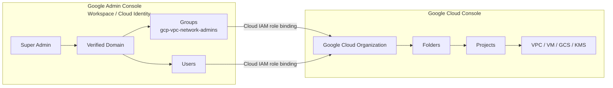

The Admin Console answers:

> **Who exists?**

The Cloud Console answers:

> **What is that person/group allowed to do in Google Cloud?**

---

# 1.5 Super Admin is not the same thing as Organization Admin

This is another important distinction.

### Google Workspace / Cloud Identity Super Admin

Managed through:

```text
admin.google.com
```

Controls the identity/domain side.

### Google Cloud Organization Administrator

IAM role:

```text
roles/resourcemanager.organizationAdmin
```

Managed through:

```text
console.cloud.google.com
```

Controls the Google Cloud Organization resource.

A person can hold both roles, especially during initial setup, but they are conceptually separate.

Google specifically recommends eventually separating the Workspace/Cloud Identity Super Administrator role from normal Google Cloud Organization administration. ([Google Cloud Documentation][2])

For a fresh Stellar Engine deployment, one highly privileged user may temporarily hold both sets of privileges.

---

# Part 2 — Understand the Google Cloud Resource Hierarchy

## 2.1 The hierarchy

The basic hierarchy is:

```text
Organization
    ↓
Folder
    ↓
Subfolder
    ↓
Project
    ↓
Resources
```

Example:

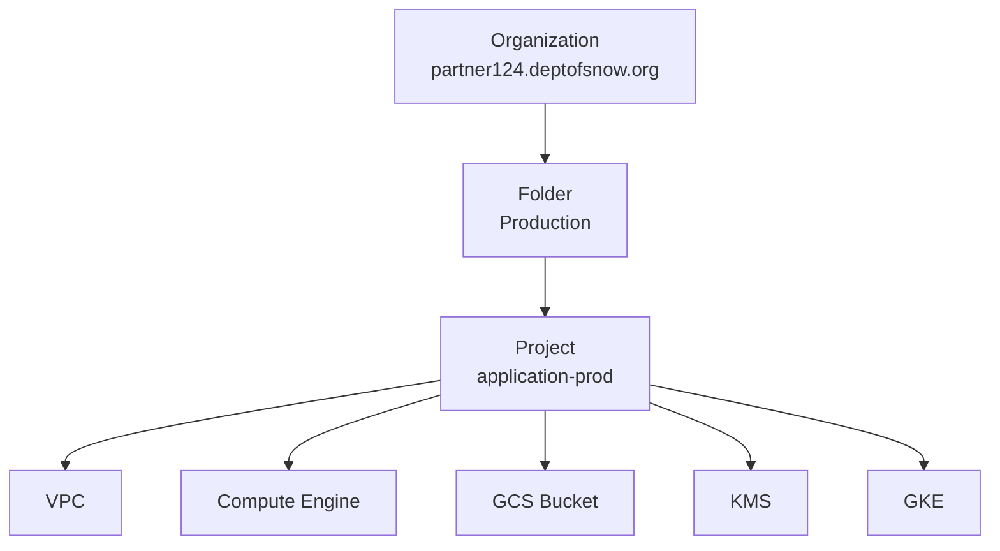

IAM and Organization Policies can be inherited downward.

For example:

```text
Organization Policy:
    compute.vmExternalIpAccess = DENY

Organization
    ↓
Prod Folder
    ↓
Tenant Folder
    ↓
Tenant Main Project
    ↓
VM
```

Unless explicitly permitted by the policy model, the project cannot simply ignore the higher-level organizational guardrail.

---

# 2.2 AWS translation

For an AWS engineer:

| Google Cloud                  | AWS Mental Model                   |
| ----------------------------- | ---------------------------------- |
| Organization                  | AWS Organization                   |
| Folder                        | AWS OU                             |
| Project                       | Roughly AWS Account                |
| Resources                     | Resources within AWS account       |
| Organization Policy           | SCP-like guardrail                 |
| IAM on Folder                 | Inherited authorization/governance |
| Service Account               | IAM role / machine identity        |
| Service Account impersonation | `sts:AssumeRole`                   |
| GCS state bucket              | S3 Terraform backend               |
| `iac-core-0` project          | Terraform deployment account       |
| `audit-logs-0` project        | Log Archive account                |
| `billing-exp-0` project       | Billing / FinOps account           |

This is not a perfect one-to-one mapping, but it is an effective way to reason about Stellar Engine.

---

# 2.3 Billing is outside the resource hierarchy

The Cloud Billing Account is not another child below the Organization like a project.

Conceptually:

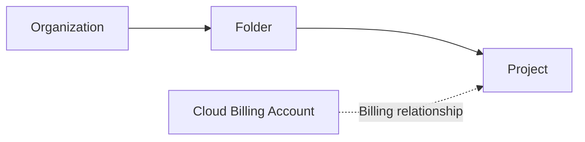

A project belongs in the resource hierarchy:

```text
Organization → Folder → Project
```

while separately being linked to:

```text
Billing Account
```

This is why Stellar requires Billing Account permissions in addition to Organization permissions.

---

# Part 3 — Where Assured Workloads Fits

Stellar Engine creates an Assured Workloads workload near the top of the hierarchy.

Your deployment contains:

```text
google_assured_workloads_workload.primary[0]
```

This creates the compliance-controlled branch that the rest of the Stellar Engine environment uses.

For your deployment:

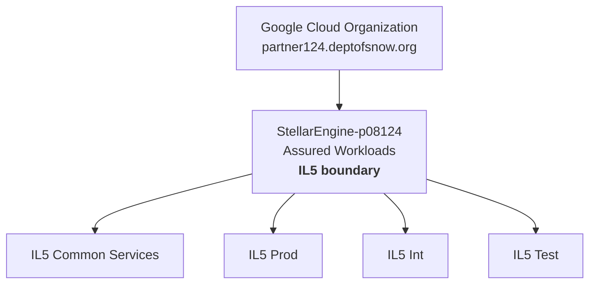

This is the most important top-level Stellar hierarchy:

```text
Organization
└── Assured Workloads
    ├── Common Services
    ├── Prod
    ├── Int
    └── Test
```

---

# Part 4 — Stellar Engine's Core Stage Pattern

Every stage follows approximately the same pattern.

A stage creates:

```text
1. WHERE the next stage operates
2. WHO runs Terraform for the next stage
3. WHERE Terraform state for the next stage lives
4. Configuration that the next stage consumes
```

Therefore:

```text
Stage 0
    creates WHO runs Stage 1
    and WHERE Stage 1 stores state

Stage 1
    creates WHO runs Stage 2 and Stage 3
    and WHERE they store state

Stage 2
    creates the actual network

Stage 3
    creates the actual security services
```

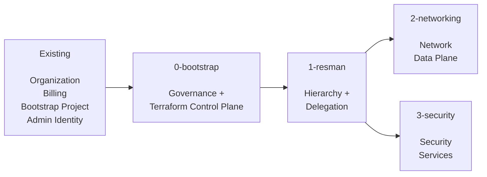

A useful shorthand is:

```text
Stage 0 = CONTROL PLANE

Stage 1 = ORGANIZATIONAL STRUCTURE

Stage 2 = NETWORK

Stage 3 = SECURITY SERVICES
```

---

# Part 5 — Authentication Before Running Stage 0

The deployment guide asks you to run:

```bash
gcloud auth login

gcloud config set project <bootstrap_project_id>

gcloud auth application-default login
```

These look redundant but they do three different things.

---

# 5.1 `gcloud auth login`

```bash
gcloud auth login
```

This authenticates the **gcloud CLI itself**.

Usually a browser opens and you authenticate as your Google user.

For example:

```text
engineer@partner124.deptofsnow.org
```

Afterward commands such as these use your gcloud CLI credentials:

```bash
gcloud organizations list

gcloud projects list

gcloud storage cp ...

gcloud org-policies list ...

gcloud config set project ...
```

Think:

```text
gcloud auth login
        ↓
"Who is the gcloud CLI?"
```

You can verify with:

```bash
gcloud auth list
```

Google documents `gcloud auth login` as the command that authorizes the gcloud CLI with a user identity. ([Google Cloud Documentation][3])

---

# 5.2 `gcloud config set project <bootstrap_project_id>`

Next:

```bash
gcloud config set project <bootstrap_project_id>
```

This does **not** log you in.

It does **not** grant permission.

It simply tells the current gcloud configuration:

> Use this project as my default project when a command does not explicitly specify another project.

Example:

```bash
gcloud config set project p08124-bootstrap
```

Now:

```bash
gcloud config list
```

might show:

```text
[core]
account = engineer@partner124.deptofsnow.org
project = p08124-bootstrap
```

Think:

```text
gcloud auth login
        ↓
WHO am I?

gcloud config set project
        ↓
WHICH project is my default context?
```

This is similar conceptually to selecting an AWS profile/default account context, although Google projects and AWS accounts are not identical.

---

# 5.3 Setting the project does not give you access

Suppose you run:

```bash
gcloud config set project secret-project
```

but you have no IAM rights there.

The command changing your configuration does not magically grant access.

Subsequent API requests will still fail with authorization errors.

So:

```text
Authentication
    ≠
Authorization
    ≠
Project context
```

Keep these three concepts separate.

---

# 5.4 `gcloud auth application-default login`

Now the important Terraform-related command:

```bash
gcloud auth application-default login
```

This creates **Application Default Credentials**, usually called:

```text
ADC
```

Terraform's Google provider and Google client libraries know how to automatically discover ADC.

Google currently recommends ADC as the normal authentication mechanism for Terraform running from a local development environment. ([Google Cloud Documentation][4])

Think:

```text
gcloud auth application-default login
        ↓
"Who are applications such as Terraform?"
```

---

# 5.5 `gcloud auth login` and ADC are separate

This distinction is extremely important.

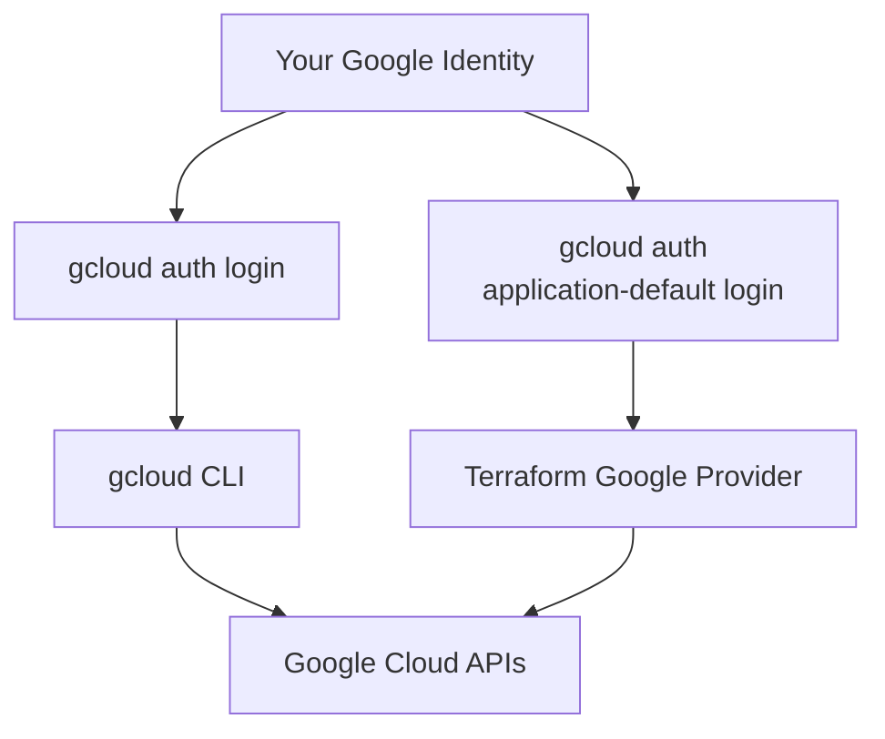

The gcloud CLI does **not normally use ADC for its own authentication**. Google explicitly documents that ADC is used by application/client libraries, while the gcloud CLI has its own authentication credentials. ([Google Cloud Documentation][5])

Both credentials can represent the exact same human user, but they are stored and consumed differently.

---

# 5.6 Why Stellar runs both

During initial bootstrap:

### `gcloud` needs credentials because Stellar's instructions/scripts run commands like:

```bash
gcloud organizations list
gcloud storage cp
gcloud config set project
```

### Terraform needs ADC because the Google Terraform provider must call APIs such as:

```text
Cloud Resource Manager
Assured Workloads
IAM
Cloud Billing
Cloud Storage
KMS
Organization Policy
```

Therefore:

```text
gcloud auth login
        ↓
Used by gcloud commands

gcloud auth application-default login
        ↓
Used initially by Terraform/provider libraries
```

Later, Terraform changes from acting directly as your user to **impersonating Stellar service accounts**.

---

# Part 6 — Stage 0 Bootstrap

## 6.1 Stage 0 does not begin from nothing

You already need:

```text
Google Workspace / Cloud Identity
        ↓
Verified Domain
        ↓
Google Cloud Organization

Billing Account

Administrative Groups

Privileged User

Manually Created Bootstrap Project
```

The bootstrap project is very important but temporary in purpose.

It is:

> **The launch pad from which Terraform creates the permanent Terraform control plane.**

---

# 6.2 Before Stage 0

Conceptually:

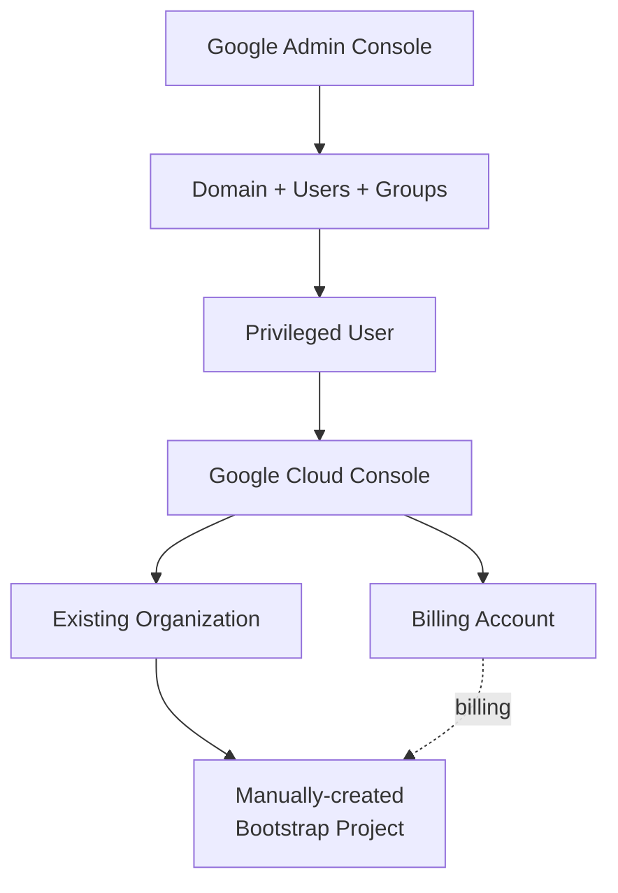

---

# Part 7 — The Most Important Stage 0 Concept: Local → Remote Terraform State

This is one of the most confusing but best-designed parts of Stage 0.

Stage 0 has a **bootstrap problem**:

> Terraform ultimately wants to store its state in a secure GCS bucket, but that GCS bucket does not exist until Terraform creates it.

Therefore Stage 0 initially has to use **local state**.

---

# 7.1 Initial provider file

The deployment instructions start by copying:

```bash
cp providers.tf.tmp 0-bootstrap-providers.tf
```

The initial provider points Terraform at:

```text
bootstrap_project
```

but contains no remote `backend "gcs"` configuration.

Therefore Terraform begins with its default:

```text
local backend
```

---

# 7.2 First `terraform init`

You run:

```bash
terraform init
```

At this point:

```text
Terraform configuration
        ↓
No remote backend configured
        ↓
Local backend
        ↓
terraform.tfstate
```

HashiCorp documents that the default local backend stores state in a local `terraform.tfstate` file. ([HashiCorp Developer][6])

---

# 7.3 First Stage 0 apply

Next:

```bash
terraform apply \
  -var bootstrap_user=$(gcloud config list --format 'value(core.account)')
```

During this first apply, your ADC user credentials are effectively the starting authentication source.

Stage 0 then creates the permanent Terraform infrastructure, including:

```text
p08124-prod-iac-core-0

Bootstrap Terraform Service Account

Bootstrap Read-Only Service Account

Stage 0 GCS Terraform State Bucket

Stage 1 GCS Terraform State Bucket

Central Terraform Outputs Bucket
```

At this exact moment there is an interesting situation:

```text
Remote GCS backend now EXISTS

but

Terraform is STILL using local terraform.tfstate
```

because backend migration has not happened yet.

---

# 7.4 Stage 0 generates its future provider configuration

Stage 0 writes a new provider file into:

```text
p08124-prod-iac-core-outputs-0
```

The generated Stage 0 provider contains conceptually:

```hcl
terraform {
  backend "gcs" {
    bucket = "<stage-0-state-bucket>"

    impersonate_service_account =
      "<bootstrap-service-account>"
  }
}

provider "google" {
  impersonate_service_account =
    "<bootstrap-service-account>"
}
```

This is the major transition.

The initial configuration was approximately:

```text
Terraform
    ↓
ADC user
    ↓
Bootstrap Project
    ↓
LOCAL state
```

The generated permanent configuration becomes:

```text
Terraform
    ↓
ADC user credentials
    ↓
Impersonate Bootstrap Service Account
    ↓
Google APIs

Terraform State
    ↓
GCS remote backend
```

---

# 7.5 Switch gcloud default project

The deployment guide then has you run:

```bash
gcloud config set project ${FAST_PREFIX}-prod-iac-core-0
```

For your example:

```bash
gcloud config set project p08124-prod-iac-core-0
```

This is saying:

> We are finished using the manually-created bootstrap project as our normal working context. The newly-created central IaC project is now our main operational project.

This changes the default **gcloud context**.

It does not itself move Terraform state.

---

# 7.6 Download the permanent provider configuration

Next:

```bash
gcloud storage cp \
  gs://${FAST_PREFIX}-prod-iac-core-outputs-0/providers/0-bootstrap-providers.tf \
  ./
```

This replaces the temporary provider configuration with one containing:

```text
GCS backend
+
Bootstrap Service Account impersonation
```

Terraform now detects:

```text
OLD BACKEND = local

NEW BACKEND = gcs
```

---

# 7.7 `terraform init --migrate-state`

Now run:

```bash
terraform init --migrate-state
```

This is the command that actually moves the Terraform state.

HashiCorp describes `-migrate-state` as attempting to copy existing state into the newly configured backend. ([HashiCorp Developer][7])

Conceptually:

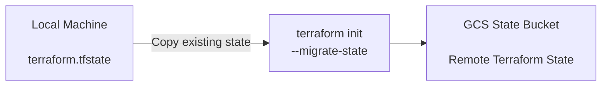

Terraform will normally ask:

```text
Do you want to migrate the existing state?
```

You answer:

```text
yes
```

---

# 7.8 What is actually being moved?

Terraform is **not moving the infrastructure**.

The projects, folders, IAM bindings, KMS keys and buckets already exist in Google Cloud.

What is being moved is Terraform's record of those resources:

```text
Resource IDs
Dependencies
Attributes
Terraform resource addresses
Current known configuration
```

Before:

```text
Laptop/Bastion
└── terraform.tfstate
       ├── Assured Workload
       ├── Common Services
       ├── iac-core project
       ├── logging project
       └── ...
```

After:

```text
GCS
└── Stage 0 Terraform State
       ├── Assured Workload
       ├── Common Services
       ├── iac-core project
       ├── logging project
       └── ...
```

The infrastructure itself never moved.

Only Terraform's **source of truth about that infrastructure** moved.

---

# 7.9 Before and after migration

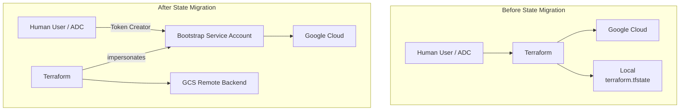

This is the real meaning of **bootstrap**.

Terraform uses temporary human/local mechanisms to build the permanent automation mechanism, and then switches itself over to that permanent mechanism.

---

# 7.10 Why remote state is better

A remote GCS backend provides:

```text
Central state storage
State locking
Controlled IAM
Encryption
Shared automation access
Less dependence on one engineer's workstation
```

The GCS backend supports Terraform state locking, and HashiCorp recommends versioning the state bucket for recovery. ([HashiCorp Developer][8])

---

# Part 8 — What `import.sh` Does After Migration

After state migration, Stellar runs:

```bash
./import.sh
```

The script looks at existing Organization Policies.

Its purpose is primarily:

> Find supported organization policies that already exist in Google Cloud but are not yet in Terraform state, and import them so Terraform can manage them rather than trying to recreate/conflict with them.

Conceptually:

```text
Existing Google Organization Policy
        ↓
Does Stellar manage this constraint?
        ↓
Yes
        ↓
Already in Terraform state?
        ↓
No
        ↓
terraform import / import block
        ↓
Now managed by Stellar Terraform
```

This aligns pre-existing organization configuration with the new remote Terraform state.

---

# Part 9 — Stage 0 Resource Summary

Your actual deployment created approximately:

| Resource                   | Count | Purpose                               |
| -------------------------- | ----: | ------------------------------------- |
| Assured Workloads workload |     1 | IL5 compliance boundary               |
| Common Services folder     |     1 | Central services branch               |
| Projects                   |     3 | IaC, audit logging, billing           |
| GCS Terraform buckets      |     3 | Stage 0 state, Stage 1 state, outputs |
| Terraform service accounts |     4 | Bootstrap + Resman apply/read         |
| KMS key rings              |     2 | GCS and logging                       |
| KMS crypto keys            |     2 | Encryption                            |
| Organization log sinks     |     4 | Central log routing                   |
| Logging buckets            |     4 | Central logging destinations          |
| Organization policies      |   ~72 | Security/compliance guardrails        |
| Custom org constraints     |     2 | Additional guardrails                 |
| Custom IAM roles           |     7 | Delegated administration              |
| Log metrics                |    24 | Security/change detection             |
| Alert policies             |    24 | Monitoring                            |
| Notification channels      |     3 | Alert delivery                        |
| BigQuery dataset           |     1 | Billing export                        |

The important projects are:

```text
p08124-prod-iac-core-0
    Central Terraform automation

p08124-prod-audit-logs-0
    Centralized logging

p08124-prod-billing-exp-0
    Billing export
```

---

# Part 10 — Stage 0 Service Accounts

Stage 0 creates:

```text
p08124-prod-bootstrap-0
    Stage 0 Terraform apply identity

p08124-prod-bootstrap-0r
    Stage 0 Terraform read/plan identity


p08124-prod-resman-0
    Stage 1 Terraform apply identity

p08124-prod-resman-0r
    Stage 1 Terraform read/plan identity
```

This shows another important Stellar principle:

> A human identity bootstraps the system, but persistent automation runs through dedicated service accounts.

In AWS terms:

```text
Human Admin
    ↓
Bootstraps

Terraform IAM Roles
    ↓
Perform long-term automation
```

---

# Part 11 — Stage 1: Resource Management

Stage 1 is where the hierarchy expands significantly.

Stage 1 does not yet build your VPC.

Instead, Stage 1 builds the:

```text
Folders
Projects
IAM
Terraform service accounts
Terraform state buckets
Tenant KMS
APIs
Monitoring
```

needed for later infrastructure.

---

# 11.1 Stage 1 consumes Stage 0 outputs

Before running Stage 1 you copy:

```bash
gcloud storage cp \
  gs://${FAST_PREFIX}-prod-iac-core-outputs-0/providers/1-resman-providers.tf ./

gcloud storage cp \
  gs://${FAST_PREFIX}-prod-iac-core-outputs-0/tfvars/0-globals.auto.tfvars.json ./

gcloud storage cp \
  gs://${FAST_PREFIX}-prod-iac-core-outputs-0/tfvars/0-bootstrap.auto.tfvars.json ./
```

Unlike the first Stage 0 initialization, the generated `1-resman` provider already knows:

```text
Which GCS backend to use

Which Resman service account to impersonate
```

Therefore Stage 1 starts with a remote backend.

There is no equivalent local → remote bootstrap migration required for Stage 1.

---

# Part 12 — Stage 1 Hierarchy

Your configuration has:

```text
Environments:
    Int
    Prod
    Test

Tenants:
    g4g
    ten1
```

Stellar calculates:

```text
Environment × Tenant
```

giving:

```text
Int-g4g
Int-ten1

Prod-g4g
Prod-ten1

Test-g4g
Test-ten1
```

---

# 12.1 Complete hierarchy after Stage 0 and Stage 1

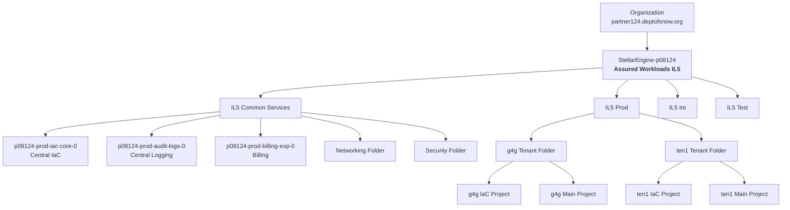

Int and Test repeat exactly the same tenant pattern.

So conceptually:

```text
Organization
└── StellarEngine Assured Workloads
    │
    ├── Common Services
    │   ├── Central IaC Project
    │   ├── Audit Logging Project
    │   ├── Billing Project
    │   ├── Networking Folder
    │   └── Security Folder
    │
    ├── Prod
    │   ├── g4g
    │   │   ├── IaC Project
    │   │   └── Main Project
    │   │
    │   └── ten1
    │       ├── IaC Project
    │       └── Main Project
    │
    ├── Int
    │   └── same structure
    │
    └── Test
        └── same structure
```

---

# Part 13 — What the Tenant IaC and Main Projects Mean

For every:

```text
Environment + Tenant
```

Stellar creates two projects.

Example:

```text
Prod / ten1
```

becomes conceptually:

```text
Prod
└── ten1
    ├── ten1 IaC Project
    └── ten1 Main Project
```

---

## IaC Project

Contains or supports:

```text
Terraform automation
Terraform service account
Terraform state
Terraform outputs
Required APIs
```

AWS mental model:

```text
Mission Owner Terraform / Deployment Account
```

---

## Main Project

Designed to contain actual tenant workload infrastructure:

```text
Compute Engine
GKE
Storage
Application resources
etc.
```

AWS mental model:

```text
Mission Owner Workload Account
```

---

# Part 14 — Stage 1 Also Creates Network and Security Automation

An important point:

```text
Networking Folder
```

does not mean Stage 1 created a VPC.

Stage 1 creates:

```text
Networking Folder

Networking Apply Service Account

Networking Read Service Account

Networking Terraform State Bucket

2-networking Provider File
```

Then Stage 2 uses those.

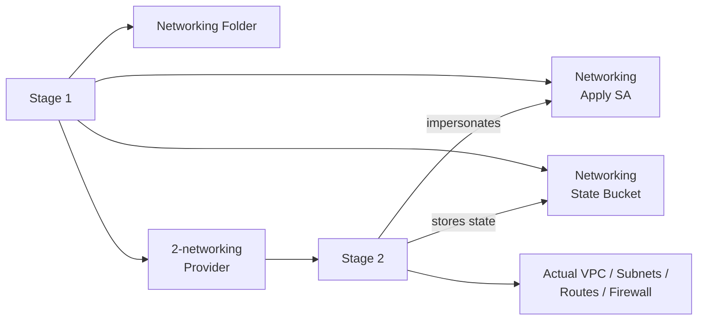

The same pattern is used for Security.

---

# Part 15 — Actual Stage 1 Resource Counts

Your deployed Stage 1 contains approximately:

| Resource              | Count | Breakdown                                     |
| --------------------- | ----: | --------------------------------------------- |
| Folders               |    11 | 3 environment + network + security + 6 tenant |
| Projects              |    12 | 6 tenant IaC + 6 tenant Main                  |
| GCS buckets           |    20 | Network/security/tenant states + outputs      |
| Service accounts      |    17 | Environment, Network, Security, Tenant        |
| KMS key rings         |     6 | One per tenant/environment                    |
| KMS crypto keys       |    12 | `default` + `gcs`                             |
| Log metrics           |    96 | Monitoring                                    |
| Alert policies        |    96 | Monitoring                                    |
| Notification channels |    12 | Alerts                                        |
| API enablements       |   264 | Enable future services                        |
| Generated GCS objects |    29 | Providers + tfvars                            |

---

# Part 16 — API Enablement Does Not Mean a Resource Exists

You may see:

```text
google_project_service["compute.googleapis.com"]

google_project_service["container.googleapis.com"]

google_project_service["pubsub.googleapis.com"]
```

These mean:

```text
Compute API enabled
GKE API enabled
Pub/Sub API enabled
```

They do not mean:

```text
VM created
GKE cluster created
Pub/Sub topic created
```

Think of API enablement as:

> This project is now allowed to call that Google service API.

---

# Part 17 — State Buckets Versus Outputs Bucket

This is another easy area to confuse.

## State bucket

Contains:

```text
Terraform state
```

It answers:

> What infrastructure does this Terraform stage currently manage?

Examples:

```text
Stage 0 state bucket
Stage 1 state bucket
Stage 2 state bucket
Stage 3 state bucket
Tenant state bucket
```

---

## Outputs bucket

Central bucket:

```text
p08124-prod-iac-core-outputs-0
```

Contains generated configuration used between stages.

Examples:

```text
providers/
    0-bootstrap-providers.tf
    1-resman-providers.tf
    2-networking-providers.tf
    3-security-providers.tf

tfvars/
    0-globals.auto.tfvars.json
    0-bootstrap.auto.tfvars.json
    1-resman.auto.tfvars.json
```

Therefore:

```text
STATE BUCKET
    = Terraform's memory

OUTPUTS BUCKET
    = Stage-to-stage configuration exchange
```

---

# Part 18 — Complete Terraform Authentication Evolution

This is the overall progression.

## Before Stage 0

```text
Human
  ↓
ADC
  ↓
Terraform
  ↓
Google APIs

State:
Local terraform.tfstate
```

---

## After Stage 0 bootstrap

```text
Human ADC
  ↓
Service Account Token Creator
  ↓
Bootstrap Service Account
  ↓
Terraform
  ↓
Google APIs

State:
Remote GCS
```

---

## Stage 1

```text
Human / CI Credential
  ↓
Resman Service Account
  ↓
Terraform
  ↓
Organization / Folder / Project APIs

State:
Stage 1 GCS Backend
```

---

## Stage 2

```text
Human / CI Credential
  ↓
Networking Service Account
  ↓
Terraform
  ↓
Networking APIs

State:
Networking GCS Backend
```

---

## Stage 3

```text
Human / CI Credential
  ↓
Security Service Account
  ↓
Terraform
  ↓
Security APIs

State:
Security GCS Backend
```

This is essentially Google's equivalent of using separate AWS Terraform IAM roles and separate S3 state prefixes/buckets for different platform responsibilities.

---

# Part 19 — Common Authentication Troubleshooting

Understanding the two credential systems helps diagnose failures.

### `gcloud organizations list` fails

Look at:

```text
gcloud auth login
Cloud IAM permissions
Organization visibility
```

Check:

```bash
gcloud auth list
gcloud config list
```

---

### `gcloud` works but Terraform gets authentication errors

Likely investigate:

```text
Application Default Credentials
```

Check:

```bash
gcloud auth application-default print-access-token
```

or rerun:

```bash
gcloud auth application-default login
```

---

### Terraform works initially but service-account impersonation fails later

Investigate whether your source identity can impersonate:

```text
p08124-prod-bootstrap-0
p08124-prod-resman-0
etc.
```

The source identity generally requires:

```text
roles/iam.serviceAccountTokenCreator
```

on the relevant service account.

---

### Group exists but Google Cloud access fails

If:

```text
gcp-vpc-network-admins@domain
```

exists in Admin Console, that only proves that the identity group exists.

Verify that the group has an IAM binding in Google Cloud:

```text
Organization / Folder / Project
        ↓
IAM
        ↓
gcp-vpc-network-admins
        ↓
Required role
```

---

# Part 20 — Terraform State Entries Are Not the Same as Major Infrastructure Resources

Your Stage 1 state contains more than 1,000 entries, but that does not mean there are 1,000 major pieces of infrastructure.

For one project, Terraform might track:

```text
google_project

google_project_service × 20

google_project_iam_binding × several

google_project_service_identity × several

google_compute_project_metadata

google_logging_metric × 8

google_monitoring_alert_policy × 8
```

So think:

```text
Terraform State

=
Major Infrastructure

+

IAM

+

API Enablements

+

Guardrails

+

Monitoring

+

Automation Plumbing
```

For hierarchy analysis, focus first on:

```text
google_assured_workloads_workload
google_folder
google_project
google_storage_bucket
google_service_account
google_kms_*
```

Then examine IAM, API and monitoring resources after the architecture is clear.

---

# Part 21 — Recommended Reading Order

Do not try to understand all Stellar Engine Terraform at once.

Use this order.

```text
0-bootstrap
│
├── organization.tf
│      Organization
│      Assured Workloads
│      Org policies
│
├── automation.tf
│      Central IaC project
│      Service accounts
│      Terraform state buckets
│
├── log-export.tf
│      Centralized logging
│
├── billing.tf
│      Billing export
│
└── outputs.tf
       Provider files
       tfvars
       Stage 1 handoff
```

Then:

```text
1-resman
│
├── branch-envs.tf
│      Prod / Int / Test
│
├── branch-tenants.tf
│      Tenant folders
│      IaC + Main projects
│
├── branch-networking.tf
│      Prepare Stage 2
│
├── branch-security.tf
│      Prepare Stage 3
│
└── outputs.tf
       Stage 2/3 providers
       Stage outputs
```

Only after that move to:

```text
2-networking
```

and learn:

```text
VPC
Shared VPC
Host Projects
Service Projects
Subnets
Cloud Router
Routes
Firewall
NGFW
Load Balancing
DNS
```

---

# Part 22 — Final Mental Model

The whole process can be reduced to this:

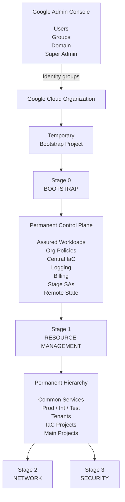

The most important sequence is:

```text
1. Google Admin Console
   creates and manages identities/groups.

2. Google Cloud IAM
   gives those identities authority over cloud resources.

3. Human ADC credentials
   initially allow Terraform to bootstrap.

4. Stage 0 starts with LOCAL Terraform state.

5. Stage 0 creates the permanent IaC project,
   service accounts and GCS backends.

6. terraform init --migrate-state
   copies Stage 0 state from local disk to GCS.

7. Terraform then impersonates dedicated service accounts.

8. Stage 1 creates the actual folder/project hierarchy
   and prepares Stage 2 and Stage 3 automation.

9. Stage 2 creates networking.

10. Stage 3 creates security services.
```

## One-sentence summary

> **Stellar Engine begins with a privileged human and a temporary bootstrap project, uses them to create a permanent Assured Workloads-governed Terraform control plane, moves Terraform state from the local machine into encrypted GCS, then uses stage-specific service accounts and remote state backends to construct the folder/project hierarchy, networking, security, and tenant infrastructure.**

One especially useful addition is the authentication/state-flow section: `gcloud auth login` authenticates the **CLI**, `gcloud config set project` selects its **default project context**, and `gcloud auth application-default login` creates **ADC for Terraform/client libraries**. Those are three separate concepts, not three ways of doing the same login. ([Google Cloud Documentation][5])

[1]: https://docs.cloud.google.com/resource-manager/docs/manage-google-cloud-resources?utm_source=chatgpt.com "Quickstart: Create your Google Cloud resource hierarchy  |  Resource Manager  |  Google Cloud Documentation"
[2]: https://docs.cloud.google.com/resource-manager/docs/creating-managing-organization?utm_source=chatgpt.com "Set up a Google Cloud organization resource  |  Resource Manager  |  Google Cloud Documentation"
[3]: https://docs.cloud.google.com/sdk/gcloud/reference/auth/login?authuser=19&utm_source=chatgpt.com "gcloud auth login  |  Google Cloud SDK  |  Google Cloud Documentation"
[4]: https://docs.cloud.google.com/docs/terraform/authentication?utm_source=chatgpt.com "Authentication for Terraform  |  Terraform on Google Cloud  |  Google Cloud Documentation"
[5]: https://docs.cloud.google.com/docs/authentication/provide-credentials-adc?authuser=8&hl=en&utm_source=chatgpt.com "Set up Application Default Credentials  |  Authentication  |  Google Cloud Documentation"
[6]: https://developer.hashicorp.com/terraform/cli/init?utm_source=chatgpt.com "Initialize the Terraform working directory | Terraform | HashiCorp Developer"
[7]: https://developer.hashicorp.com/terraform/language/backend?utm_source=chatgpt.com "Backend block configuration overview | Terraform | HashiCorp Developer"
[8]: https://developer.hashicorp.com/terraform/language/backend/gcs?utm_source=chatgpt.com "Backend Type: gcs | Terraform | HashiCorp Developer"
