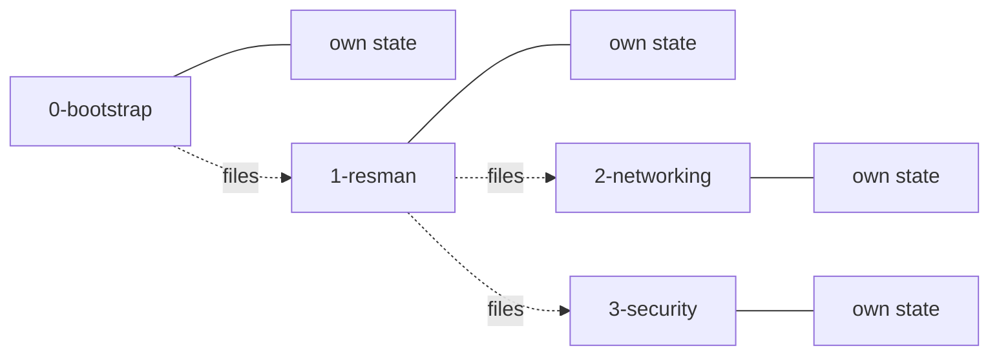
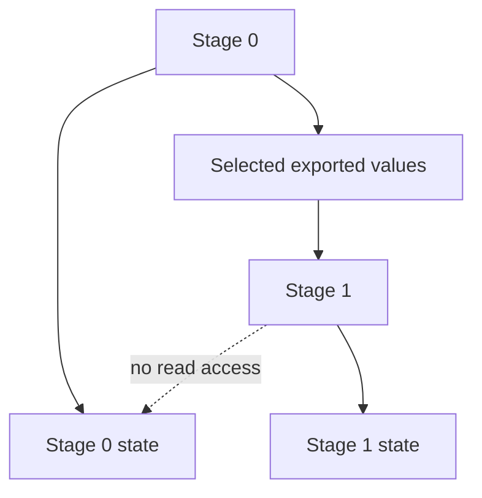
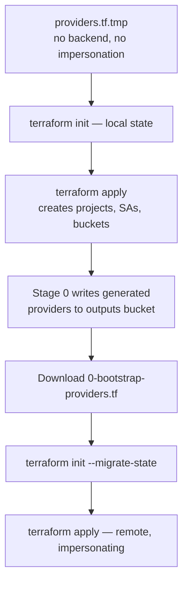
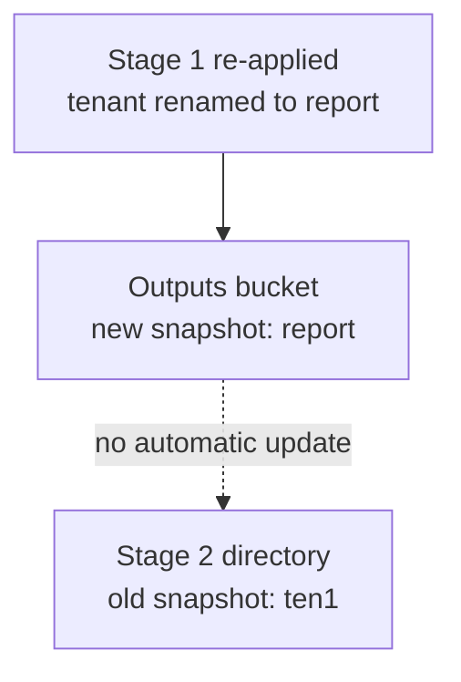
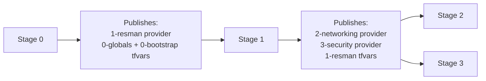

# How Terraform Works Across Stellar Engine Stages

Verified against the repository and against a live deployment
(prefix `p08124`, org `partner124.deptofsnow.org`).

---

## 1. Four independent Terraform roots, not one pipeline

Each stage is a separate Terraform root module with its own state file and its
own service account. There is no shared state.

| Stage | State bucket | Runs as |
| --- | --- | --- |
| `0-bootstrap` | bootstrap | `p08124-prod-bootstrap-0` |
| `1-resman` | resman | `p08124-prod-resman-0` |
| `2-networking` | networking | `p08124-prod-resman-net-0` |
| `3-security` | security | security SA |



The dotted lines are configuration handoffs. Nothing is shared state.

---

## 2. What crosses a stage boundary

Not resources, and not state — three kinds of configuration:

| Information | Carried in | Consumed as |
| --- | --- | --- |
| Backend location | Generated providers file | `terraform init` target |
| Execution identity | Same providers file | `impersonate_service_account` |
| Upstream values | `*.auto.tfvars.json` | Auto-loaded variables |

Two of the three arrive in one file. The generated providers file answers
*where is my state* and *who do I become*; the tfvars answer *what already
exists*.

```hcl
terraform {
  backend "gcs" {
    bucket                      = "<stage state bucket>"
    impersonate_service_account = "<stage SA>"
  }
}

provider "google" {
  impersonate_service_account = "<stage SA>"
}
```

---

## 3. No `terraform_remote_state` anywhere

Grepping the repository returns zero occurrences. Stage 1 never opens stage
0's state file.

This matters for trust. With `terraform_remote_state`, stage 1's identity
would need read access to stage 0's state backend — and stage 0's state
contains the entire organization's configuration. Instead, each stage exports
only the specific values downstream stages need.



The trade-off is snapshot staleness — see section 7.

---

## 4. Two kinds of bucket

Easy to confuse, entirely different jobs.

**State buckets** (one per stage) — *what does this stage manage?*

**The outputs bucket** `p08124-prod-iac-core-outputs-0` — a mailbox, not a
backend:

```text
providers/    0-bootstrap, 1-resman, 2-networking, 3-security  (+ -r variants)
tfvars/       0-globals, 0-bootstrap, 1-resman  (.auto.tfvars.json)
```

---

## 5. Stage 0 is the only one that migrates state

Terraform can't store state in a bucket it hasn't created yet. So stage 0
starts local and switches over mid-stage.



Migration moves Terraform's *record* of resources into GCS. The projects,
folders, and KMS keys never move — they already exist in Google Cloud and stay
exactly where they are.

Stages 1 through 3 receive their providers file from the stage before them, so
they are remote from the first `init`. No migration.

---

## 6. Each stage directory has three input sources

```text
1-resman/
├── 1-resman-providers.tf         ← downloaded: backend + identity
├── 0-globals.auto.tfvars.json    ← downloaded: prefix, org, regions
├── 0-bootstrap.auto.tfvars.json  ← downloaded: folder and project IDs
└── terraform.tfvars              ← you write: what this stage should create
```

Terraform auto-loads anything matching `*.auto.tfvars.json` plus
`terraform.tfvars`, and merges them into one variable set. No flags needed.

Variables sourced upstream are annotated in `variables.tf`:

```hcl
variable "folder_ids" {
  # tfdoc:variable:source 1-resman
}
```

That annotation means *do not set this yourself*.

Later stages pull more files, because they need values from more predecessors.
Stage 2 pulls all four.

---

## 7. The tfvars are snapshots, not links

This is the cost of the decoupling, and the most common way to get burned.



**Rule: re-download the tfvars whenever an upstream stage changes.**

```bash
gcloud storage cp gs://p08124-prod-iac-core-outputs-0/tfvars/1-resman.auto.tfvars.json ./
```

---

## 8. Each stage generates the next stage's providers file

Only stage 1 knows the networking service account and state bucket, because it
just created them. So stage 1 — not stage 0 — writes
`providers/2-networking-providers.tf`.



Visible in state as paired resources — `google_storage_bucket_object.providers["1-resman"]`
writes to the bucket, `local_file.providers["1-resman"]` writes to
`~/fast-config` when `outputs_location` is set.

---

## 9. Blast radius is IAM, not folder names

Each stage uses a dedicated service account whose permissions are tailored to
its responsibilities. The effective scope is determined by actual IAM grants at
organization, folder, project, and billing level — not by which folder the
stage is associated with.

The networking service account is a good example. It holds folder-level rights
on the Networking branch, and also three organization-level bindings from
`1-resman/organization-iam.tf`, including `roles/compute.xpnAdmin` — because
Shared VPC administration legitimately requires org scope.

So networking is much narrower than bootstrap, but not confined to a folder.
Read the IAM, don't infer from the name.

---

## 10. Read-only twins

Every stage has an `-r` variant — a second service account with view-only
permissions and its own providers file.

```text
2-networking-providers.tf     → write SA → terraform apply
2-networking-r-providers.tf   → read SA  → terraform plan
```

Intended for CI: plan on a pull request as the read identity, apply on merge as
the write identity. Manual labs only use the write path, which is why the state
lists contain twice as many service accounts as expected.

---

## 11. Lockdown

`./sa_lockdown.sh` at the end disables the stage service accounts. To make
later changes:

```bash
./sa_lockdown.sh --enable
# apply the relevant stages
./sa_lockdown.sh
```

The broad human privilege from stage 0 is spent once, converted into narrow
machine identities, and those are then switched off.

---

## 12. Three questions for any stage directory

| Question | Where to look |
| --- | --- |
| Where is my state? | `backend "gcs"` in `<stage>-providers.tf` |
| Who do I become? | `impersonate_service_account`, same file |
| What already exists? | The `*.auto.tfvars.json` files |

Backend plus identity plus inputs is the whole model.

---

## Summary

Each stage owns its own resources and its own state. Upstream stages export
only the configuration downstream stages need. The outputs bucket is the
handoff mechanism: the providers file says *where your state lives and who you
are*, and the tfvars files say *what already exists*. Copying between them is
manual and produces snapshots, which must be refreshed when anything upstream
changes.
