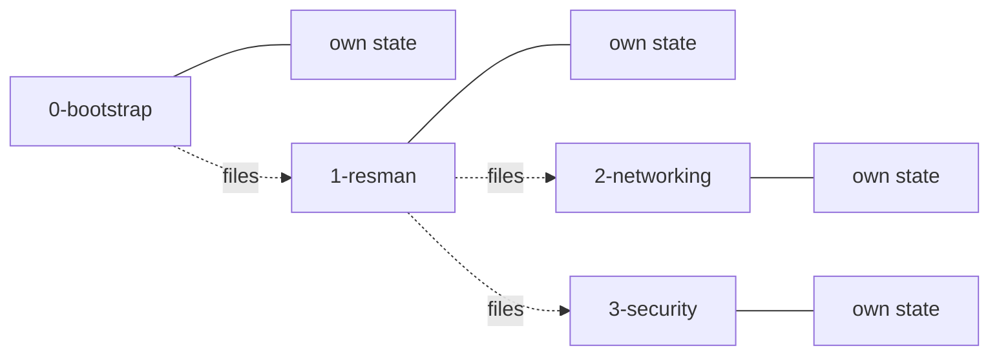
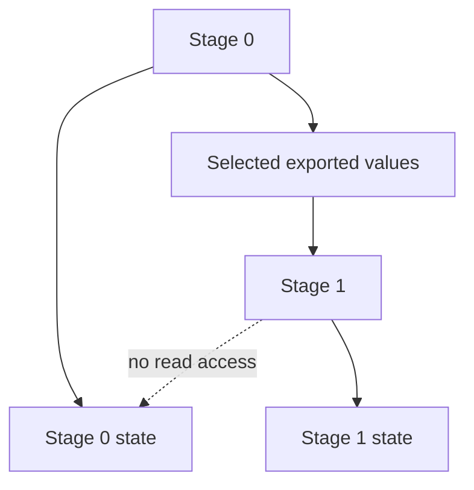
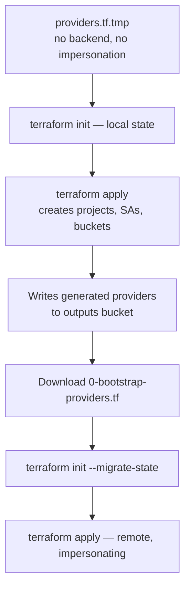
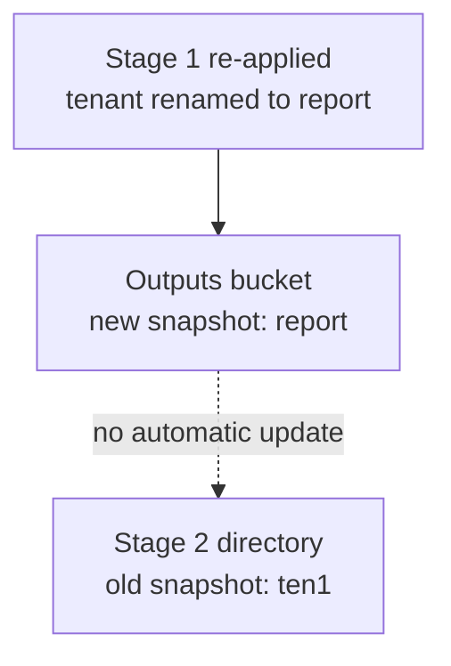
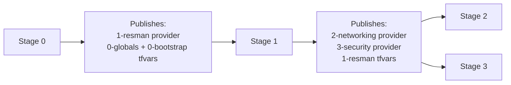

# How Terraform Works Across Stellar Engine Stages
Assuming your number 124 and prefix is p08124
(prefix `p08124`, org `partner124.deptofsnow.org`, region `us-west1`).

---

## 1. Four independent Terraform roots, not one pipeline

Each stage is a separate Terraform root module with its own state file and its
own service account. There is no shared state.



The dotted lines are configuration handoffs, not state sharing.

---

## 2. Stage wiring at a glance

Every state bucket lives in the central IaC project
`p08124-prod-iac-core-0`. Note that stage 0's own resources use the derived
prefix `p08124-prod`, while stage 1's use the bare prefix `p08124`.

| Stage | State bucket | Impersonated identity | Publishes for the next stage |
| --- | --- | --- | --- |
| `0-bootstrap` | `p08124-prod-iac-core-bootstrap-0` | `p08124-prod-bootstrap-0` | `1-resman` providers, `0-globals` + `0-bootstrap` tfvars |
| `1-resman` | `p08124-prod-iac-core-resman-0` | `p08124-prod-resman-0` | `2-networking` + `3-security` providers, `1-resman` tfvars |
| `2-networking` | `p08124-prod-resman-net-0` | `p08124-prod-resman-net-0` | `2-networking` tfvars |
| `3-security` | `p08124-prod-resman-sec-0` | `p08124-security-0` | terminal stage |

Every stage also has a read-only `-r` twin — a second service account with
view-only permissions and its own providers file. That is why the state lists
contain twice as many service accounts as expected.

**The single outputs bucket** is `p08124-prod-iac-core-outputs-0`. It is a
mailbox, never a Terraform backend:

```text
providers/    0-bootstrap, 1-resman, 2-networking, 3-security  (+ -r variants)
tfvars/       0-globals, 0-bootstrap, 1-resman, 2-networking   (.auto.tfvars.json)
```

---

## 3. What crosses a stage boundary

Not resources, and not state — three kinds of configuration:

| Information | Carried in | Consumed as |
| --- | --- | --- |
| Backend location | Generated providers file | `terraform init` target |
| Execution identity | Same providers file | `impersonate_service_account` |
| Upstream values | `*.auto.tfvars.json` | Auto-loaded variables |

Two of the three arrive in one file:

```hcl
terraform {
  backend "gcs" {
    bucket                      = "p08124-prod-iac-core-resman-0"
    impersonate_service_account = "p08124-prod-resman-0@p08124-prod-iac-core-0.iam.gserviceaccount.com"
  }
}

provider "google" {
  impersonate_service_account = "p08124-prod-resman-0@p08124-prod-iac-core-0.iam.gserviceaccount.com"
}
```

---

## 4. No `terraform_remote_state` anywhere

Grepping the repository returns zero occurrences. Stage 1 never opens stage
0's state file.

With `terraform_remote_state`, stage 1's identity would need read access to
stage 0's state backend — which holds the entire organization's configuration.
Instead each stage exports only the values downstream stages need.



The trade-off is snapshot staleness — see section 10.

---

## 5. Stage 0 — bootstrap

**State:** local, then migrated to `p08124-prod-iac-core-bootstrap-0`
**Runs as:** your ADC, then `p08124-prod-bootstrap-0`

The only stage that migrates state, because Terraform cannot store state in a
bucket it has not created yet.



Migration moves Terraform's *record* of resources into GCS. The projects,
folders, and KMS keys never move — they already exist and stay where they are.

### Key resources

| Resource | Count | Detail |
| --- | ---: | --- |
| Assured Workloads workload | 1 | `StellarEngine-p08124`, IL5 boundary |
| Folder | 1 | `IL5 Common Services` |
| Projects | 3 | iac-core-0, audit-logs-0, billing-exp-0 |
| GCS buckets | 3 | bootstrap state, resman state, outputs |
| Service accounts | 4 | bootstrap + resman, each with `-r` twin |
| KMS key rings / keys | 2 / 2 | `gcs`, `log-sink` |
| Org log sinks / log buckets | 4 / 4 | audit, vpc-sc, workspace, empty |
| Organization policies | 72 | Inherited by everything below |
| Custom org constraints | 2 | `custom.kmsRotation`, `custom.restrictFirewallRanges` |
| Custom IAM roles | 7 | Delegated administration |
| Log metrics / alerts | 24 / 24 | 8 events × 3 projects |
| Notification channels | 3 | One per project |
| BigQuery dataset | 1 | Billing export |

All three projects carry a `google_resource_manager_lien` blocking accidental
deletion.

---

## 6. Stage 1 — resource management

**State:** `p08124-prod-iac-core-resman-0`
**Runs as:** `p08124-prod-resman-0`
**Config:** 3 environments (Prod, Int, Test) × 2 tenants (g4g, report)

### Key resources

| Resource | Count | Breakdown |
| --- | ---: | --- |
| Folders | 11 | 3 env + networking + security + 6 tenant |
| Projects | 12 | 6 tenant IaC + 6 tenant Main |
| GCS buckets | 20 | 1 network + 1 security + 6 tenant core + 6 tenant IaC state + 6 tenant IaC outputs |
| Service accounts | 17 | 1 envs + 2 network + 2 security + 6 tenant core + 6 tenant self-IaC |
| KMS key rings / keys | 6 / 12 | `default` + `gcs` per environment/tenant pair |
| Log metrics / alerts | 96 / 96 | 6 pairs × 2 projects × 8 events |
| Notification channels | 12 | 6 pairs × 2 projects |
| API enablements | 264 | Permission to use, not resources created |
| Generated GCS objects | 29 | Providers and tfvars for stages 2 and 3 |

Tenant folders nest inside environment folders. Networking and Security folders
are children of Common Services (`parent = var.common_services_folder`).

---

## 7. Stage 2 — networking (FedRAMP High)

**State:** `p08124-prod-resman-net-0`
**Runs as:** `p08124-prod-resman-net-0`
**Consumes:** all three upstream tfvars files

### Key resources

| Resource | Count | Detail |
| --- | ---: | --- |
| Host projects | 4 | 1 VDSS + 3 environment spokes |
| VPCs | 5 | landing, dmz, prod, int, test |
| Subnets | 9 | 1 landing + 1 dmz + 6 tenant + 3 proxy-only |
| Shared VPC attachments | 6 | One per environment/tenant pair |
| NVA appliances | — | Instance template, regional MIG, 2 internal LBs |
| Cloud NAT / Router | 1 each | Internet egress from dmz |
| Firewall rule sets | 5 | Per network key, including the IAP RDP rules |
| DNS response policy | ~45 rules | Pins Google APIs to `private.googleapis.com` |
| KMS, log metrics, alerts | — | Same CIS pattern on each new project |

Publishes `2-networking.auto.tfvars.json` to the outputs bucket.

---

## 8. Stage 3 — security

**State:** `p08124-prod-resman-sec-0`
**Runs as:** `p08124-security-0`

### Key resources

| Resource | Detail |
| --- | --- |
| Security projects | `prod-sec-project`, `dev-sec-project` |
| KMS | `prod-sec-kms`, `dev-sec-kms` |
| VPC Service Controls | Perimeters plus discovery configuration |
| Log metrics and alerts | Same CIS pattern |

Terminal stage — publishes nothing downstream.

---

## 9. Each stage directory has three input sources

```text
1-resman/
├── 1-resman-providers.tf         ← downloaded: backend + identity
├── 0-globals.auto.tfvars.json    ← downloaded: prefix, org, regions
├── 0-bootstrap.auto.tfvars.json  ← downloaded: folder and project IDs
└── terraform.tfvars              ← you write: what this stage should create
```

Terraform auto-loads anything matching `*.auto.tfvars.json` plus
`terraform.tfvars` and merges them. No flags needed.

Variables sourced upstream are annotated in `variables.tf`:

```hcl
variable "folder_ids" {
  # tfdoc:variable:source 1-resman
}
```

That annotation means *do not set this yourself*. Later stages pull more files
because they depend on more predecessors — stage 2 pulls all four.

---

## 10. The tfvars are snapshots, not links

The cost of the decoupling, and the most common way to get burned.



**Rule: re-download the tfvars whenever an upstream stage changes.**

```bash
gcloud storage cp gs://p08124-prod-iac-core-outputs-0/tfvars/1-resman.auto.tfvars.json ./
```

---

## 11. Each stage generates the next stage's providers file

Only stage 1 knows the networking service account and state bucket, because it
just created them. So stage 1 — not stage 0 — writes
`providers/2-networking-providers.tf`.



Visible in state as paired resources —
`google_storage_bucket_object.providers["1-resman"]` writes to the bucket,
`local_file.providers["1-resman"]` writes to `~/fast-config` when
`outputs_location` is set.

---

## 12. Blast radius is IAM, not folder names

Each stage uses a dedicated service account whose permissions are tailored to
its responsibilities. Effective scope is determined by actual IAM grants at
organization, folder, project, and billing level — not by which folder the
stage is associated with.

The networking service account is the clearest example. It holds folder-level
rights on the Networking branch, and also three organization-level bindings
from `1-resman/organization-iam.tf`, plus `roles/compute.xpnAdmin` from
`branch-networking.tf` line 27 — because Shared VPC administration legitimately
requires org scope.

Networking is much narrower than bootstrap, but not confined to a folder. Read
the IAM, don't infer from the name.

---

## 13. Lockdown

`./sa_lockdown.sh` at the end disables the stage service accounts. To make
later changes:

```bash
./sa_lockdown.sh --enable
# apply the relevant stages
./sa_lockdown.sh
```

The broad human privilege from stage 0 is spent once, converted into narrow
machine identities, and those are then switched off.

---

## 14. Three questions for any stage directory

| Question | Where to look |
| --- | --- |
| Where is my state? | `backend "gcs"` in `<stage>-providers.tf` |
| Who do I become? | `impersonate_service_account`, same file |
| What already exists? | The `*.auto.tfvars.json` files |

Backend plus identity plus inputs is the whole model.

---

## Summary

Each stage owns its own resources and its own state. Upstream stages export
only the configuration downstream stages need. The outputs bucket is the
handoff mechanism: the providers file says *where your state lives and who you
are*, and the tfvars files say *what already exists*. Copying between them is
manual and produces snapshots, which must be refreshed when anything upstream
changes.
